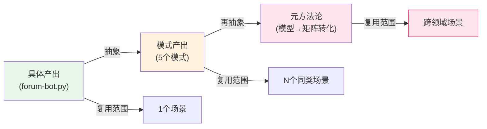
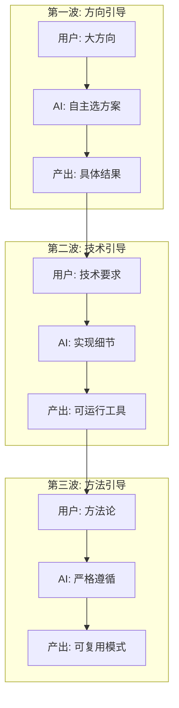
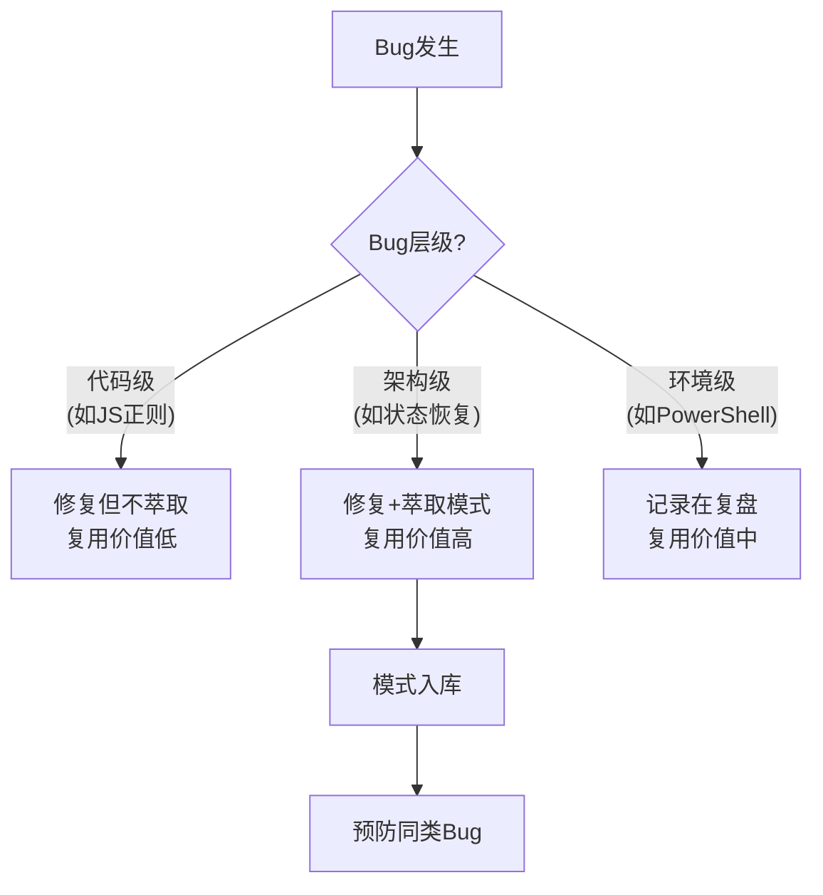
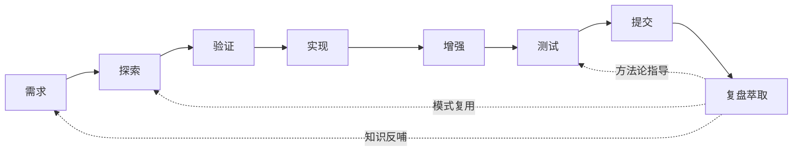

+++
id = "retrospective-forum-automation-full-workflow-insight"
date = "2026-06-29"
type = "insight-extraction"
scope = "comprehensive"
maturity = "L2"
source = "论坛自动化全工作流9阶段"
+++

# 元洞察萃取 — 跨阶段规律性发现

## 元洞察一：知识沉淀的复利效应

### 发现

S9复盘萃取阶段的时间投入仅占整个工作流的15%，但产出了复用价值最高的资产（5个可复用模式+3份复盘报告）。相比之下，S4-S5开发阶段投入30%时间产出的forum-bot.py脚本，复用范围仅限论坛自动化单一场景。

### 深层含义



**复利公式**：
```
知识资产价值 = 基础产出 × 抽象层级^复用次数
```

- forum-bot.py：基础产出=1，抽象层级=1（即用层），复用次数=1 → 价值=1
- 分级日志模式：基础产出=1，抽象层级=2（模式层），复用次数=N → 价值=N²
- 模型→矩阵转化：基础产出=1，抽象层级=3（方法论层），复用次数=N → 价值=N³

**通用规律**：工程活动的杠杆率与产出的抽象层级成正比。**工具是消耗品，模式是资产，方法论是杠杆。**

### 实践指导

1. **每个工作流都应预留15-20%时间用于复盘萃取**——这是ROI最高的工程活动
2. **抽象层级的提升需要刻意练习**——从"做了什么"到"为什么这样做"到"如何指导别人做"
3. **模式入库需要成熟度验证**——L1模式需在实际复用后升级为L2/L3

---

## 元洞察二：用户引导与AI自主性的"三波节奏"

### 发现

整个工作流中，用户引导呈现三波递进节奏：方向引导（S1-S3）→ 技术引导（S4-S6）→ 方法引导（S7-S9）。AI的自主性空间递减，但产出价值递增。

### 深层含义

| 波次 | 引导类型 | AI自主性 | 产出类型 | 产出价值 |
|------|---------|---------|---------|---------|
| 第一波 | "检查帖子状态" | 高（自由选方案） | 具体结果 | 即时价值 |
| 第二波 | "封装Python脚本" | 中（技术指定） | 可运行工具 | 团队价值 |
| 第三波 | "基于三级决策模型" | 低（方法指定） | 可复用模式 | 长期价值 |



**通用规律**：用户引导的抽象层级与产出价值成正比，与AI自主性成反比。**最高价值的产出往往来自最低自主性的严格遵循。**

### 实践指导

1. **AI应在第一波主动探索方案空间**，在第二波忠实实现技术要求，在第三波严格遵循方法论
2. **用户应意识到**：越具体的引导产出越确定但复用性越低，越抽象的引导产出越不确定但复用性越高
3. **三波节奏是自然的工程演进**：先确认"能做"，再确认"怎么做"，最后提炼"为什么这样做"

---

## 元洞察三：Bug即资产的转化机制

### 发现

整个工作流中共修复7个Bug（4功能Bug+3工具链Bug），其中4个Bug的修复方式被萃取为可复用模式。Bug的深层级（架构级）与萃取出的模式复用价值正相关。

### 深层含义



**Bug转化的三个条件**：
1. **可命名**：Bug的根因能用一个简洁的名称概括（如"检查函数状态恢复"）
2. **可复现**：Bug的触发条件能清晰描述（如"检查函数导航到其他页面"）
3. **可防护**：存在通用的防护模式（如"保存状态→检测→恢复"）

**通用规律**：不是所有Bug都值得萃取为模式。**只有架构级Bug且满足"可命名+可复现+可防护"三条件的，才值得萃取为可复用模式。** 代码级Bug在代码注释中说明即可，环境级Bug在复盘中记录即可。

### 实践指导

1. **Bug修复后自问三个问题**：可命名？可复现？可防护？三yes则萃取
2. **架构级Bug优先萃取**——其防护模式的复用范围最广
3. **Bug修复模式应立即入库**，而非等综合复盘时批量萃取（避免遗忘上下文）

---

## 元洞察四：从需求到交付的"知识闭环"

### 发现

整个工作流形成了一个完整的知识闭环：需求→探索→验证→实现→增强→测试→提交→复盘→（知识反哺新需求）。S9的复盘产出不是终点，而是下一个工作流的输入。

### 深层含义



**闭环的三个反哺点**：
1. **需求层反哺**：复盘产出的洞察可能触发新需求（如"测试计划自动化"）
2. **探索层反哺**：已入库的模式可直接复用于新方案探索（如"多信号检测"用于新工具）
3. **方法层反哺**：元方法论可指导新工作流的测试设计（如"模型→矩阵转化"用于其他工具）

**通用规律**：工程工作流不是线性管道，而是**螺旋上升的知识闭环**。每次闭环的复盘产出都会提升下一次闭环的起点。

### 实践指导

1. **每个工作流都必须以复盘收尾**——未复盘的工作流是"开环"的，知识会泄漏
2. **复盘产出必须入库**——未入库的洞察是"游离"的，无法被反哺
3. **新工作流开始前先检索模式库**——站在上一次闭环的肩膀上

---

## 跨洞察综合：工作流的"价值密度"模型

综合四个元洞察，可以提炼出一个**工作流价值密度模型**：

```
工作流总价值 = Σ(各阶段产出 × 抽象层级)
             = 即用层产出×1 + 文档层产出×2 + 模式层产出×3 + 方法论层产出×4

复盘萃取是唯一能将低层级产出"升级"为高层级产出的活动。
```

| 活动 | 产出层级 | 价值系数 | 不可替代性 |
|------|---------|---------|-----------|
| 编码实现 | 即用层 | ×1 | 可被替代 |
| 文档编写 | 文档层 | ×2 | 部分可替代 |
| 模式萃取 | 模式层 | ×3 | 难以替代 |
| 元洞察提炼 | 方法论层 | ×4 | 不可替代 |

**结论**：AI辅助开发的最大价值不在于编码实现（×1），而在于复盘萃取（×3~×4）。人类工程师应将更多精力投入到模式萃取和元洞察提炼上，编码实现交给AI。
