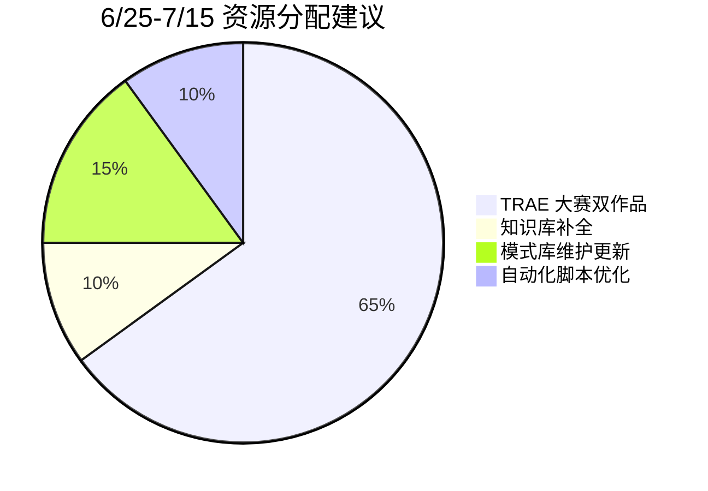

# 战略建议与行动路线图

## 一、下一阶段方向评估

### 1.1 方向一：TRAE 大赛双作品落地（短期，6/25-7/15）

| 评估维度 | 评分 | 说明 |
|---------|------|------|
| 紧迫性 | ★★★★★ | 报名截止 7/15，初赛提交截止同日 |
| 风险 | ★★☆☆☆ | 策略已完备，竹简悟道已通过报名审核 |
| 资源需求 | 中 | 竹简悟道 28.5h + SpecWeave 8h ≈ 36.5h |
| 方法论验证价值 | ★★★★☆ | 实战检验双作品交叉叙事 + 全人工评审说服力 |

策略文件已完备（export-suggestions.md），执行清单已对齐报名→初赛→抖音→复赛→决赛全阶段。

### 1.2 方向二：SpecWeave 开源发布与外部验证（中期，赛后 1-3 个月）

| 评估维度 | 评分 | 说明 |
|---------|------|------|
| 紧迫性 | ★★★☆☆ | 可在赛后启动 |
| 风险 | ★★★☆☆ | 目前无外部团队独立验证——方法论可能"自说自话" |
| 资源需求 | 高 | 需要：README 重写（面向外部用户而非 AI）、英文翻译、示例项目、CLI 工具 |
| 方法论验证价值 | ★★★★★ | **外部验证是方法论成熟的必要条件**——目前 SpecWeave 仅在本项目中自证有效 |

**建议行动**：
1. 赛后发布"AI 智能体协作方法论白皮书"（借势大赛热度）
2. 向 AGENTS.md 标准社区提交 best-practice 案例
3. 开发 SpecWeave CLI（specweave init/check/generate）
4. 招募 2-3 个外部团队进行试点验证

### 1.3 方向三：知识库补全与决策框架扩充（持续）

| 弱点 | 当前状态 | 目标 | 行动 |
|------|---------|------|------|
| 知识库仅 6 个条目 | 16+ 个方法论模式却只有 6 个知识库 | 知识库条目 ≥ 15 | 从 40 份复盘报告中系统提取故障排查、操作指南、决策记录 |
| 决策框架仅 4 个 | 大量场景无标准决策矩阵 | 决策框架 ≥ 8 | 从方法论模式的 [bindings] 字段逆向提取决策树 |
| 自动化验证覆盖不均 | 集中在结构化检查（链接/Git/格式） | 内容质量自动化检查 | 研究 LLM-as-Judge 可行性，用于事实表述一致性、逻辑完备性检查 |

### 1.4 方向四：AGENTS.md 通用化适配（长期）

| 当前状态 | 目标 | 挑战 |
|---------|------|------|
| 高度定制于本项目目录结构 | 外部项目可通过模板化一键初始化 | 路由表、角色定义、工具规范中的项目特定引用需要参数化 |

**建议行动**：
1. 识别 AGENTS.md 中所有项目特定引用，用 `{project_name}` 等占位符参数化
2. 创建 `agents init --template basic/standard/full` CLI 命令
3. 提供 3 种模板级别：Basic（仅 AGENTS.md + 路由表）、Standard（+ 核心角色和协议）、Full（完整四层架构）

---

## 二、资源配置建议

| 阶段 | 时间 | 主要任务 | 次要任务 |
|------|------|---------|---------|
| 6/25-6/30 | 立即 | 竹简悟道 UI 完善 + 四路径 AI 对话引擎 | 知识库从 6 条目扩展到 10+ |
| 7/1-7/10 | 近期 | HTML ZIP 打包 + Demo 帖撰写 + SpecWeave 报名帖提交 | 决策框架补充 2 个 |
| 7/11-7/15 | 截止前 | 质量审查 + 提交初赛 | 方法论模式 [bindings] 字段补全 |
| 7/15-8/9 | 复赛期 | 如晋级：产品增强 + 导师对接 | SpecWeave CLI 原型 |
| 8/9+ | 赛后 | 白皮书发布 + 外部验证招募 | AGENTS.md 通用化适配 |

---

## 三、风险与预案

| 风险 | 概率 | 影响 | 预案 |
|------|------|------|------|
| 竹简悟道初赛未通过 | 20% | 高（主作品出局） | 立即转至 SpecWeave 增强——将方法论展示从"辅助证据"升级为"主体展示" |
| 两个作品均未晋级 | 10% | 中（大赛投资回报为零） | 赛后立即启动开源发布——大赛经验转化为"为什么 AI 协作需要方法论"的案例素材 |
| 方法论外部验证失败 | 30% | 高（核心命题受质疑） | 区分"方法论本身的问题"和"适配问题"——外部团队失败可能来自适配不当而非方法论缺陷 |
| 知识生产速度放缓 | 50% | 低（临界质量效应减弱但仍有效） | 正常现象——3 天 400 文件的密度不可持续，后续应追求深度（模式成熟度 L1→L3）而非广度 |
| AGENTS.md 通用化难度超预期 | 40% | 中（社区推广受阻） | 优先发布"本项目的 AGENTS.md"作为案例展示，推迟通用 CLI 工具到 v2 |

---

## 四、改进建议优先级

| 序号 | 建议 | 优先级 | 实施路径 |
|------|------|--------|---------|
| 1 | 知识库条目从 6 扩展到 15+ | P0 | 从 40 份复盘报告中系统提取故障排查、决策记录与操作指南 |
| 2 | 补全 16+ 个方法论模式的 [bindings] 字段 | P0 | 扫描所有模式文件，确保 `references` 字段标注了实际关联关系 |
| 3 | 增加"路径确认三步走"到文件操作规范 | P0 | 写入 `.agents/tools/file-operations.md`——新建前先确认目标目录符合项目约定 |
| 4 | 大块替换（>50 行）禁用多轮 SearchReplace | P1 | 写入工具规范——优先用整体读写策略 |
| 5 | 建立"定位评审"自查流程 | P1 | 写入 `.agents/modules/self-insight.md`——区分问题域术语与借用标签 |
| 6 | 决策框架新增 4 个（何时启动复盘/多智能体 vs 单/Cascade 更新/模式萃取触发条件） | P1 | 从现有模式 [bindings] 字段逆向提取 |
| 7 | 设计 AGENTS.md 通用化模板 | P2 | 赛后启动，需先完成参赛和开源发布 |
| 8 | 内容质量自动化验证研究 | P2 | 优先攻克"事实表述一致性"的自动化检查 |

---

## 五、一句话总结

**本项目在 3 天内从零构建了一个"自指涉"的 AI 智能体协作方法论体系——400 个文件、40 份报告、16+ 个模式、26 个脚本——不是靠蛮力堆量，而是靠一个正反馈系统：每一次与 AI 协作既是"做"也是"学"，每一次复盘既是"回顾"也是"进化"，每一次模式萃取既是"输出"也是"输入"。下一个阶段的核心命题是：从内部自证到外部验证——证明这套方法论不只是"对同一个人有效"。**

---

*数据来源：项目全面复盘执行报告 + 项目级洞察萃取 + 16+ 个方法论模式 + 40 份复盘报告 + TRAE 大赛竞品分析 v11*
