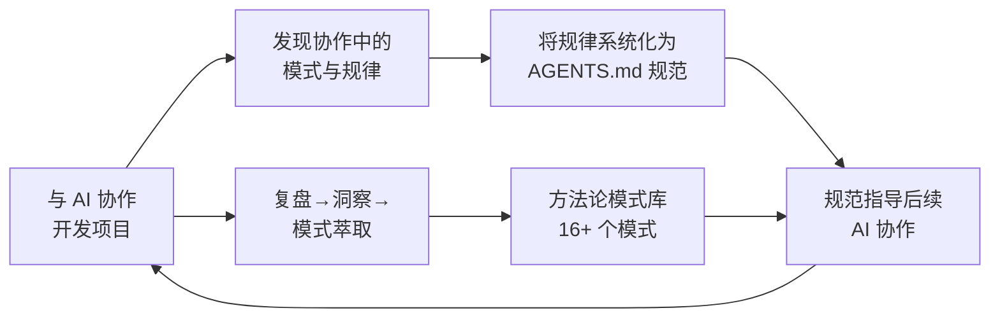
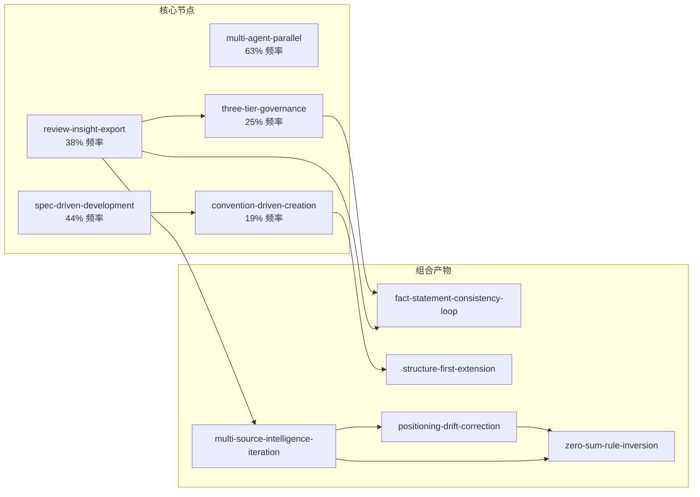

# 项目级洞察萃取

## 一、五大核心发现

### 发现 1：自指涉方法论——"做"与"写"的量子纠缠 ⭐⭐⭐⭐⭐

本项目最根本的洞察：**项目的内容是"如何更好地与 AI 协作"，而它的诞生过程本身就是这个命题的最佳实践。** 这不是巧合——这是经过设计的。



**"做"与"写"的双螺旋**：
- 每次与 AI 协作做一件事 → 同时积累了"这件事的协作模式"数据
- 复盘中萃取这些模式 → 写成一个可复用的方法论
- 这个方法论在下一次协作中被加载 → 提升下一次协作的效率
- 这又是一次新的协作实践 → 产生新的数据

**结果**：3 天内积累的 400 个文件不是偶然——它是一个**正反馈系统**的产出。每一次对话既是执行，也是实验；每一份复盘报告既是文档，也是数据。

> **规律**：当一个项目的内容与其开发方法存在自我指涉关系时，知识生产的边际效率不递减——因为每一次"做"同时为"想"提供了原料，而每一次"想"反过来提升了"做"的效率。这是本项目在 3 天内达到 400 文件体量的根本原因。

### 发现 2：临界质量效应——你知道得越多，学得越快 ⭐⭐⭐⭐⭐

当方法论模式数量超过 6 个后，知识生产从"线性累积"进入"组合爆炸"阶段：

| 阶段 | 模式数 | 新模式的来源 | 边际产出 |
|------|--------|------------|---------|
| 线性累积期（6/23） | 1-6 | 单一复盘事件驱动 | 每 1-2 份报告产 1 个模式 |
| **组合爆发期（6/24→6/25）** | **7→16+** | **现有模式交叉组合** | **每 0.5-0.8 份报告产 1 个模式** |
| 自发生成期（预计 6/26+） | 18+ | 模式网络自发涌现 | 不依赖新复盘报告 |

**已观察到的交叉组合实例**：

| 组合 | 产物 |
|------|------|
| review-loop + three-tier-governance | fact-statement-consistency-loop |
| spec-driven + document-refactoring | convention-driven-creation |
| convention-driven + package-structure-analysis | structure-first-extension |
| multi-source-intelligence + positioning-drift-correction | zero-sum-rule-inversion |
| retrospective-acceleration + critical-mass | 本项目（自我指涉的正反馈系统） |

**临界质量效应成立的前提条件**：
1. 模式文档标注了关联关系（`[bindings]` 或 `references` 字段）
2. 模式间存在正交维度（分属不同抽象层次/应用域）
3. 复盘报告对交叉模式有明确追溯路径
4. 模式成熟度健康分布（L1-L4 梯度存在）

> **规律**：知识资产的价值不与其数量成正比——而与其**关联密度**成正比。6 个孤立模式的效用 = 6；6 个关联模式的效用 = 6 + C(6,2) = 21 个潜在交叉点。这就是为什么本项目从第 7 个模式开始加速。

### 发现 3：复盘加速效应——高频复盘的复利奇迹 ⭐⭐⭐⭐

在 12 轮会话中观察到知识转化率逐轮递增（基线 1× → 首轮复盘 1.5× → 执行反思 2× → 元级闭合 3×）。本项目的"做"与"思"交替节奏（每 4-6 个任务一次复盘）实现了：

| 传统模式 | 本项目 | 倍率 |
|---------|--------|------|
| 每周复盘 1 次 | 每 4-6 任务一批次复盘 | ~20× 频率 |
| 改进延迟 1-2 周 | 改进延迟趋近于 0 | 信息熵→结构化知识的延迟为 0 |
| 知识从对话中蒸发 | 每次对话的经验在下次对话前已沉淀为规范/changelog/模式 | 知识留存率从 ~20% 提升至 ~90% |

**关键机制**：复盘不是"事后诸葛亮"——它是 **"生产系统的一部分"**。复盘的实时性越强，它对下一次执行的指导价值越大。当复盘延迟从 1 周降到 0 分钟时，复盘就从"回顾"变成了"实时学习"。

### 发现 4：规范自举——规范本身规定如何扩展规范 ⭐⭐⭐⭐

AGENTS.md 中的**上下文路由表**是一个关键的架构决策：

```
| 任务类型 | 必读入口 |
| ... |
| 指令集（复盘/洞察/导出报告/原子化/原子提交） | .agents/commands/ |
| 硬编码治理规则体系 | .agents/rules/ |
| 技术知识库查阅 | docs/knowledge/README.md |
```

这个路由表的意义在于：**当需要新增一个规则体系时，你不需要修改 AGENTS.md 的结构——你只需要在路由表中新增一行，然后将内容写入对应目录。** 这是一种"规范自举"（specification bootstrapping）：规范本身定义了如何向规范体系中添加新规范。

> **规律**：一个好的规范体系不是"一次性写完就定型"的——它应该具有"自举性"：新增规范时不需要修改规范的框架结构，只需要在预留的扩展点上注册。上下文路由表 + 四层闭环架构 + 统一五要素模板共同构成了 AGENTS.md 体系的扩展接口。

### 发现 5：从"蹭标签"到"定义问题"——定位漂移的识别与修正 ⭐⭐⭐

SpecWeave 定位修正过程中发现的普遍规律：

```
蹭标签路径（漂移）：
  "我是 Vibe Coding 领域的第一套方法论"
  问题：Vibe Coding 是大赛标签，不是问题本身。5 年后可能没人说这个词。
  结果：评审/用户用一个更窄的框架评判你。

定义问题路径（锚定）：
  "当 AI 胜任多角色时，如何确保 100 次对话中始终理解你的意图？"
  问题：这是一个长期命题，不管叫 Vibe Coding 还是别的名字，问题都在。
  结果：评审/用户以问题的实际广度评判你。
```

**修正三阶段操作法**：
1. **识别**：定位中哪些术语来自外部（平台/赛事/流行词）而非问题本身？
2. **剥离**：移除外部术语后，用"如果这个词不存在"回答三个问题（核心痛点/改变了什么/5 年后还存在吗）
3. **重构**：用问题域术语重新定义定位，外部术语降级为"这些标签也在描述同一个问题"的佐证材料

---

## 二、系统性弱点

| 弱点 | 严重度 | 表现 | 根因 |
|------|--------|------|------|
| **知识库条目过少** | 中 | 仅 6 个知识库条目，方法论模式却已有 16+ 个——实操型知识（知识库）与抽象型知识（模式）严重失衡 | 知识库写入的触发条件模糊，不像复盘→模式萃取有明确流程 |
| **决策框架不足** | 中 | 仅 4 个决策框架，大量场景（如"何时启动复盘"、"多智能体 vs 单智能体"）缺少标准决策矩阵 | 决策框架的萃取门槛高于方法论文档，需要更强的抽象归纳 |
| **自动化验证覆盖率不均** | 中低 | 26 个脚本集中在链接/规格/Git/原子化四个域，缺少内容质量（事实正确性/表述一致性）的自动验证 | 内容质量验证的技术难度远高于结构化检查 |
| **外部可用性未验证** | 中 | SpecWeave 体系仅在当前项目中自证有效，尚未有外部团队或项目的独立验证 | 项目周期仅 3 天，外部验证自然滞后于内部体系建设 |
| **AGENTS.md 的可移植性** | 低 | 当前 AGENTS.md 中的路由表等高度定制于本项目的目录结构，外部项目直接复用需要适配 | AGENTS.md 设计时就定位于"本项目入口"，通用化是第二阶段目标 |

---

## 三、可复制到其他项目的经验

| 经验 | 复制难度 | 复制建议 |
|------|---------|---------|
| AGENTS.md 单入口路由 + 按需读取 | 低 | 任何需要多个 Markdown 规范文件的项目——创建一个 AGENTS.md 作为入口，用路由表连接所有规范文件 |
| 复盘→洞察→萃取→更新四步闭环 | 低 | 每 4-6 个任务执行一次复盘，立即萃取模式和更新规范——将改进延迟从"1-2 周"降至"0 分钟" |
| Spec-driven 开发 + 统一模板 | 中 | 为每个任务先建 spec.md，为每份复盘报告使用四文件标准结构，低成本确保一致性 |
| Mermaid 优先的可视化 | 低 | 所有流程/架构/关系用 Mermaid 表达——可渲染、可版本化、可被 AI 读取 |
| 自指涉方法论 | 高 | 仅适用于"元项目"（内容与方法高度相关）——但复盘加速效应和临界质量效应适用于所有项目 |

---

## 四、模式关联网络（当前快照）



**关联密度**：5 个核心节点 + 5 个组合产物 = 10 条有向边。平均每个节点的度数为 2.0。随着新模式持续加入，网络密度将持续上升——这是临界质量效应在持续发挥作用。

---

*数据来源：40 份复盘报告的跨项目元分析 + 16+ 个方法论模式的 [bindings] 字段 + 项目规模统计数据*
