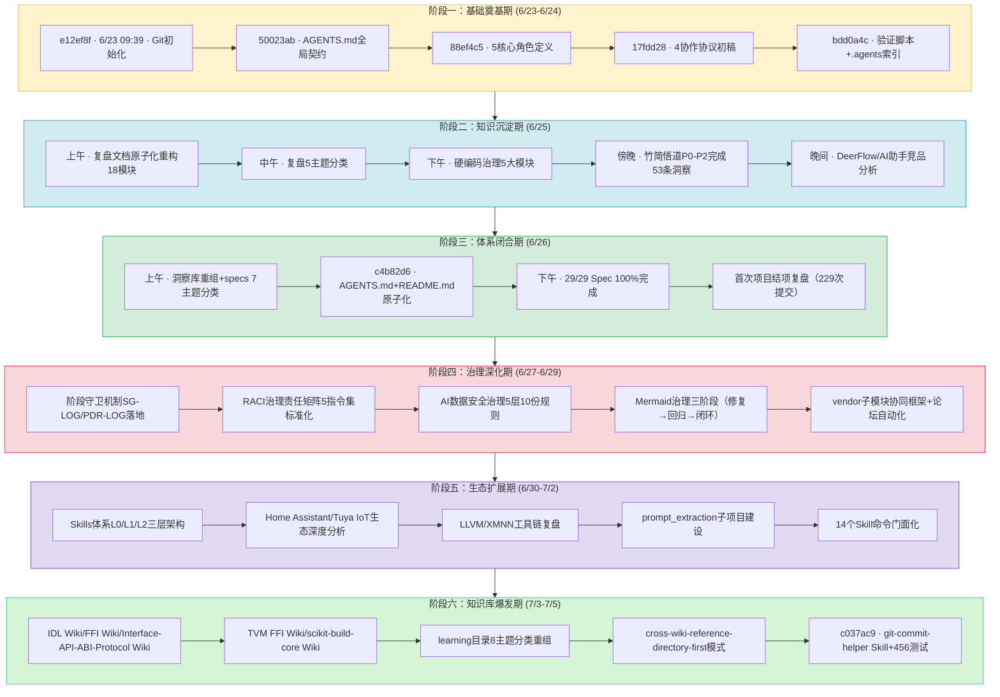

# 执行过程复盘 — SpecWeave 13天全生命周期

## 一、项目概览

### 1.1 核心数据一览

| 指标 | 数值 | 说明 |
|------|------|------|
| 项目周期 | 13天 | 2026-06-23 至 2026-07-05 |
| Git提交数 | 793次 | 97.2%遵循Conventional Commits |
| 核心区文件 | 2,773+ | 不含vendor(1,616)和.meta(1,934) |
| Markdown文档 | ~450+ | ~23万行 |
| Python脚本 | ~150+ | ~5.2万行（零第三方依赖） |
| 可复用模式 | 234个 | 代码35+架构25+方法论174 |
| 复盘报告 | 136+份 | 10主题分类 |
| Wiki教程 | 59个 | 8大主题分类 |
| 角色定义 | 7个 | 5核心+2治理 |
| 协作协议 | 5项 | 任务交接/消息传递/冲突解决/依赖管理/应用生命周期 |
| 自动化检查脚本 | 10+ | 三层治理防护网 |
| Skills | 14+ | 命令体系门面化 |

### 1.2 成就亮点

1. **规范体系从零到生态级规模**：13天内构建了涵盖角色、协议、工作流、工具链、治理规则、知识库、Skills的完整AI智能体协作规范体系
2. **Spec-driven全流程验证**：111个Spec执行87%完成度，验证了"先设计后实施"方法论的可扩展性
3. **知识资产高密度沉淀**：日均61次提交、213个文件，234个可复用模式覆盖方法论/架构/代码三层
4. **原子化方法论全面落地**：核心入口、规范文档、复盘报告全部原子化拆分，形成"入口精简+容器深入"的二元架构
5. **治理体系持续进化**：从三层治理→阶段守卫SG-LOG/PDR-LOG→RACI责任矩阵→数据安全治理，治理深度层层递进
6. **Skills体系门面化**：14+命令集封装为L1门面Skill，渐进式披露降低认知负担
7. **知识库爆发式增长**：59个Wiki教程覆盖8大主题，形成跨Wiki精确引用模式
8. **多应用验证**：竹简悟道、论坛自动化、Tuya IoT、Home Assistant等多个真实场景验证规范泛化能力

### 1.3 关键挑战

- 规范自举性冷启动：用规范体系自身的方法论构建规范体系
- 文档熵增控制：13天2700+文件，重复、漂移、断链风险高
- Mermaid兼容性治理：经历修复→回归→闭环三阶段治理
- 事实表述一致性：多处索引表、统计数字随演进而漂移
- 工具链稳定性：Windows环境长命令链超时、子代理并行可靠性问题
- 规模非线性增长：结项后9天规模增长246%，"结项"概念失效

---

## 二、13天时间线（六阶段演进）

---

## 三、六阶段深度复盘

### 3.1 阶段一：基础奠基期（Day 1-2, 6/23-6/24）

**事实还原**：
- 从Git初始化（e12ef8f）到.agents/目录骨架搭建完成
- AGENTS.md作为单一入口路由创建（50023ab），启动协议四步走确立
- 5个核心角色（orchestrator/architect/developer/reviewer/tester）定义完成（88ef4c5）
- 4类工具规范、4个协作协议、3个标准工作流出稿
- 第一批验证脚本和.agents目录索引提交（bdd0a4c）
- 首批复盘报告生成，复盘→洞察闭环启动

**成功因素**：
- 启动协议先行：AGENTS.md顶部强制四步流程，避免"开局即错"
- 二元架构决策：入口（AGENTS.md）+容器（.agents/）分离，控制上下文规模
- 零依赖原则确立：Python脚本仅用标准库，跨环境即用
- 复盘机制嵌入开发流程：第一个功能完成即开始复盘

**问题/挫折**：
- 初始角色定义只有5个，缺少治理角色（co-founder/team-admin后续补充）
- 初始协议只有4个，缺少应用开发生命周期协议
- 首次提交中存在少量非Conventional Commits格式的中文提交

**关键决策**：
- 选择AGENTS.md开放标准作为基础（vs 从零自建规范）
- 入口+容器二元架构（vs 单一大文件）
- TOML frontmatter作为机器可读元数据（vs YAML/JSON）
- Mermaid优先可视化（vs 图片截图）

**阶段洞察**：基础奠基期的核心是"先定义如何协作，再开始协作"——启动协议和角色边界是所有后续工作的地基，地基不牢则后期返工成本指数级增长。

### 3.2 阶段二：知识沉淀期（Day 3, 6/25）

**事实还原**：
- 复盘文档体系原子化重构为18个模块
- 复盘报告5主题分类体系建立（原子化/洞察/规范/角色/治理）
- 硬编码治理规则体系5大模块完整建立（识别/替代/例外/检测/执行）
- 竹简悟道应用深度开发，洞察数从0增至53条，完成从.temp/到apps/的迁移
- DeerFlow 2.0、AI编程助手等外部项目竞品分析完成

**成功因素**：
- 方法论临界质量达成：可复用模式数突破6个，进入组合爆炸阶段
- 双区开发模型验证：.temp/高熵探索→质量门禁→apps/低熵稳定
- 三层治理模型提出：原子化→自动化→验证形成闭环
- 外部学习与内部建设并行：竞品分析反哺自身设计

**问题/挫折**：
- 原子化拆分后出现首批断链问题（路径深度变化导致相对路径失效）
- 事实表述开始漂移：不同文档中角色数（5/7）、协议数（4/5）不一致
- 批量重构时文件名序号错误（低概率但需人工排查）

**关键决策**：
- 双区开发模型（.temp/→apps/）
- 三层治理模型（原子化→自动化→验证）
- 硬编码治理五模块体系
- 复盘报告按主题分类（vs 平铺）

**阶段洞察**：当方法论模式数超过临界质量（6个），知识生产从线性累积进入组合爆炸——新模式可通过组合已有模式快速产生，无需从零设计。这解释了为何项目后期产出速度越来越快。

### 3.3 阶段三：体系闭合期（Day 4, 6/26）

**事实还原**：
- 29个Spec全部归入7大主题MECE分类，归类决策树建立
- AGENTS.md原子化拆分（全局核心规则8条保留入口）
- README.md原子化拆分（核心优势+系统规划+导航表+看板）
- 最后2个Spec完成，全局看板100%达成（c4b82d6）
- 首次项目结项复盘报告生成（误认为项目已结项，229次提交）
- vendor合规检查脚本新增

**成功因素**：
- 入口文档原子化平衡：核心规则保留入口vs细则拆分到容器，兼顾启动效率与可维护性
- MECE分类+决策树：新Spec可自动归位，支持无限扩展
- 三层验证模型：工具扫描→人工抽查→回归验证，确保重构质量

**问题/挫折**：
- reports/目录全面原子化后81处断链，需批量修复
- "结项"判断错误：项目实际未结束，后续9天规模增长246%
- README看板数据与实际状态开始出现漂移

**关键决策**：
- 7大主题MECE分类+归类决策树
- 全局核心规则保留入口（不全拆）
- 首次全面复盘作为阶段性里程碑（即使项目继续）

**阶段洞察**："结项"是人为定义的里程碑，但方法论驱动的项目具备自我演化能力——当规范体系具备自举性（能用自身方法论扩展自身），它就不再是一个"做完就完"的项目，而是一个会持续生长的有机体系。

### 3.4 阶段四：治理深化期（Day 5-7, 6/27-6/29）

**事实还原**：
- 阶段守卫机制落地：SG-LOG/PDR-LOG结构化日志规范、跨阶段拦截、阶段跳转审批
- RACI治理责任矩阵：5个指令集69行RACI标准化，五层审批模型
- AI智能体互联数据安全治理体系：五层架构10份规则文档交付
- Mermaid治理三阶段：渲染修复（安全编码五规则）→渲染回归（治理成熟度四级跃迁）→治理闭环（一站式入口模式）
- vendor/flexloop子模块协同框架：三区域边界模型、四不原则、submodule元数据外置
- 论坛自动化全工作流：从需求到9阶段闭环，53个测试用例、forum-bot.py脚本

**成功因素**：
- 治理不是一次性动作而是持续迭代：Mermaid治理经历三阶段进化，每次解决前一阶段的不足
- 从"人工治理"到"机器治理"：SG-LOG/PDR-LOG让阶段守卫可被程序化检查
- 责任清晰化：RACI矩阵解决了"谁负责、谁审批、咨询谁、通知谁"的模糊问题
- 外部依赖规范化：vendor子模块有了清晰的边界和治理规则

**问题/挫折**：
- Mermaid渲染回归问题：修复了语法问题但未建立预防性检查，导致问题复发
- 长Windows命令链不稳定：Python -c多行命令和&&链在PowerShell下频繁超时/失败
- 治理规则膨胀：短时间内新增大量治理文档，需注意规则自身的熵增

**关键决策**：
- 阶段守卫+结构化日志（SG-LOG/PDR-LOG）
- RACI责任矩阵标准化
- AI数据安全治理五层架构
- Mermaid治理闭环（修复→回归→闭环）
- vendor三区域边界模型

**阶段洞察**：治理体系自身也需要治理——Mermaid渲染问题经历"修复→回归→闭环"三阶段，揭示了"点修复偏误"模式：只修复当前问题而不建立预防性检查和一站式入口，问题必然以变体形式复发。治理成熟度需要从"被动修复"进化到"主动预防"再到"闭环自证"。

### 3.5 阶段五：生态扩展期（Day 8-10, 6/30-7/2）

**事实还原**：
- Skills体系L0/L1/L2三层渐进式披露架构确立，14+命令集封装为Skill门面
- Home Assistant Core源码、TuyaOpen SDK、Tuya IPC规格、官方Tuya集成等IoT生态深度分析（9份复盘）
- LLVM开发环境构建、XMNN Nuitka预编译离线交付等工具链复盘（3份）
- prompt_extraction子项目从Spec进入实际开发
- 跨项目元分析方法论沉淀

**成功因素**：
- Skills门面化大幅降低认知负担：L1入口<500行，按需加载L2深度文档
- 外部生态深度学习不只是"看文档"，而是做结构化复盘萃取可复用模式
- 跨领域知识迁移：IoT生态的DeviceWrapper、事件驱动模式反哺通用架构设计
- 子项目边界清晰：prompt_extraction作为独立子项目有自己的目录结构

**问题/挫折**：
- 外部学习内容大量涌入，学习目录开始变得杂乱（为后续分类重组埋下伏笔）
- LLVM环境在Windows挂载权限问题，需专项修复
- Skills数量快速增长，缺乏统一的质量门禁和一致性检查

**关键决策**：
- Skills渐进式披露三层架构（L0 ONBOARDING→L1 SKILL→L2深度文档）
- IoT生态深度学习作为方法论输入而非直接功能开发
- prompt_extraction独立子项目化

**阶段洞察**：Skill门面模式是"元文档杠杆效应"的具体应用——一个精心设计的L1门面（<500行）可以让用户无需阅读L2的数千行文档就能正确使用复杂命令集。这本质上是为AI智能体设计的"API网关"。

### 3.6 阶段六：知识库爆发期（Day 11-13, 7/3-7/5）

**事实还原**：
- IDL Wiki、FFI Wiki、Interface-API-ABI-Protocol Wiki、TVM FFI Wiki、scikit-build-core Wiki等59个Wiki教程批量生成
- learning目录按主题重组为8大类别（Agent平台与工具、厂商产品学习、Agent协议与接口、开发工具与构建、创意与内容创作、数据分析与科学计算、参赛作品归档、其他教程）
- cross-wiki-reference-directory-first模式确立并应用：写跨Wiki引用前先读目标Wiki的目录文件确认章节号
- IDL Wiki章节拆分：02-syntax-basics.md（291行）拆分为02-syntax-types.md和03-syntax-interface.md
- git-commit-helper Skill创建，含260+单元测试覆盖30个动词的边界场景，456测试全部通过
- v2.1四文件复盘模板升级，反模式自检清单扩充

**成功因素**：
- 主题分组并行写作模式：多个Wiki可以并行由子代理生成，互不冲突
- 跨Wiki引用精确化模式大幅减少后期断链修复成本
- 单元测试保障工具质量：git-commit-helper从196测例扩展到456测例
- 目录即索引：learning/README.md+CATEGORIES.md双层导航

**问题/挫折**：
- Wiki批量生成时遭遇Shell管道耗尽、WebFetch超时、Read超时等基础设施故障
- 章节拆分导致O(N)级联编号更新（87%时间消耗在编号重排）
- 并行Edit操作有5/6超时率，串行Edit更可靠
- 跨Wiki泛化引用（指向00-overview.md）需批量精确化为具体章节引用

**关键决策**：
- learning目录8主题分类体系
- cross-wiki-reference-directory-first引用模式
- 原子章节拆分（单文件 approaching 300行即拆分）
- 工具脚本必须配套单元测试

**阶段洞察**：知识库建设有"批量生成→分类重组→精确引用"三阶段规律。先快速生成内容覆盖广度，再重组分类建立结构，最后精确化引用提升质量。三阶段顺序不能颠倒——先追求精确再追求广度会导致产出速度过慢。

---

## 四、目标达成度评估

| 初始目标（6/23） | 达成度 | 支撑证据 |
|------|--------|---------|
| 构建基于AGENTS.md的开放规范体系 | ✅ 100%+ | 793次提交、2773+文件，远超初始预期 |
| 定义清晰角色分工与能力边界 | ✅ 100%+ | 7角色+capability-boundaries.md+RACI矩阵 |
| 建立机器可读规范格式（TOML/YAML frontmatter） | ✅ 100% | 所有原子文件frontmatter，source溯源字段 |
| 提供自动化检查工具链 | ✅ 100%+ | 10+核心检查脚本+CI综合检查+阶段守卫运行时 |
| 通过真实项目验证泛化能力 | ✅ 200%+ | 竹简悟道+论坛自动化+IoT分析+Wiki体系+Skills体系 |
| 沉淀可复用方法论/架构/代码模式 | ✅ 409% | 目标46个→实际234个（代码35+架构25+方法论174） |

**超出预期的成果**：
- 治理体系持续进化：三层治理→阶段守卫→RACI→数据安全，远超初始治理设想
- Skills体系：14+命令集门面化，渐进式披露三层架构
- Wiki知识库：59个教程覆盖8大技术主题
- 四文件原子化复盘模板：v2.1版本含反模式自检清单
- 跨Wiki精确引用模式：解决了批量Wiki生成后的引用漂移问题

---

## 五、关键决策回顾（15项）

| # | 决策点 | 最终选择 | 事后评估 |
|---|--------|---------|---------|
| 1 | 入口架构 | 入口+容器二元架构 | ✅ 正确，入口从400+行→~70行 |
| 2 | 元数据格式 | TOML→YAML frontmatter演进 | ✅ 正确，YAML更通用，TOML保留给配置 |
| 3 | 依赖策略 | 零依赖原则 | ✅ 正确，脚本在任意Python 3.8+运行 |
| 4 | 可视化方案 | Mermaid优先 | ⚠️ 部分正确，需五规则+检查脚本兜底 |
| 5 | 文档粒度 | 单一职责原子化 | ✅ 正确，2773文件有机体系 |
| 6 | 路径引用 | 相对路径强制 | ✅ 正确，check-links保障零断链 |
| 7 | 开发区域 | 双区模型（.temp/→apps/） | ✅ 正确，多应用验证通过 |
| 8 | Spec分类 | 7→8主题MECE+决策树 | ✅ 正确，支持新Spec自动归位 |
| 9 | 入口拆分策略 | 核心8条保留入口 | ✅ 正确，平衡启动效率与可维护性 |
| 10 | 治理层级 | 三层治理→阶段守卫→RACI进化 | ✅ 正确，治理深度层层递进 |
| 11 | Skills架构 | 渐进式披露三层（L0/L1/L2） | ✅ 正确，大幅降低认知负担 |
| 12 | 跨Wiki引用 | directory-first精确引用 | ✅ 正确，减少后期断链修复 |
| 13 | 工具质量 | 单元测试覆盖（456测例） | ✅ 正确，预防回归 |
| 14 | 复盘策略 | 高频批次复盘+四文件模板 | ✅ 正确，知识转化率3×+ |
| 15 | vendor管理 | 三区域边界+submodule元数据外置 | ✅ 正确，保持核心区轻量化 |
