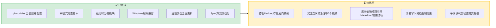
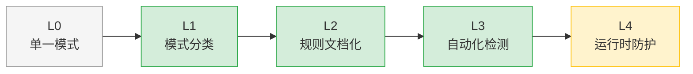

# 改进建议：flexloop 双模式子模块治理后续项

## 改进建议总览

## 待执行建议

### 建议1：修复 flexloop 存量反向依赖链接（优先级：🔴 高）

**责任角色**：developer（flexloop 维护者）
**状态**：⏳ 待执行

提交后验证发现 flexloop 子模块内有 8 处 Markdown 反向依赖链接：
- `docs/topics/designer-deviation.md` L75、L106
- `docs/topics/doc-ahead-of-implementation.md` L117
- `docs/topics/extraction-methodology.md` L125、L139
- `docs/topics/governance-gap.md` L131
- `docs/topics/philosophy-as-dao.md` L136
- `docs/topics/retrospective-rethinking.md` L143
- `docs/topics/skeleton-vs-runtime.md` L123

这些链接都指向 `../../../apps/chaos/.agents/` 路径，是 flexloop 从 AgentForge 拆分出来时的历史遗留链接。当前反向依赖检测对所有文件类型一视同仁，导致这些文档链接被报为错误。

**可选处理方案**：
- **方案A**：在 flexloop 仓库内修复这些链接（改为指向 flexloop 内部对应文档，或标记为外部链接）
- **方案B**：给反向依赖检测添加"仅检查代码文件（.py），忽略 Markdown 文档链接"的配置选项
- **方案C**：将这些链接改为绝对 URL（如有线上文档地址）

**验收标准**：`repo-check.py vendor --deep` 0 错误。

### 建议2：将萃取的5个模式沉淀到模式库（优先级：🟡 中）

**责任角色**：developer
**状态**：⏳ 待执行

本次复盘中萃取的5个可复用模式需要入库：

| 模式名称 | 建议入库路径 | 成熟度 |
|---------|------------|--------|
| 双模式子模块治理框架 | `patterns/methodology-patterns/governance-strategy/dual-mode-submodule-governance.md` | L2（有实践） |
| 新检测规则存量暴露效应 | `patterns/methodology-patterns/tools-automation/legacy-exposure-effect.md` | L2（有实践） |
| 跨平台输出编码强制设置 | `patterns/code-patterns/cross-platform-encoding-enforcement.md` | L2（有实践） |
| 临时路径修改条件导入 | `patterns/code-patterns/temporary-syspath-modification.md` | L2（有实践） |
| 路径锚点语义化 | `patterns/code-patterns/path-anchor-semantization.md` | L1（提炼） |

**验收标准**：5个模式文档创建完成，模式库索引更新。

### 建议3：反向依赖检测添加文件类型过滤配置（优先级：🟡 中）

**责任角色**：developer
**状态**：⏳ 待规划

当前 `_check_reverse_dependency` 检查所有文件类型的相对路径链接，但 Markdown 文档中的历史链接、注释中的路径示例等不应该被视为"反向依赖"。应该添加配置选项：
- 仅检查 `.py` 代码文件的 import/路径引用
- Markdown 链接可配置为 warning 或忽略
- 注释中的路径不检查

**验收标准**：vendor.py 支持文件类型过滤配置，默认仅检查代码文件。

### 建议4：沙箱写入路径强制限制升级（优先级：🟢 低）

**责任角色**：developer
**状态**：⏳ 待规划

当前 `run_flexloop_script()` 沙箱仅通过 `cwd` 和环境变量约定写入路径，没有强制阻止脚本写入其他路径（脚本仍可通过绝对路径写入主项目任意位置）。如果未来需要运行不可信的 flexloop 脚本，应升级为：
- 方案A：使用 `tempfile.TemporaryDirectory` 作为工作目录，脚本输出必须显式复制到允许目录
- 方案B：使用操作系统级权限控制（如 Windows DACL、Linux chroot）
- 方案C：在子进程中拦截文件系统调用（复杂，不推荐初期使用）

**验收标准**：沙箱能可靠阻止脚本写入白名单外路径（可通过测试脚本验证）。

### 建议5：添加子模块开发状态检查与提交指引（优先级：🟢 低）

**责任角色**：developer
**状态**：⏳ 待规划

当 vendor check 发现子模块有未提交修改或 ahead of remote 时，当前只报告状态，没有给出下一步操作指引。应在提示信息中添加：
- 子模块有未提交修改时：提示进入子模块目录 commit/push，或在主仓库提交子模块指针更新
- 子模块 ahead of remote 时：提示推送到 flexloop 远程仓库
- 添加 `--fix` 选项辅助处理（如自动打开子模块目录）

**验收标准**：vendor check 错误/警告信息包含明确的可操作指引。

## 已完成项确认

| # | 任务 | 交付物 | 提交 |
|---|------|--------|------|
| 1 | .gitmodules 添加 branch=main | [.gitmodules](../../../../../../.gitmodules) | `826fb17` |
| 2 | vendor.py 双模式检查支持 | `vendor.py` | `826fb17` |
| 3 | vendor_sandbox.py 运行时沙箱 | [vendor_sandbox.py](../../../../../../.agents/scripts/lib/vendor_sandbox.py) | `826fb17` |
| 4 | check-vendor.py UTF-8 包装 | [check-vendor.py](../../../../../../.agents/scripts/check-vendor.py) | `826fb17` |
| 5 | VENDOR-INTEGRATION.md 协作模式更新 | [VENDOR-INTEGRATION.md](../../../../../knowledge/VENDOR-INTEGRATION.md) | `826fb17` |
| 6 | dependency-management.md 双模式区分 | [dependency-management.md](../../../../../../.agents/protocols/dependency-management.md) | `826fb17` |
| 7 | vendor 元数据更新 | [vendor/README.md](../../../../../../vendor/README.md)、[vendor/VERSION.md](../../../../../../vendor/VERSION.md) | `826fb17` |
| 8 | Spec 方案文档化 | [adjust-vendor-flexloop-governance/](../../../../../../.trae/specs/standards-tools/adjust-vendor-flexloop-governance/) | `826fb17` |
| 9 | 主题看板更新 | [standards-tools/README.md](../../../../../../.trae/specs/standards-tools/README.md) | `826fb17` |

## 治理成熟度评估

基于本次实施，子模块依赖治理的成熟度评估：

**当前位置：L3（自动化检测），向 L4（运行时防护）演进中**

- ✅ L1：双模式分类（third_party/owned_collab），适用场景明确
- ✅ L2：三区域边界模型 + 协作四原则 + 子模块开发流程文档齐全
- ✅ L3：vendor.py 自动检测（分支跟踪、反向依赖、条件导入识别、子模块状态）
- 🟡 L4（部分）：vendor_sandbox.py 基础沙箱（cwd 隔离+环境变量清理），但无强制写入限制

三道防线现状：
- ✅ 第一道（源头预防）：Spec 流程 + 条件导入模板 + 沙箱封装
- ✅ 第二道（自动检测）：vendor.py 四类检查 + CI 集成
- ⏳ 第三道（人工审查）：Code Review 中尚无明确的子模块变更检查项
