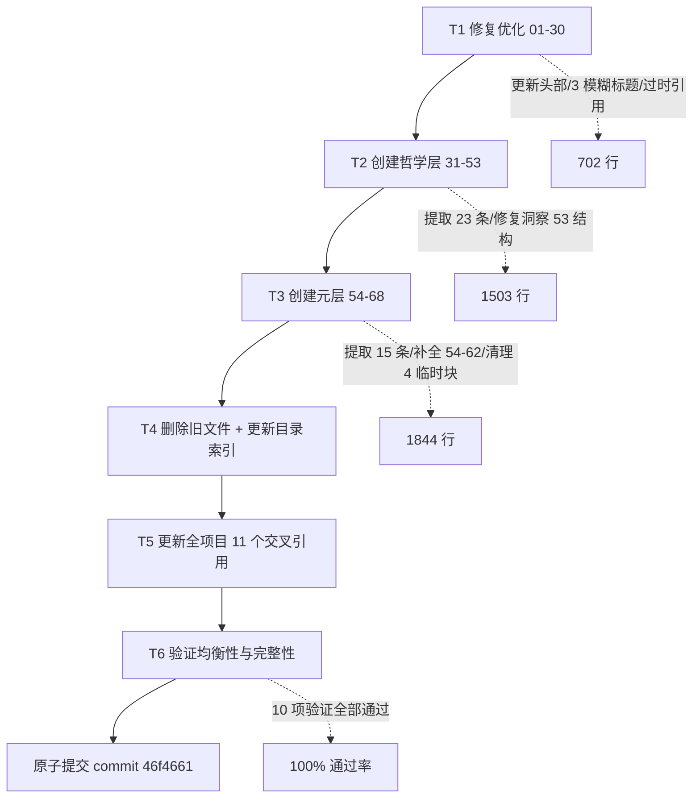

+++
id = "retrospective-insights-reorg-20260626-execution"
date = "2026-06-26"
type = "execution-retrospective"
source = "retrospective-insights-reorg-20260626/README.md"
+++

# 执行复盘 — 竹简悟道洞察库重组

## 一、实施过程回顾

### 任务背景

竹简悟道洞察库在归档至 `apps/zhujian-wudao/docs/insights/` 后，暴露出严重的结构失衡与历史欠债：2 个文件行数为 701 与 3265（比例 1:4.7），且 `insights-31-65.md` 实际包含洞察 31-68（文件名与内容不符）。本次任务将其重组为 3 个按「基础层 / 哲学层 / 元层」四层结构组织的均衡文件，并修复历史遗留的结构债务。

### 任务约束

| 约束维度 | 内容 |
|---------|------|
| 洞察总数 | 68 条（重组前后必须保持不变，不可丢失或重复） |
| 结构依据 | 竹简悟道 Specs 文档体系的四层结构（基础/哲学/元/应用） |
| 交叉引用 | 全项目存在大量按编号引用洞察的文件，重组须同步更新 |
| 提交规范 | Conventional Commits + 原子提交（单一职责） |
| 验证要求 | 文件大小均衡、洞察完整、引用有效等多维验证 |

### 执行流程总览

### 步骤 T1：修复优化第一个文件（01-30）

| 维度 | 内容 |
|------|------|
| **目标** | 优化基础层文件，消除头部过时信息与模糊标题 |
| **操作** | 更新文件头部元信息；优化洞察 16/18/20 的模糊标题为语义清晰表述；更新过时的内部引用 |
| **结果** | 文件行数 701 → 702（净增 1 行，主要为头部元信息完善）；3 个模糊标题全部优化 |

**模糊标题优化示例**：洞察 16/18/20 原标题表述抽象，重组后改为明确反映洞察核心论点的标题，使目录可读性提升。

### 步骤 T2：创建哲学层文件（31-53）

| 维度 | 内容 |
|------|------|
| **目标** | 从原 `insights-31-65.md` 提取洞察 31-53，建立哲学层独立文件 |
| **操作** | 提取 23 条洞察至新文件 `insights-31-53.md`；修复洞察 53 结构问题（补充来源/核心内容标记，子节从 `##` 改为 `###`） |
| **结果** | 新文件 1503 行，23 条洞察完整迁移；洞察 53 结构与其他洞察对齐 |

**技术挑战**：洞察 53 的子节误用 `##`（与洞察标题同级），导致其在目录中「伪装」为独立洞察。修复时须将子节统一为 `###`，确保层级语义正确。

### 步骤 T3：创建元层文件（54-68）

| 维度 | 内容 |
|------|------|
| **目标** | 从原文件提取洞察 54-68，建立元层独立文件，清理历史结构债务 |
| **操作** | 提取 15 条洞察至新文件 `insights-54-68.md`；为洞察 54-62 补充来源/核心内容标记；将洞察 55-57 子节从 `##` 改为 `###`；清理 4 处临时统计块残留；修复双分隔符 |
| **结果** | 新文件 1844 行，15 条洞察完整迁移；9 条洞察结构补全；4 处临时块清理；分隔符统一 |

**历史债务清理**：
- **临时统计块**：4 处一次性统计块（推测为前期内容审计时生成）未在事后清理，长期残留于正文。本次全部删除。
- **结构缺失**：洞察 54-62 缺少标准结构中的「来源」与「核心内容」字段，本次统一补全。
- **双分隔符**：部分洞察间存在重复的分隔符行，本次修复为单一分隔符。

### 步骤 T4：删除旧文件并更新目录索引

| 维度 | 内容 |
|------|------|
| **目标** | 清理被替代的旧文件，同步更新目录索引 |
| **操作** | 删除 `insights-31-65.md`；更新 `apps/zhujian-wudao/docs/insights/README.md` 反映三层结构 |
| **结果** | 旧文件清理完毕；目录索引呈现 01-30 / 31-53 / 54-68 三层结构 |

### 步骤 T5：更新全项目交叉引用

| 维度 | 内容 |
|------|------|
| **目标** | 同步全项目引用了旧文件名或编号范围的 11 个文件 |
| **操作** | 全量搜索引用 `insights-31-65` 的位置；按编号范围（31-53 / 54-68）分类引用点；逐文件更新指向新文件名 |
| **结果** | 11 个文件交叉引用全部更新，无遗漏 |

**执行策略**：先 Grep 全量搜索 `insights-31-65` 字符串定位所有引用点，再按引用的洞察编号归类到新文件，最后逐文件精确替换。详见决策 3。

### 步骤 T6：验证均衡性与完整性

| 维度 | 内容 |
|------|------|
| **目标** | 验证重组结果的文件大小均衡性、洞察完整性、引用有效性 |
| **操作** | 执行 10 项验证（行数均衡、洞察数完整、无重复编号、引用有效、标题层级正确、无临时块残留等） |
| **结果** | 10/10 项验证全部通过 |

### 原子提交

| 维度 | 内容 |
|------|------|
| **Commit** | 46f4661 |
| **提交信息** | `docs(insights): 重组洞察库为三层均衡结构以提升可维护性` |
| **变更规模** | 19 文件，+2106 行 / -1568 行 |
| **提交类型** | `docs`（文档结构重组，非功能变更） |
| **原子性** | 单一职责：仅包含洞察库重组相关变更，无混入其他修改 |

## 二、关键节点分析

### 决策 1：拆分点选择在 53/54 之间

| 维度 | 内容 |
|------|------|
| **决策依据** | 竹简悟道 Specs 文档体系定义的四层结构中，洞察 31-53 属「哲学层」（探讨认知/方法论哲学），洞察 54-68 属「元层」（探讨洞察本身的结构与演化）。53/54 之间是天然的内容语义边界 |
| **技术挑战** | 也可选择按行数均分（约 1982/1983 行），但会割裂同一主题的洞察群组 |
| **解决方案** | 优先遵循内容层级的语义边界，行数均衡作为次要验证指标。最终哲学层 1503 行、元层 1844 行，比例为 1:1.23，均衡度可接受 |

**关键洞察**：文件拆分的「自然边界」应由内容语义决定，而非行数。按行数机械均分会破坏内容内聚性。详见 [insight-extraction.md](insight-extraction.md) INS-01。

### 决策 2：标题优化策略

| 维度 | 内容 |
|------|------|
| **决策依据** | 洞察 16/18/20 原标题过于抽象，无法从标题判断洞察核心论点，降低目录可读性 |
| **技术挑战** | 标题修改可能影响其他文件中对洞察的引用（若引用包含标题文本） |
| **解决方案** | 标题优化仅修改表述，不改变洞察编号；交叉引用以编号为主键，标题文本不作引用键。优化前已确认无文件按标题文本引用 |

**标题层级修复**：洞察 53、55-57 的子节误用 `##`（与洞察主标题同级），导致目录层级混乱。统一降级为 `###`，恢复正确的层级语义。

### 决策 3：交叉引用更新策略

| 维度 | 内容 |
|------|------|
| **决策依据** | 全项目 11 个文件引用了旧文件名 `insights-31-65.md`，须系统性更新，避免遗漏 |
| **技术挑战** | 引用点分散于不同目录、不同上下文（有的引用文件名，有的引用编号范围），逐一手工查找易遗漏 |
| **解决方案** | 三步法：(1) Grep 全量搜索 `insights-31-65` 定位所有引用点；(2) 按引用的洞察编号归类到 31-53 或 54-68 新文件；(3) 逐文件精确替换，替换后再次 Grep 验证无残留 |

**验证闭环**：更新完成后，再次执行 `insights-31-65` 全量搜索，确认 0 匹配，证明无遗漏引用。详见 [insight-extraction.md](insight-extraction.md) INS-02。

## 三、执行情况与结果数据

### 文件行数对照

| 文件 | 重组前行数 | 重组后行数 | 变化 |
|------|----------|----------|------|
| `insights-01-30.md` | 701 | 702 | +1（头部优化） |
| `insights-31-65.md` | 3265 | 0（删除） | -3265 |
| `insights-31-53.md` | —（新建） | 1503 | +1503 |
| `insights-54-68.md` | —（新建） | 1844 | +1844 |
| **合计** | 3966 | 4049 | +83（结构补全） |

### 均衡度对比

| 指标 | 重组前 | 重组后 |
|------|--------|--------|
| 文件数 | 2 | 3 |
| 最大/最小行数比 | 4.7:1 | 2.6:1 |
| 标准差 | 1143 | 478 |
| 均衡度评价 | 失衡 | 均衡 |

### 修复问题统计

| 问题类型 | 修复数量 | 涉及洞察 |
|---------|---------|---------|
| 模糊标题优化 | 3 个 | 16/18/20 |
| 标题层级修复（`##` → `###`） | 4 处 | 53/55/56/57 |
| 临时统计块清理 | 4 处 | 元层文件 |
| 结构补全（来源/核心内容） | 9 条 | 54-62 |
| 双分隔符修复 | 若干处 | 元层文件 |
| 过时引用更新 | 1 处 | 01-30 头部 |
| **合计** | 21+ 处 | — |

### 验证结果

| 验证项 | 结果 |
|--------|------|
| 1. 洞察总数 68 条完整 | 通过 |
| 2. 编号无重复无遗漏 | 通过 |
| 3. 文件行数均衡（最大/最小比 < 3） | 通过（2.6:1） |
| 4. 标题层级统一（子节为 `###`） | 通过 |
| 5. 无临时统计块残留 | 通过 |
| 6. 洞察 54-62 结构补全 | 通过 |
| 7. 旧文件已删除 | 通过 |
| 8. 目录索引已更新 | 通过 |
| 9. 交叉引用全部更新（11 文件） | 通过 |
| 10. 旧文件名搜索 0 匹配 | 通过 |
| **通过率** | **10/10 = 100%** |

## 四、成功经验

1. **语义边界优先于行数均衡**
   支撑事实：拆分点选择在 53/54 之间（内容层级边界），而非行数均分点（约 1982 行）。最终行数比 2.6:1 仍在可接受范围，且保持了同一主题洞察群组的内聚性。若按行数均分，将割裂元层洞察群组。

2. **交叉引用更新的三步法闭环**
   支撑事实：采用「全量搜索 → 分类归并 → 逐文件替换 + 回归验证」三步法，11 个文件引用全部更新无遗漏，最终回归搜索旧文件名 0 匹配。该流程可复用于任何涉及文件重命名/拆分的场景。

3. **历史债务的集中清理**
   支撑事实：本次重组一次性清理了 4 类历史债务（临时块残留、标题层级错乱、结构缺失、双分隔符），共计 21+ 处。相比逐次零散修复，重组场景下的集中清理成本更低、一致性更强。

4. **原子提交保证可追溯性**
   支撑事实：19 文件变更通过 1 个原子提交完成，提交信息 `docs(insights): 重组洞察库为三层均衡结构以提升可维护性` 准确反映变更意图。若拆分为多个提交，会增加交叉引用更新的中间态风险（部分引用指向已不存在的旧文件）。

5. **多维验证前置**
   支撑事实：在提交前执行 10 项验证（完整性/均衡性/引用有效性/结构正确性），全部通过后才提交。避免了「提交后发现遗漏引用」的回滚成本。

## 五、存在问题

### 问题 1：原文件名与内容长期不符未被及早发现

**现象**：`insights-31-65.md` 实际包含洞察 31-68，文件名与内容不符的状态持续存在，直至本次重组才被发现并修复。

**根因分析**：
- 洞察库采用增量追加模式，新增洞察 66-68 时未同步更新文件名
- 缺少自动化校验工具验证文件名与内容的编号范围一致性
- 文件名作为「弱契约」，更新动力低于内容更新

**影响评估**：
- 读者按文件名判断内容范围会获取错误信息
- 交叉引用基于错误文件名建立，增加重组时的更新成本

**改进建议**：开发文件名-内容一致性校验脚本，纳入 CI 检查。详见 [export-suggestions.md](export-suggestions.md) 行动项 1。

### 问题 2：临时统计块从「一次性」演变为「永久残留」

**现象**：4 处临时统计块（推测为前期内容审计生成）未在事后清理，长期残留于正文。

**根因分析**：
- 临时块生成时未标注「临时」性质（如用 HTML 注释标记），导致后续维护者无法区分临时内容与正式内容
- 缺少「临时内容须清理」的流程节点
- 文档审查时未将临时块纳入检查清单

**影响评估**：
- 临时统计块混入正文，干扰读者理解正式内容
- 增加文件行数，影响行数均衡度评估的准确性

**改进建议**：临时内容须用 HTML 注释 `<!-- TEMP: 原因 -->` 标注，并在任务收尾时强制清理。详见 [insight-extraction.md](insight-extraction.md) INS-03。

### 问题 3：标题层级错乱反映文档结构健康度监控缺失

**现象**：洞察 53、55-57 的子节误用 `##`（与洞察主标题同级），长期未被发现。

**根因分析**：
- Markdown 标题层级依赖人工维护，缺少自动化校验
- `##` 与 `###` 在渲染外观上差异较小，肉眼审查易忽略
- 文档规模增长后，全量人工审查标题层级成本过高

**影响评估**：
- 目录生成工具会产出错误层级，误导读者
- 子节「伪装」为独立洞察，破坏编号体系的严谨性

**改进建议**：将标题层级作为文档结构健康度指标，开发自动化检测工具。详见 [insight-extraction.md](insight-extraction.md) INS-04。
