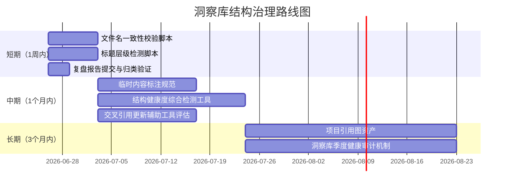

# 导出建议 — 竹简悟道洞察库重组

## 一、改进行动项

### P0 — 立即执行（本次任务已完成）

| # | 问题 | 改进措施 | 优先级 | 预期效果 | 状态 |
|---|------|---------|--------|---------|------|
| 1 | 洞察库 2 文件大小失衡（1:4.7） | 按四层结构拆分为 3 个均衡文件 | P0 | 均衡度提升至 2.6:1 | ✅ 完成 |
| 2 | 文件名与内容不符（31-65 实含 31-68） | 拆分为 31-53、54-68 两个文件 | P0 | 文件名与内容一致 | ✅ 完成 |
| 3 | 标题层级错乱（4 处 `##` 应为 `###`） | 统一降级为 `###` | P0 | 目录层级正确 | ✅ 完成 |
| 4 | 临时统计块残留（4 处） | 删除残留块 | P0 | 正文无临时内容 | ✅ 完成 |
| 5 | 洞察 54-62 结构缺失 | 补充来源/核心内容标记 | P0 | 结构完整一致 | ✅ 完成 |
| 6 | 全项目 11 个交叉引用过时 | 三步法更新全部引用 | P0 | 引用有效无残留 | ✅ 完成 |

### P1 — 短期跟进（1 周内）

| # | 问题 | 改进措施 | 优先级 | 预期效果 | 状态 |
|---|------|---------|--------|---------|------|
| 7 | 无文件名-内容一致性自动化校验 | 开发校验脚本，解析文件首尾洞察编号与文件名范围比对 | P1 | 文件名与内容不符问题自动发现 | 待执行 |
| 8 | 无标题层级自动化检测 | 开发标题层级检测脚本，检查层级严格递进 | P1 | 标题层级错误自动发现 | 待执行 |
| 9 | 本次复盘报告未提交 | 提交 `retrospective-insights-reorg-20260626/` 4 文件 | P1 | 复盘归档可追溯 | 待执行 |
| 10 | 归类验证未执行 | 运行 `.agents/scripts/check-report-categorization.py` | P1 | 确认报告归类正确 | 待执行 |

### P2 — 中期优化（1 个月内）

| # | 问题 | 改进措施 | 优先级 | 预期效果 | 状态 |
|---|------|---------|--------|---------|------|
| 11 | 临时内容无标注规范 | 制定临时内容标注规范（`<!-- TEMP: 原因 -->`），纳入文档写作规范 | P2 | 临时内容可识别、可清理 | 待执行 |
| 12 | 文档结构健康度无综合检测 | 整合标题层级、临时块、结构缺失等检测为综合工具，纳入 CI | P2 | 文档结构债务早发现 | 待执行 |
| 13 | 交叉引用更新无工具支持 | 评估开发交叉引用更新辅助工具（基于三步法） | P2 | 引用更新效率提升 | 待执行 |

### P3 — 长期规划（3 个月内）

| # | 问题 | 改进措施 | 优先级 | 预期效果 | 状态 |
|---|------|---------|--------|---------|------|
| 14 | 项目引用关系不可视 | 维护项目「引用图」资产，支持可视化查看文件间依赖 | P3 | 重组成本降低 | 待执行 |
| 15 | 洞察库无定期健康审计 | 建立洞察库季度健康审计机制（结构/引用/完整性） | P3 | 结构债务不积累 | 待执行 |

---

## 二、可复用方法论

### 方法论 1：四层结构拆分法

本次重组验证的核心方法论，用于将失衡文件按内容层级重组为均衡文件群。

```
1. 识别内容分层 → 2. 定位语义边界 → 3. 验证规模均衡 → 4. 按边界拆分 → 5. 交叉引用更新 → 6. 多维验证
```

| 步骤 | 关键原则 | 验证指标 |
|------|---------|---------|
| 1. 识别内容分层 | 依据内容主题/职责，非行数 | 层级划分清晰 |
| 2. 定位语义边界 | 优先相邻层交界 | 边界处无内容割裂 |
| 3. 验证规模均衡 | 最大/最小比 < 3 | 均衡度达标 |
| 4. 按边界拆分 | 保持内容完整性 | 无洞察丢失/重复 |
| 5. 交叉引用更新 | 三步法闭环 | 旧引用 0 残留 |
| 6. 多维验证 | 完整性/均衡性/引用/结构 | 验证项 100% 通过 |

**复用条件**：
- 文件规模失衡（最大/最小比 > 3）
- 内容存在天然分层结构
- 全项目存在交叉引用

### 方法论 2：交叉引用更新三步法

本次重组验证的引用更新闭环方法，确保文件拆分/重命名后引用无遗漏。

```
1. 全量搜索（定位引用点） → 2. 分类归并（映射到新目标） → 3. 逐文件替换 + 回归验证（闭环确认）
```

| 步骤 | 输入 | 输出 | 关键工具 |
|------|------|------|---------|
| 1. 全量搜索 | 旧文件名/标识 | 引用点清单 | Grep |
| 2. 分类归并 | 引用点 + 新文件结构 | 引用-目标映射 | 人工分类 |
| 3. 逐文件替换 + 回归验证 | 映射表 | 更新后文件 + 0 残留确认 | Edit + Grep |

**与机械全局替换的区别**：分类归并步骤确保每条引用指向语义正确的新文件，而非机械统一替换。对于文件拆分（一对多）场景，这一步骤不可省略。

**复用条件**：
- 文件重命名/拆分/合并引发引用更新
- 引用点分散于多文件
- 需要可证明的更新完整性

### 方法论 3：历史债务集中清理模式

本次重组验证的债务清理模式，适用于重组/重构场景下的历史债务处理。

```
重组契机 → 全量债务识别 → 集中清理 → 验证无残留
```

| 阶段 | 动作 | 优势 |
|------|------|------|
| 重组契机 | 借重组场景触发债务清理 | 成本分摊至重组任务 |
| 全量识别 | 系统性识别所有类型债务 | 避免零散修复的遗漏 |
| 集中清理 | 一次性清理所有债务 | 一致性强、成本低 |
| 验证无残留 | 多维验证确认清理完整 | 可证明的清理结果 |

**与零散修复的对比**：零散修复每次只处理单类债务，成本高、一致性差；集中清理借重组契机一次性处理，边际成本低。

---

## 三、风险预警

### 风险 1：交叉引用更新遗漏导致断链

**现象**：本次重组涉及 11 个文件的交叉引用更新。若遗漏某个引用文件，将导致指向已删除的 `insights-31-65.md` 的断链。

**风险等级**：高

**预防措施**：
- **即时**：本次已通过回归搜索（旧文件名 0 匹配）确认无遗漏
- **短期**：将交叉引用完整性检查纳入 CI（检测指向不存在文件的引用）
- **长期**：维护项目引用图，重组前自动生成受影响文件清单

**监测指标**：CI 中断链检测的告警数。

### 风险 2：结构债务再次积累

**现象**：本次清理了 21+ 处结构债务，但若不建立预防机制，新债务会再次积累。特别是：
- 新增洞察时可能再次省略「来源/核心内容」字段
- 临时统计块可能再次生成且未标注
- 标题层级可能再次错乱

**风险等级**：中

**预防措施**：
- **短期**：制定洞察新增规范，明确必填字段（来源/核心内容）
- **中期**：开发结构健康度检测工具，纳入 CI
- **长期**：建立定期健康审计机制（季度）

**监测指标**：CI 结构检测的告警数、季度审计发现的新债务数。

### 风险 3：四层结构边界随内容增长而模糊

**现象**：本次拆分依据四层结构（基础/哲学/元/应用）。随着洞察库持续增长，未来可能出现：
- 新洞察难以明确归类到某一层（跨层主题）
- 某一层文件规模再次失衡
- 层级定义本身需要演进

**风险等级**：中

**预防措施**：
- **即时**：在目录索引中明确各层的定义与边界
- **中期**：建立新洞察归类的决策规则（若跨层，归入主主题层）
- **长期**：当单层文件超过阈值（如 2000 行）时，触发该层的二次细分

**监测指标**：各层文件行数、跨层洞察占比。

---

## 四、后续优化方向

### 路线图建议



### 优化方向详述

#### 方向 1：文档结构健康度自动化检测体系

**目标**：将本次手工发现的结构债务类型转化为自动化检测，纳入 CI。

**检测项**：
| 检测项 | 检测方法 | 严重级别 |
|--------|---------|---------|
| 文件名-内容一致性 | 解析首尾洞察编号，与文件名范围比对 | 错误 |
| 标题层级递进性 | 检查标题层级是否严格递进，无跳级 | 错误 |
| 标准结构完整性 | 检查每条洞察是否包含必填字段 | 警告 |
| 临时块残留 | 检测无标注的疑似临时统计块 | 警告 |
| 引用有效性 | 检测指向不存在文件的引用 | 错误 |

**预期收益**：结构债务在引入时即被发现，避免积累至重构阈值才触发清理。

#### 方向 2：交叉引用维护工具化

**目标**：降低文件拆分/重命名场景下的引用更新成本。

**工具功能**：
- 输入旧文件名 → 自动输出所有引用点清单
- 输入拆分映射（旧文件 → 新文件群）→ 自动生成引用更新建议
- 执行更新后 → 自动回归验证无残留

**预期收益**：引用更新耗时从「小时级」降至「分钟级」。

#### 方向 3：洞察库健康审计机制

**目标**：建立定期审计机制，防止结构债务积累。

**审计维度**：
| 维度 | 指标 | 阈值 |
|------|------|------|
| 规模均衡 | 最大/最小行数比 | < 3 |
| 结构完整 | 必填字段缺失率 | 0% |
| 引用有效 | 断链数 | 0 |
| 层级正确 | 标题层级错误数 | 0 |
| 命名一致 | 文件名-内容不符数 | 0 |

**审计频率**：季度

**预期收益**：结构债务不积累，避免大规模重构的周期性需求。

---

## 五、知识资产导出

### 本次任务产出的知识资产

| 资产类型 | 资产名称 | 存储位置 | 成熟度 |
|---------|---------|---------|--------|
| 方法论 | 文件拆分的自然边界识别原则 | 本报告 insight-extraction.md INS-01 | L3 |
| 方法论 | 交叉引用更新三步法 | 本报告 insight-extraction.md INS-02 | L3 |
| 概念 | 结构债务的渐进式积累模式 | 本报告 insight-extraction.md INS-03 | L2 |
| 概念 | 标题层级作为文档结构健康度指标 | 本报告 insight-extraction.md INS-04 | L2 |
| 方法论 | 四层结构拆分法 | 本报告 insight-extraction.md | L3 |
| 方法论 | 历史债务集中清理模式 | 本报告 export-suggestions.md | L2 |

### 建议入库路径

| 资产 | 当前位置 | 建议目标 | 入库条件 |
|------|---------|---------|---------|
| INS-01 自然边界识别原则 | 本报告 | `docs/retrospective/patterns/methodology-patterns/` | L3 已达入库标准 |
| INS-02 交叉引用更新三步法 | 本报告 | `docs/retrospective/patterns/methodology-patterns/` | L3 已达入库标准 |
| 四层结构拆分法 | 本报告 | `docs/retrospective/patterns/methodology-patterns/` | L3 已达入库标准 |
| INS-03 结构债务积累模式 | 本报告 | `docs/retrospective/concepts/` | L2，待第 2 次验证后入库 |
| INS-04 标题层级健康度指标 | 本报告 | `docs/retrospective/concepts/` | L2，待工具实现后入库 |
