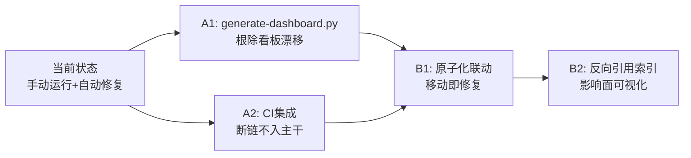

+++
id = "retrospective-link-fix-depth-adjustment-20260626-suggestions"
type = "suggestions"
date = "2026-06-26"
parent = "retrospective-link-fix-depth-adjustment-20260626"
+++

# 改进建议与行动计划

## 一、改进建议总表

| 问题 | 改进措施 | 优先级 | 预期效果 | 状态 |
|------|---------|--------|---------|------|
| README 看板数据手动同步易漂移 | 开发 `generate-dashboard.py` 自动从 .trae/specs/ 聚合状态 | 高 | 根除看板数据漂移，数字始终准确 | 待规划 |
| 重构后需要手动运行 check-links | 将 `check-links.py --fix` 集成到 CI 检查（ci-check.ps1） | 高 | 断链问题在 CI 阶段被发现，不进入主干 | 待规划 |
| 原子化操作时引用方不更新 | 在原子化脚本中集成引用扫描与路径自动更新 | 中 | 原子化完成后链接自动正确，无需事后修复 | 待规划 |
| 外部链接可达性未验证 | 定期运行 `--check-external` 检查外部链接 | 低 | 发现失效的外部 URL | 待规划 |
| 缺少链接依赖关系视图 | 构建文件引用关系图（反向索引） | 低 | 移动文件时可快速定位所有受影响的引用方 | 待规划 |

## 二、行动计划

### 高优先级行动项

| 序号 | 改进项 | 具体措施 | 建议时间 | 状态 |
|------|--------|---------|---------|------|
| A1 | 开发看板自动生成脚本 | 新增 `.agents/scripts/generate-dashboard.py`，扫描 `.trae/specs/*/tasks.md` 聚合状态，自动更新 README.md 的 Spec 执行进度章节 | 2026-06-27 | 待规划 |
| A2 | CI 集成链接检查 | 修改 `.agents/scripts/ci-check.ps1`，在现有检查后增加 `python .agents/scripts/check-links.py` 步骤，断链时返回非零退出码 | 2026-06-27 | 待规划 |

### 中优先级行动项

| 序号 | 改进项 | 具体措施 | 建议时间 | 状态 |
|------|--------|---------|---------|------|
| B1 | 原子化脚本联动更新 | 研究原子化脚本（如 check-atomization-*.py）的调用入口，在文件移动后自动运行 `check-links.py --fix` 更新引用 | 2026-06-28 | 待规划 |
| B2 | 反向引用索引 | 可选开发 `.agents/scripts/build-ref-index.py`，构建 `{目标文件: [引用文件列表]}` 的反向索引，移动文件时可列出受影响文件 | 2026-06-30 | 待规划 |

### 低优先级行动项

| 序号 | 改进项 | 具体措施 | 建议时间 | 状态 |
|------|--------|---------|---------|------|
| C1 | 外部链接定期检查 | 每周/每两周运行一次 `python .agents/scripts/check-links.py --check-external`，检查外部 URL 可达性 | 按需 | 待规划 |

## 三、模式成熟度更新

| 模式 ID | 成熟度变化 | 触发原因 | 更新时间 | 验证/复用次数 |
|---------|-----------|---------|---------|-------------|
| pattern-relative-depth-adjustment | L1 → L2 | 算法实现完成，通过 7 个测试用例 + 14 个真实断链验证，全量扫描零误报 | 2026-06-26 | 1 次实战验证 |
| pattern-fix-priority-chain | L1 → L2 | 在 link_fixer.py 中按精确→模糊顺序实现了 5 级修复链，工作稳定 | 2026-06-26 | 1 次实战验证 |
| pattern-dry-run-first | L2 → L3 | 本次再次验证 dry-run 模式对安全修改的重要性，与历次实践一致 | 2026-06-26 | 多次复用 |

## 四、check-links.py --fix 当前支持的修复类型清单

本次增强后，`--fix` 模式可自动修复以下类型的断链：

| 修复类型 | 说明 | 精确度 |
|---------|------|--------|
| `file:///` 绝对路径转相对路径 | 将本地绝对路径转换为相对于源文件的相对路径 | 高 |
| **相对路径层级校正**（新增） | 自动调整 `../` 层数 ±3 级，处理目录迁移/原子化后的断链 | 高 |
| 目录链接尾部斜杠补全 | 目录引用自动解析为下的 `README.md` | 高 |
| 顶级目录根路径识别 | 以 `docs/`、`.agents/`、`.trae/`、`prompt_extraction/` 开头的路径自动从项目根解析 | 高 |
| 文件名重命名映射 | 已知的文件重命名自动映射（如 SUMMARY.md → AGENTS.md） | 高 |
| 文件名模糊搜索 | 基于 basename 在全项目搜索同名文件（兜底） | 中（可能有歧义） |

使用方法：

```bash
# 预览所有可修复的断链（不修改文件）
python .agents/scripts/check-links.py --fix --dry-run

# 实际执行修复
python .agents/scripts/check-links.py --fix

# 同时检查外部链接
python .agents/scripts/check-links.py --fix --check-external
```

## 五、后续优化方向

### 路线图



### 与现有工具链整合

- 新增的 `generate-dashboard.py` 可在规范稳定后纳入 `ci-check.ps1`，确保 README 看板始终是最新状态
- `check-links.py --fix` 可作为原子化操作后的标准清理步骤，在 `.agents/commands/atomization.md` 流程文档中补充
- 本次新增的"相对路径层级校正"算法可作为通用工具函数，在未来开发文件重命名/移动工具时复用
