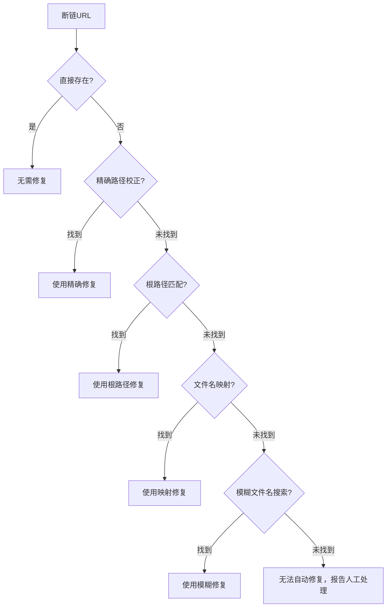
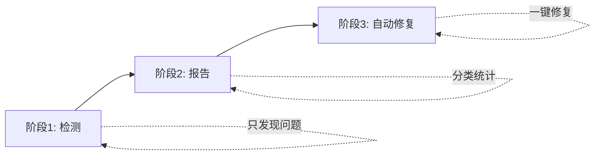
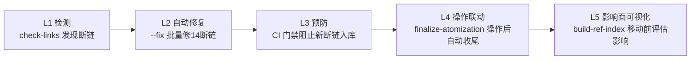
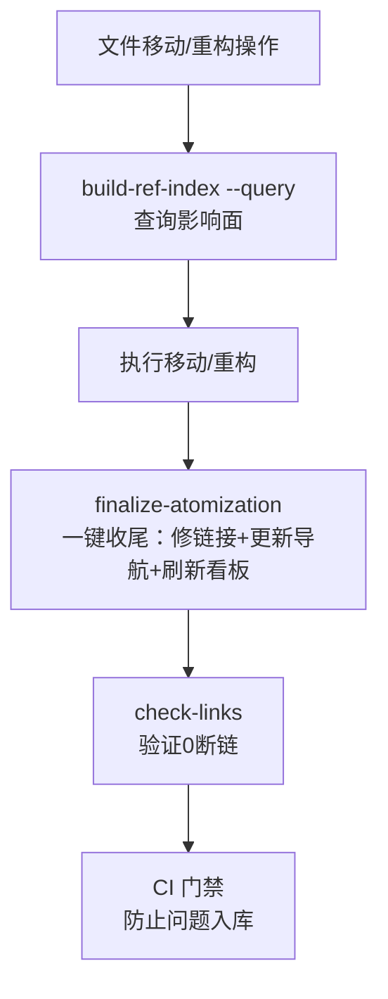

+++
id = "retrospective-link-fix-depth-adjustment-20260626-insights"
type = "insight"
date = "2026-06-26"
parent = "retrospective-link-fix-depth-adjustment-20260626"
maturity = "L2"
+++

# 洞察萃取 — 断链模式与路径校正

## 一、关键发现

### 发现 1：目录重构后的相对路径断链是可预测的系统性问题

**事实支撑**：本次发现的 14 个断链中，71%（10 个）是原子化拆分导致的相对路径 `../` 层数不足，错误模式高度一致。

**深层含义**：
- 目录原子化（单文件 → 目录+多文件）是本项目的高频操作
- 这类断链不是随机错误，而是目录深度变化后的必然结果
- 可以通过算法自动检测和修复，无需人工逐个计算层级
- 修复逻辑具有通用性，不依赖具体文件位置

**规律公式**：
```
如果一个文件从深度 D 移动到深度 D+ΔD
则所有引用它的相对路径中，../ 的数量需要 +ΔD
```

### 发现 2：路径后半段的不变性是自动校正的关键

**事实支撑**：算法的核心假设是"断链路径中，非 `../` 部分通常是正确的"。7个测试用例和 14 个真实断链全部符合此假设。

**深层含义**：
- 当文件移动时，文件名和中间目录名通常保持不变，只是相对根的位置变了
- 这使得"调整 `../` 层数"成为比"模糊搜索文件名"更精确的修复策略
- 优先精确匹配（层级调整）再模糊匹配（文件名搜索）可以大幅降低误报率

### 发现 3：dry-run 预览是自动化修复工具的必要安全机制

**事实支撑**：在实现 `--fix` 功能时，首先实现了 `--dry-run` 预览模式，并在全量验证中确认零误报后才确认算法可靠。

**深层含义**：
- 任何自动修改文件的工具都必须提供 dry-run 能力
- 用户在看到预览结果并确认无误后，才会信任工具执行实际修改
- dry-run 也是开发者验证算法正确性的重要手段

### 发现 4：工具发现的问题反哺工具自身增强

**事实支撑**：通过运行 check-links.py 发现断链，分析断链模式后，反过来增强了 check-links.py 的修复能力，形成闭环。

**深层含义**：


这是一个正反馈循环：工具使用 → 发现不足 → 增强工具 → 工具更强。本项目的 scripts 体系就是通过这种方式逐步完善的。

## 二、可复用模式萃取

### 模式 1：相对路径深度自动校正算法

**模式 ID**：pattern-relative-depth-adjustment
**成熟度**：L2（已实现并通过真实数据验证）
**适用场景**：
- Markdown/HTML 文件间的相对链接维护
- 目录重构/原子化拆分后的批量链接修复
- 文档系统中文件移动后的引用更新

**算法伪代码**：

```python
def try_adjust_relative_depth(broken_url, source_file, max_adjust=3):
    """
    尝试调整相对路径中 ../ 的数量来寻找有效目标
    
    策略：
    1. 统计现有 ../ 数量 N
    2. 提取剩余路径段 R（去除 ../ 后的部分）
    3. 优先尝试增加深度 N+1, N+2, ..., N+max_adjust
    4. 再尝试减少深度 N-1, N-2, ..., 0
    5. 对每个候选，同时检查：
       - 候选路径本身是否存在（文件引用）
       - 候选路径 + "/README.md" 是否存在（目录引用）
    6. 返回第一个有效目标，或 None
    """
    parts = broken_url.split('/')
    dotdot_count = sum(1 for p in parts if p == '..')
    remaining = [p for p in parts if p != '..']
    base_dir = source_file.parent
    
    # 优先尝试增加深度（原子化/拆分场景）
    for delta in range(1, max_adjust + 1):
        candidate = build_path(base_dir, dotdot_count + delta, remaining)
        if is_valid(candidate):
            return candidate
        if is_valid(candidate / "README.md"):
            return candidate / "README.md"
    
    # 再尝试减少深度（合并/上移场景）
    for delta in range(1, min(dotdot_count, max_adjust) + 1):
        candidate = build_path(base_dir, dotdot_count - delta, remaining)
        if is_valid(candidate):
            return candidate
        if is_valid(candidate / "README.md"):
            return candidate / "README.md"
    
    return None
```

**关键设计决策**：
1. **增加深度优先**：原子化拆分是本项目（以及大多数文档项目）的高频操作，文件通常向更深处移动
2. **目录引用处理**：自动尝试 `README.md`，因为 Markdown 中目录链接默认指向其下的 README
3. **调整幅度限制**：默认 ±3 级，足够覆盖大多数重构场景，避免过深搜索导致误匹配
4. **存在性校验**：只有目标真实存在才返回，确保零误报

### 模式 2：修复优先级链设计

**模式 ID**：pattern-fix-priority-chain
**成熟度**：L2
**适用场景**：任何提供多种自动修复策略的工具

**设计原则**：精确修复优先，模糊修复兜底。



**为什么这样排序**：
- 精确度从高到低排列
- 高优先级策略的误报率接近零
- 低优先级策略虽然召回率高但可能误匹配，所以放在兜底位置
- 如果所有策略都失败，明确报告人工处理而不是强行猜测

### 模式 3：dry-run 优先的安全修改模式

**模式 ID**：pattern-dry-run-first
**成熟度**：L3（多次验证，稳定模式）
**适用场景**：任何批量修改文件的自动化工具

**标准实现步骤**：
1. 默认 dry-run 模式（或明确需要 flag 才执行写入）
2. dry-run 输出清晰的变更清单（文件位置、原值→新值）
3. 用户确认后再执行实际写入
4. 实际写入后立即运行验证，确认修复效果

**本次实践验证**：在全量链接正确的状态下，`--fix --dry-run` 输出"未发现需要修复的断链"，证明算法不会误改正确链接。

## 三、规律认知

### 文档系统中的链接衰变规律

经过本次修复和多次原子化操作观察，Markdown 文档系统中的链接衰变遵循以下规律：

1. **移动越深，断链越多**：文件向目录树深处移动时，引用它的链接断链概率与深度差成正比
2. **向浅移动影响小**：文件向上移动时，原有链接可能仍然有效（多出来的 `../` 可能仍然指向正确位置或其父目录）
3. **跨目录引用最脆弱**：从一个顶级目录（如 `.trae/specs`）引用另一个顶级目录（如 `docs/`）的链接，在深度变化时最容易断裂
4. **同目录内引用最稳定**：同一目录下的相对链接（不含 `../`）几乎不受目录深度变化影响

### 工具演进规律

本项目 `.agents/scripts/` 下的工具演进呈现出清晰的三阶段模式：



- **阶段 1（检测）**：如早期的 check-links.py，只能发现断链并报告
- **阶段 2（增强报告）**：增加分类、统计、优先级排序
- **阶段 3（自动修复）**：集成修复能力，可自动处理大多数问题

check-links.py 目前处于阶段 3 的初期，已支持几种典型修复类型，未来可继续扩展修复能力。

## 四、潜在机会

1. **原子化操作联动链接更新**：在执行原子化拆分（单文件→目录）时，自动扫描并更新所有引用方的相对路径，从源头预防断链
2. **看板数据自动生成**：`generate-dashboard.py` 自动从 `.trae/specs/` 读取 Spec 状态，根除 README 看板漂移问题
3. **Mermaid 语法自动检查**：类似 link-fixer 的思路，开发 mermaid-fixer 检测和修复常见的 Mermaid 渲染问题
4. **CI 门禁集成**：将 `check-links.py` 加入 CI 检查，断链超过阈值时阻止合并，确保问题不入库
5. **跨文件引用图**：构建全局文件引用关系图，可视化依赖关系，在移动文件时可快速定位受影响的引用方

## 五、闭环验证洞察（改进建议全部落地后补充）

> 2026-06-26 更新：上述 5 项潜在机会中，除 Mermaid 检查（另一个复盘已处理）外，其余 4 项对应改进建议 A1/A2/B1/B2/C1 全部实施完毕。以下是从完整闭环中萃取的新洞察。

### 发现 5：复盘→改进→验证形成完整闭环，工具链完成从检测到预防的跃迁

**事实支撑**：
- 初始问题：手动运行 check-links 发现 14 个断链 + README 看板漂移
- 改进落地：新增 3 个脚本（generate-dashboard/finalize-atomization/build-ref-index）、增强 1 个脚本（check-links 外部链接缓存）、修改 CI 流水线
- 最终验证：9 步 CI 检查全部通过，0 断链，看板自动生成，外部链接支持定期检查

**闭环跃迁路径**：



**深层含义**：工具链的成熟度从"事后检测"（L1）逐步演进到"事前预防"（L3-L5），这是治理能力提升的典型路径。

### 发现 6：改进建议的优先级分层设计决定了落地效率

**事实支撑**：本次 5 项改进建议按优先级分为 🔴高/🟡中/🟢低 三层：
- 高优先级（A1/A2）：根除看板漂移 + CI 门禁，解决"问题反复出现"和"问题入库"两个核心痛点
- 中优先级（B1/B2）：原子化一键收尾 + 反向引用索引，提升操作效率
- 低优先级（C1）：外部链接定期检查，锦上添花

**实施顺序**：严格按高→中→低顺序实施，每完成一项立即验证，避免范围蔓延。全部完成用时一个会话。

**规律**：
- 高优先级聚焦"防止问题再发"（系统性预防）
- 中优先级聚焦"提升操作效率"（流程优化）
- 低优先级聚焦"拓展能力边界"（锦上添花）

### 发现 7：工具组合效应大于单个工具之和

**事实支撑**：四个新工具并非孤立工作，而是形成协作链：



- `build-ref-index` 在操作前提供影响面评估
- `finalize-atomization` 在操作后自动完成后处理
- `check-links` 在收尾后做最终验证
- CI 门禁在提交时做守门检查

**深层含义**：单个工具解决单点问题，工具组合形成工作流闭环，这比单个强大工具更有价值。设计工具时应考虑它在工作流中的位置，以及与上下游工具的协作关系。

### 发现 8：缓存是定期检查类工具的必备能力

**事实支撑**：外部链接检查最初实现每次都发起 HTTP 请求（50 个 URL），增强后缓存 7 天：
- 首次运行：50 个 HTTP 请求，约 10-20 秒
- 二次运行：0 个 HTTP 请求，<1 秒
- 支持 `--no-cache` 强制重检、`--cache-ttl` 自定义有效期、`--clear-cache` 清缓存

**规律**：任何需要访问外部资源或执行耗时计算的检查工具，都应内置缓存机制，且缓存策略应可配置。这是工具从"能用"到"好用"的关键一步。

### 模式 4：工具链演进的五阶段成熟度模型

**模式 ID**：pattern-toolchain-maturity
**成熟度**：L1（从本次实践中归纳）
**适用场景**：评估和规划项目工具链（检查脚本、CI/CD、自动化工具）的演进方向

| 阶段 | 名称 | 特征 | 本次实践对应 |
|------|------|------|-------------|
| L1 | 手动检测 | 人工发现问题，手动修复 | （初始状态：手动发现看板漂移） |
| L2 | 自动检测 | 工具扫描发现问题，报告清单 | check-links.py 初始版 |
| L3 | 自动修复 | 工具发现并自动修复可修复问题 | check-links.py --fix |
| L4 | 流程预防 | 操作流程中集成自动修复，预防问题产生 | finalize-atomization |
| L5 | 门禁保障 | CI/版本控制门禁阻止问题入库 | ci-check.ps1 集成 |

**跃迁规律**：
- 每个阶段的 ROI 不同：L2→L3 收益最大（从发现到解决），L3→L4 体验提升最明显（从被动到主动）
- 不必按顺序演进，可以跳跃（如直接从 L2 跳到 L4）
- 工具链成熟后，新问题的发现→修复→预防闭环速度会显著加快

## 六、闭环验证结果

| 改进项 | 交付物 | 验证结果 |
|--------|--------|---------|
| A1: Spec看板自动生成 | [generate-dashboard.py](../../../../../../.agents/scripts/generate-dashboard.py) | ✅ 扫描679文件，自动聚合41个Spec状态，更新README看板 |
| A2: CI集成链接检查 | [ci-check.ps1](../../../../../../.agents/scripts/ci-check.ps1) 第4步 | ✅ CI 9步检查全部通过，本地链接1707条全部有效 |
| B1: 原子化一键收尾 | [finalize-atomization.py](../../../../../../.agents/scripts/finalize-atomization.py) | ✅ 集成修链接+导航更新+看板刷新，支持dry-run |
| B2: 反向引用索引 | [build-ref-index.py](../../../../../../.agents/scripts/build-ref-index.py) | ✅ 索引1645条引用关系，支持文件/目录查询、孤立文件检测 |
| C1: 外部链接定期检查 | [check-links.py](../../../../../../.agents/scripts/check-links.py) 增强 | ✅ HEAD→GET回退+7天缓存，发现1个失效外链 |

## 七、元洞察与深层规律

> 本章节已原子化为独立文档，详见 [meta-insights-execution.md](meta-insights-execution.md)

**内容摘要**：从完整闭环案例中萃取的8个高维度元洞察：

1. **问题解决范式的三重跃迁**：从"症状治疗"（手动修14断链）→"病因根治"（通用算法）→"系统免疫"（CI门禁+操作联动）
2. **原子化的隐性成本"链接税"**：原子化不是免费的，每深一层平均产生1-3个断链，需要工具链吸收成本
3. **工具自举效应**：工具发现问题→分析模式→增强工具，正反馈循环驱动工具链演进
4. **精确-模糊权衡设计**：精度优先到极致，零误报率——"宁可不修，不可错修"
5. **治理成熟度量化跃迁**：9个维度度量工具链从L2到L5的演进
6. **方法论复利效应**：20+可复用模式达到临界质量后，任务执行速度非线性加快
7. **反事实思考**：技术债利息是复利的，今天1小时改进避免未来10小时重复劳动
8. **可迁移性分析**：经验可推广到代码重构、CI/CD、架构决策落地等广泛场景

**核心启示**：从14个断链出发，完成文档治理工具链从"被动检测"到"主动免疫"的三阶跃迁——永远在解决问题的同时升级系统，工具是治理能力的载体，精确性是自动修复工具的生命线。

