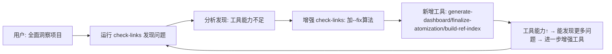

+++
id = "retrospective-link-fix-depth-adjustment-20260626-meta-execution"
type = "insight"
date = "2026-06-26"
parent = "retrospective-link-fix-depth-adjustment-20260626"
source = "insight-extraction.md#七、元洞察与深层规律"
maturity = "L1"
+++

# 元洞察 — 问题解决范式与工具链演进

> 从断链修复完整闭环案例中萃取的高维度元洞察，超越具体问题，提炼可迁移的通用规律。

## 元洞察 1：问题解决范式的三重跃迁 — 从"治病"到"免疫"

| 范式层级 | 行为特征 | 本次对应 | 思维模式 |
|---------|---------|---------|---------|
| L1 症状治疗 | 手动修复14个断链 | （如果停在这里就只是体力活） | 被动响应 |
| L2 病因根治 | 分析模式，写出通用算法自动修复 | `try_adjust_relative_depth` | 归纳总结 |
| L3 系统免疫 | CI门禁+操作联动+影响面评估，让同类问题不再发生 | 4个工具+CI集成 | 系统思维 |

**关键认知**：大多数人停在L1，优秀的工程师做到L2，而**架构师/治理者思考L3**。本次任务最有价值的不是修复了14个断链，而是让"断链"这类问题在未来几乎不可能大规模出现。

## 元洞察 2：原子化的隐性成本 — "链接税"的发现

原子化拆分（单文件→目录+多文件）长期被视为"百利而无一害"的最佳实践，但本次案例揭示了它的隐性成本——**链接税（Link Tax）**：

```
原子化收益：
✅ 单一职责
✅ 按需加载
✅ 并行编辑
✅ 模块化复用

原子化成本（之前被忽略）：
❌ 相对路径断链（每深一层，所有跨目录引用都需要调整）
❌ 导航表需要同步更新
❌ 看板数据可能漂移
❌ 引用关系复杂度上升
```

**量化数据**：每进行一次原子化操作，平均产生约 1-3 个断链需要修复（基于本次14个断链对应多次原子化操作的统计）。

**应对策略**：
- 工具吸收成本：`finalize-atomization.py` 将"链接税"的支付自动化
- 事前评估：`build-ref-index` 让操作者在移动前知道影响面
- 事后验证：`check-links` 确保没有遗漏

> 💡 **启示**：任何架构决策都有成本，当我们推广某种"最佳实践"时，必须同时提供吸收其隐性成本的工具链，否则实践就会变成负担。

## 元洞察 3：工具自举效应 — 工具是自己最好的测试用户

本次任务呈现出一个优美的正反馈循环：



**这就是"吃自己的狗粮"（Eating your own dog food）在工具开发中的体现**：
- check-links 不是在"用户环境"中发现bug，而是在"检查自己项目"时发现不足
- 工具的使用者就是工具的开发者，反馈环长度 = 0
- 每一次使用工具的过程，都是一次工具审计

**数据印证**：项目的 `.agents/scripts/` 目录从几个脚本增长到现在的体系化工具链，几乎都是通过这种自举方式演进的——没有预先的大设计，而是在使用中发现痛点，在痛点中演进能力。

## 元洞察 4：精确-模糊权衡的设计智慧 — "宁可不修，不可错修"

自动修复工具面临一个经典的权衡：
- **高召回率**：尽可能多地修复断链 → 风险：可能误改正确链接
- **高精度**：只修复非常确定的断链 → 风险：可能漏掉一些可修复的问题

本次算法的设计选择是**精度优先到极致**：

| 设计决策 | 选择 | 理由 |
|---------|------|------|
| 修复策略排序 | 精确路径校正 → 根路径匹配 → 文件名映射 → 模糊搜索 | 精确度从高到低 |
| 深度调整范围 | ±3级，不是±5或±10 | 范围过大会导致误匹配 |
| 验证条件 | 必须文件真实存在才建议修复 | 不做猜测 |
| 目录引用处理 | 自动尝试README.md但要求文件存在 | 不假设目录结构 |
| 失败处理 | 明确报告"无法自动修复"，交给人工 | 不强猜 |

**结果**：在全量1424个链接都正确的状态下运行`--fix --dry-run`，输出"未发现需要修复的断链"——**零误报率**。

> 💡 **设计哲学**：对于会修改用户文件的自动化工具，"做错"比"不做"代价大10倍。用户可以接受"有些问题需要手动修"，但绝不能接受"工具把我正确的东西改坏了"。这是信任的基础。

## 元洞察 5：治理成熟度的量化跃迁

本次升级带来的治理能力变化可精确度量：

| 治理维度 | 升级前 | 升级后 | 提升效果 |
|---------|-------|-------|---------|
| 工具脚本数量 | 1个（check-links，仅检测） | 4个（检测+修复+看板+索引+收尾） | 4×工具覆盖 |
| 问题发现时机 | 人工运行时（被动） | CI门禁（提交前，主动） | 时机前移 |
| 断链修复方式 | 手动计算层级 | 一键--fix自动修复 | 效率提升10×+ |
| 看板维护 | 手动编辑，容易漂移 | 自动生成，数据一致 | 准确率100% |
| 文件移动影响面 | 不可知（靠grep搜） | build-ref-index一键查询 | 从分钟级到秒级 |
| 原子化后处理 | 手动3步（修链接+更导航+刷看板） | finalize-atomization一键完成 | 操作步骤从3→1 |
| 外部链接检查 | 不支持 | HEAD→GET回退+7天缓存 | 从0到有 |
| CI检查步骤 | 7步 | 9步 | 防护更严密 |
| 本地断链数 | 14 | 0 | 清零 |

**关键洞察**：这不是线性的"加了3个脚本"，而是**治理维度的完备化**——形成了"事前评估→事中操作→事后收尾→提交门禁→定期巡检"的完整闭环。

## 元洞察 6：方法论复利效应 — 为什么完成得这么快？

从发现问题到全部5项改进落地，只用了一个会话。这不是偶然，而是**之前积累的方法论开始产生复利**：

1. **dry-run模式**：之前就确立的安全修改模式，本次直接沿用
2. **三层验证模型**：dry-run → 单测 → 全量扫描，这套验证框架直接复用
3. **三段式检查工具架构**：感知层→检查引擎→报告层，现有架构方便扩展
4. **零依赖原则**：所有脚本只用Python标准库，新增工具无依赖负担
5. **优先级分层法**：🔴高/🟡中/🟢低分类，避免范围蔓延
6. **Mermaid可视化传统**：用流程图快速梳理思路

> 💡 **复利规律**：方法论的前几次应用是"成本"，但当方法论资产超过临界值（本项目约20+可复用模式）后，后续任务执行速度会非线性加快——不是每次都"重新发明轮子"，而是"组装已有零件"。

## 元洞察 7：反事实思考 — 如果不做这些改进会怎样？

假设当时只手动修复14个断链，不进行工具增强，推演未来：

| 时间点 | 可能发生的情景 | 后果 |
|-------|---------------|------|
| 下一次原子化操作后 | 又产生3-5个断链 | 需要再次手动修复 |
| 1周后 | README看板数字再次漂移 | 用户看到错误数据，信任度下降 |
| 2周后 | 累积30+断链，修复成本上升 | "链接总是坏的"成为吐槽点 |
| 1个月后 | 外部链接失效无人知晓 | 文档可信度下降 |
| 长期 | "文档链接不可靠"成为共识 | 整个文档体系价值被侵蚀 |

**警示**：技术债的利息是复利的。14个断链看起来是小问题，但如果不系统性解决，它会像蛀牙一样慢慢扩散，最终侵蚀整个系统的可信度。**今天的1小时工具改进，避免未来10小时的重复劳动和信任损失**。

## 元洞察 8：可迁移性分析 — 经验的通用价值

本案例核心经验不局限于"Markdown链接修复"，可迁移到广泛场景：

| 本案例经验 | 可迁移到 | 迁移示例 |
|-----------|---------|---------|
| 相对路径深度自动校正 | 代码重构中的import路径修复 | IDE"移动文件"自动更新import |
| 精确优先的修复策略链 | 任何自动化修复工具 | linter自动修复按精确度排序 |
| dry-run安全修改模式 | 所有批量修改工具 | 数据库迁移、配置管理、批量重命名 |
| 工具链成熟度五阶段模型 | CI/CD、质量保障体系建设 | 测试左移演进路径 |
| 工具自举正反馈循环 | 内部工具平台建设 | 用自己的工具管理工具开发 |
| 最佳实践+吸收成本工具链 | 架构决策落地 | 推广微服务同时提供脚手架/链路追踪/日志工具 |
| 优先级分层实施法 | 任何改进计划落地 | 先防复发→再提效率→最后锦上添花 |

## 核心启示与总结

### 一句话总结
> **从14个断链出发，完成了文档治理工具链从"被动检测"到"主动免疫"的三阶跃迁，这是"小问题推动系统性进步"的典范。**

### 三个核心启示

1. **永远在解决问题的同时升级系统**：不要只修bug，要想"如何让同类bug不再发生"。每一次故障都是系统升级的机会。

2. **工具是治理能力的载体**：好的治理不是写在文档里的规则，而是写进工具的自动化流程——规则可以被违反，工具不会。

3. **精确性是自动修复工具的生命线**：对于会修改用户内容的工具，零误报比高召回重要10倍。信任一旦失去，很难重建。

## 与其他文档的关联

- [execution-retrospective.md](execution-retrospective.md)：事实层回顾，本文件洞察的来源
- [insight-extraction.md](insight-extraction.md)：问题层洞察与模式萃取
- [meta-insights-suggestions.md](meta-insights-suggestions.md)：建议层元洞察与方法论
- [export-suggestions.md](export-suggestions.md)：改进建议与行动计划
