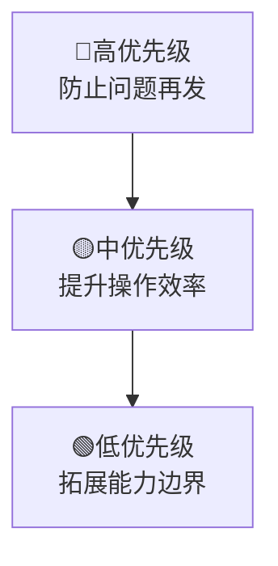
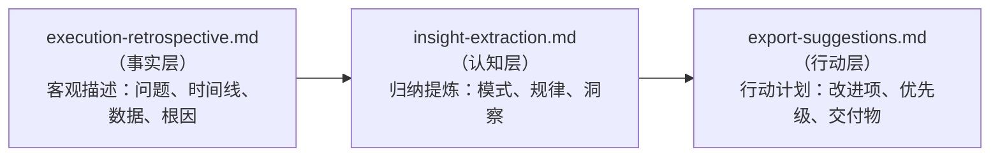

+++
id = "retrospective-link-fix-depth-adjustment-20260626-meta-suggestions"
type = "insight"
date = "2026-06-26"
parent = "retrospective-link-fix-depth-adjustment-20260626"
source = "export-suggestions.md#六、元洞察与建议方法论"
maturity = "L2"
+++

# 元洞察 — 建议方法论与落地机制

> 从改进建议100%落地的案例中，萃取建议文档的设计方法论与可复用模式。

## 元洞察 1：建议文档的"可执行性"五要素

对比"空泛建议"和"可落地建议"，高落地率的建议必须包含五个关键要素：

| 要素 | 空泛反例 | 本案例正面示例 |
|------|---------|---------------|
| **具体交付物** | "应该加个自动修复功能" | "新增 `.agents/scripts/generate-dashboard.py`"（精确到文件名） |
| **验收标准** | "让看板更准确" | "扫描 `.trae/specs/*/tasks.md` 聚合状态，自动更新 README.md"（描述清楚做什么） |
| **优先级** | 无优先级或都是高优先级 | 🔴高/🟡中/🟢低 三级分层，2+2+1 合理分布 |
| **集成位置** | "加到CI里" | "修改 `.agents/scripts/ci-check.ps1`，在现有检查后增加步骤，断链返回非零退出码"（说明怎么加、加在哪、失败怎么办） |
| **状态追踪** | 建议写完就不管了 | 每项都有 ✅ 状态标记，总表+分表双重追踪 |

**规律公式**：
```
建议落地概率 = f(具体性, 可验证性, 优先级明确度, 集成路径清晰度, 状态可见性)
```

> 💡 **关键认知**：很多"建议无法落地"不是执行者的问题，而是建议本身就不具备可执行性——它只说了"应该做什么"，没说"具体怎么做、做成什么样、怎么验证做对了"。

## 元洞察 2：优先级分层的隐藏逻辑 — 按治理层级排序

优先级排序不是按难度，而是遵循**治理能力的演进逻辑**：

| 优先级 | 改进项 | 治理层级 | 核心目的 |
|--------|-------|---------|---------|
| 🔴 高 | A1: 看板自动生成 | **根除反复出现的问题** | 让"看板漂移"这类问题**永远不再需要手动修** |
| 🔴 高 | A2: CI集成链接检查 | **建立门禁防线** | 让"新断链"根本进不了主干 |
| 🟡 中 | B1: 原子化一键收尾 | **流程内自动化** | 在操作流程中自动修复问题，不让问题流到事后 |
| 🟡 中 | B2: 反向引用索引 | **事前预防** | 在做操作前就能评估影响面 |
| 🟢 低 | C1: 外部链接检查 | **能力拓展** | 覆盖之前没覆盖的检查范围 |

**排序逻辑**：


> 💡 **启示**：给改进建议排优先级时，不要问"哪个容易做"，要问"哪个能从根本上减少未来的工作量"。**先建防线，再优化体验，最后锦上添花。**

## 元洞察 3：模式成熟度显式追踪 — 知识资产的"资产负债表"

模式成熟度更新表是知识管理的关键设计：

| 模式 ID | 成熟度变化 | 验证/复用次数 |
|---------|-----------|-------------|
| pattern-relative-depth-adjustment | L1 → L2 | 1 次实战验证 |
| pattern-fix-priority-chain | L1 → L2 | 1 次实战验证 |
| pattern-dry-run-first | L2 → L3 | 多次复用 |

**成熟度分级定义**：
- **L1（实验性）**：刚提出的想法，可能好用但还没验证过
- **L2（已验证）**：在真实场景中验证过一次，证明有效
- **L3（标准化）**：多次复用验证稳定，可以作为标准模式推广

**显式追踪的价值**：
1. 避免过度自信：不会把"刚想出来的好主意"当成"经过验证的最佳实践"
2. 复用决策依据：L3模式放心复用，L1模式需要先验证
3. 知识演进可视化：看到知识资产如何从想法→验证→标准逐步成熟
4. 信用积累：每个模式的"验证次数"就是它的"信用分"

> 💡 **洞察**：可复用知识不是写出来就完了，它需要像代码一样有版本、有测试、有成熟度标记。模式成熟度表就是知识资产的"资产负债表"。

## 元洞察 4：能力清单化 — 工具的"功能矩阵"价值

修复类型清单是一个重要实践：

| 修复类型 | 精确度 |
|---------|--------|
| `file:///` 绝对路径转相对路径 | 高 |
| 相对路径层级校正 | 高 |
| 目录链接尾部斜杠补全 | 高 |
| 顶级目录根路径识别 | 高 |
| 文件名重命名映射 | 高 |
| 文件名模糊搜索 | 中 |

**能力清单的三重价值**：
1. **对用户**：清晰知道工具能做什么、不能做什么，不用猜；看到"中"精确度就知道需要人工确认
2. **对维护者**：新增能力时必须加一行，强迫思考类型、精确度、优先级位置
3. **对未来扩展**：这张表本身就是缺口分析工具，一眼能看出哪些没覆盖、哪些精确度可以提升

> 💡 **洞察**：工具的能力边界需要被**显式声明**，而不是让用户去试错。能力清单既是用户手册，也是维护者的backlog，还是未来规划的起点。

## 元洞察 5：三段式复盘结构的协同效应

本复盘目录采用 execution/insights/suggestions 三段式结构，三层之间有严格单向依赖：



**每层约束**：
- 事实层不能有建议：只客观描述，不能写"应该加工具"
- 认知层不能凭空想：所有洞察必须有事实层数据支撑
- 行动层不能没有溯源：每项建议必须对应认知层某个洞察，洞察必须对应事实层某个问题

**三段式如何避免常见问题**：

| 常见问题 | 三段式如何避免 |
|---------|---------------|
| 复盘变成"诉苦会" | 事实层只客观描述，不带情绪和评判 |
| 建议凭个人喜好 | 建议必须有洞察支撑，洞察必须有事实支撑 |
| 学不到东西 | 认知层强制提炼模式和规律 |
| 建议大而空 | 行动层强制要求具体交付物、优先级、验收标准 |

> 💡 **洞察**：这就是"复盘"和"总结"的区别。总结只需要说"做了什么、结果如何"，复盘必须完成"事实→认知→行动"的完整闭环。没有事实的认知是空想，没有认知的行动是蛮干，没有行动的复盘是清谈。

## 元洞察 6：建议-交付物的"无冗余映射"

改进建议和最终交付物呈现精准的1:1映射：

| 改进建议 | 交付物 | 映射类型 |
|---------|-------|---------|
| A1: 看板自动生成 | generate-dashboard.py（新文件） | 1:1 新增工具 |
| A2: CI集成链接检查 | ci-check.ps1（修改现有文件） | 1:1 修改集成点 |
| B1: 原子化一键收尾 | finalize-atomization.py（新文件） | 1:1 新增工具 |
| B2: 反向引用索引 | build-ref-index.py（新文件） | 1:1 新增工具 |
| C1: 外部链接检查 | check-links.py（增强现有文件） | 1:1 增强现有工具 |

**设计特征**：
1. **原子化建议**：每项建议对应一个原子化变更
2. **无重叠**：建议之间边界清晰，没有模糊地带
3. **独立可验证**：每完成一项都可以独立验证
4. **增量实施**：可以按优先级一项一项来

> 💡 **洞察**：好的改进建议应该像好的代码——**单一职责**。一个建议只解决一个问题，对应一个可独立交付、独立验证的变更单元。

## 可复用模式：三段式复盘改进法

**模式 ID**：pattern-three-part-retrospective
**成熟度**：L2（本次验证）
**适用场景**：任何项目复盘、事后分析、经验总结

**核心步骤**：
1. **事实层**：客观描述发生了什么，不带主观判断，用数据说话
2. **认知层**：从事实中提炼模式、规律、可复用的洞察
3. **行动层**：基于洞察提出具体、可验证、有优先级的改进项

**检查清单**：
- [ ] 事实层是否只陈述事实，没有"应该"、"必须"？
- [ ] 每个洞察是否都能追溯到具体事实？
- [ ] 每个建议是否都有具体交付物、验收标准、优先级？
- [ ] 建议之间是否边界清晰、无重叠、原子化？
- [ ] 是否建立了状态追踪机制，确保闭环？

## 核心启示总结

1. **建议的质量决定落地率**：不是团队"执行力差"，很多时候是建议本身就不具备可执行性。好建议自带"落地基因"。

2. **优先级不是拍脑袋**：按"治理层级"排序——先建防线防止问题再发，再优化流程提升效率，最后拓展边界锦上添花。

3. **知识需要成熟度管理**：不要把"想法"当成"最佳实践"。显式追踪L1/L2/L3，用"验证次数"给知识积累信用。

4. **能力边界要显式声明**：工具能做什么、精确度如何，要列成清单让用户知道。

5. **三段式结构防止清谈**：事实→认知→行动的单向依赖，确保每次复盘都形成闭环，不沦为空谈。

## 与其他文档的关联

- [execution-retrospective.md](execution-retrospective.md)：事实层回顾
- [insight-extraction.md](insight-extraction.md)：问题层洞察与模式萃取
- [meta-insights-execution.md](meta-insights-execution.md)：执行层元洞察与工具链演进
- [export-suggestions.md](export-suggestions.md)：改进建议与行动计划
