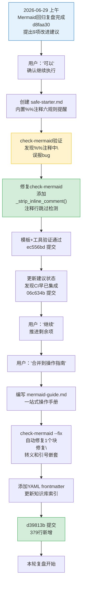

# 执行复盘：Mermaid 治理闭环执行过程

## 执行时间线

## 量化数据

| 指标 | 数值 |
|------|------|
| 执行提交数 | 3（ec556bd、06c634b、d39813b） |
| 新增文件 | 2（safe-starter.md、mermaid-guide.md） |
| 修改文件 | 5（mermaid.py、README×2、export-suggestions.md） |
| 新增代码行数 | ~540 行 |
| 新增Mermaid图 | 4张（全部通过check-mermaid验证） |
| 工具bug发现 | 1个（`%%` 注释中 `\n` 误报） |
| 工具bug修复 | 1个（新增 `_strip_inline_comment()` 函数） |
| 自动修复触发 | 1次（操作指南排查流程图中引号嵌套问题） |
| check-mermaid全项目扫描 | 3次（模板验证、CI验证、指南验证） |

## 事实陈述

### 阶段1：安全模板创建（ec556bd）

**做了什么：**
- 创建了 [safe-starter.md](../../../../../.agents/templates/mermaid-templates/safe-starter.md)，在 Mermaid 代码块内用 `%%` 注释内嵌完整六规则安全提醒
- 包含起步流程图（含 ` ` 多行文本正确示例）、节点形状表、编号避坑表、Subgraph写法示例
- 更新模板目录 README.md，将 safe-starter 标记为首选模板，五规则升级为六规则

**发现的问题：**
- 首次运行 check-mermaid 验证新模板时，注释行中包含的 `\n` 字面量（描述"禁止 \n"时）触发了 2 个误报
- 原因：`_check_backslash_n` 和 `_fix_backslash_n` 做简单文本搜索替换，未识别 Mermaid 的 `%%` 注释语法
- 这是一个"工具自测发现"——在使用工具验证自身示例时发现的工具缺陷

**修复方案：**
- 新增 `_strip_inline_comment()` 辅助函数，返回行的代码部分（跳过整行注释、剥离行内注释）
- `_check_backslash_n` 改为在代码部分上搜索 `\n`
- `_fix_backslash_n` 改为保留注释行不修改，行内注释只替换代码部分

### 阶段2：CI状态验证与建议更新（06c634b）

**做了什么：**
- 检查 ci-check.ps1/sh，确认第4步已集成 check-mermaid（失败时 exit 1 阻断）
- 检查是否有 pre-commit hook 强制运行 CI 检查（没有，这是预期的——Git hooks 是本地配置）
- 更新 export-suggestions.md 中建议5-6的状态为✅已完成，优先级矩阵更新
- 修复优先级矩阵中 S3 节点被 ` ` 打断的问题

**发现的问题：**
- CI 集成建议被错误标记为"待规划"，实际上 ci-check.ps1 早已包含该检查
- 根因：制定改进建议时没有充分验证现有基础设施，存在"默认缺失"的认知偏误

### 阶段3：操作指南整合（d39813b）

**做了什么：**
- 创建 [mermaid-guide.md](../../../../knowledge/best-practices/mermaid-guide.md)，将模板、规则、工具、排查流程整合为一站式操作手册
- 放置在 `docs/knowledge/best-practices/`（知识库最佳实践分类）
- 包含快速开始3步流程、六规则详解、10项检测能力对照表、6步排查决策图、各图表类型注意事项
- 添加 YAML frontmatter，运行 generate_index.py 更新知识库索引

**遇到的问题：**
- 排查流程图中使用 `\"` 转义引号在 Mermaid 双引号节点内不可行（Mermaid 不支持反斜杠转义）
- 改用中文引号「」表达代码示例中的引号
- 排查流程图中展示反例 `\n` 时不能直接写 `\n`（会被check-mermaid检测），改用文字描述"反斜杠+n"
- check-mermaid --fix 自动修复了1个块（可能是空行微调）

## 过程分析

### 成功因素

1. **工具即文档**：check-mermaid.py 的注释感知修复是通过"用工具检测工具自身示例"发现的，说明用工具验证自身文档是有效的质量保障手段
2. **原子提交**：三个阶段各一次原子提交，每个提交单一职责，便于回滚和审查
3. **边做边验**：每次修改后立即运行 check-mermaid 验证，问题在引入时即被发现

### 不足与教训

1. **改进建议制定前未充分调研现有能力**：CI集成建议是一个误判——ci-check.ps1早已集成，制定建议时只看了脚本列表没看脚本内容
2. **文档内代码示例的约束传递**：在Mermaid图中展示Mermaid反例（如`\n`、引号嵌套）时，需要特殊处理以避免被检测工具标记或导致渲染错误
3. **知识库索引需要自动维护意识**：新增知识条目后需要运行generate_index.py更新索引，这个步骤容易遗漏
