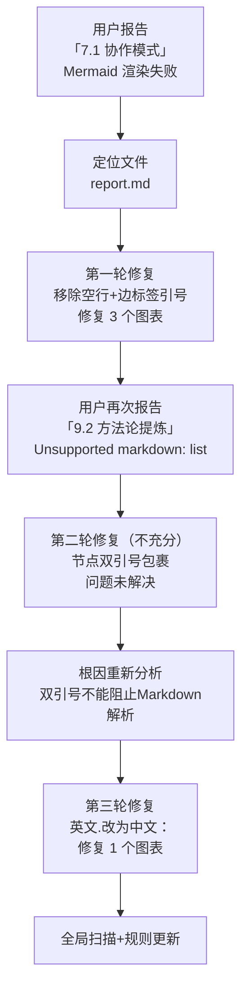
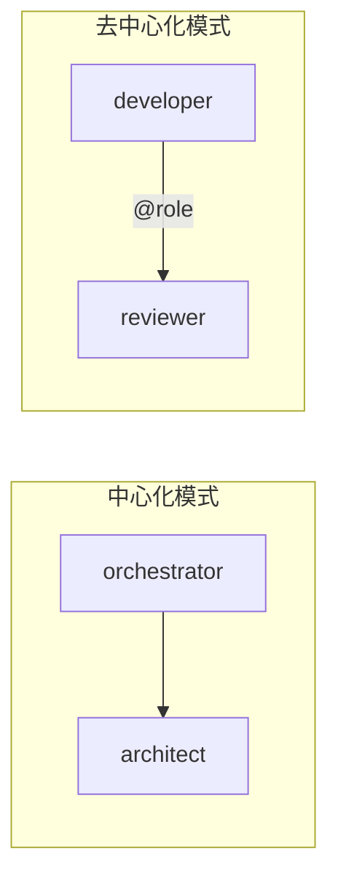

+++
id = "execution-retrospective"
source = "retrospective-mermaid-rendering-fix-20260626/README.md"
+++

# 执行复盘：Mermaid 渲染兼容性问题修复

## 一、事实回顾

### 1.1 时间线



| 轮次 | 事件 | 处理动作 | 结果 |
|------|------|---------|------|
| 第一轮 | 用户报告 7.1 协作模式渲染失败 | 移除空行、边标签加引号、修复 3 个图表 | 结构层问题解决 |
| 第二轮 | 用户报告 9.2 方法论 "Unsupported markdown: list" | 节点文本加双引号包裹 | ❌ 仍失败（错误认知） |
| 第三轮 | 重新分析根因 | 双引号不阻止内部Markdown解析；改用中文冒号 | ✅ 问题解决 |
| 验证 | 全局扫描+规则更新 | 更新项目记忆、开发规范、复盘报告 | 规则体系完善 |

### 1.2 受影响文件与图表

**受影响文件**：`docs/retrospective/reports/project-governance/retrospective-specweave-full-project-comprehensive-20260626/report.md`

| 图表位置 | 图表类型 | 问题类型 | 严重程度 |
|---------|---------|---------|---------|
| 3.1 项目时间线（L99-143） | flowchart TB（4 subgraph） | subgraph 间空行 | 渲染完全失败 |
| 7.1 协作模式（L362-375） | flowchart LR（2 subgraph） | subgraph 间空行 + 边标签未加引号 | 渲染完全失败 |
| 8.1 五维分析（L402-409） | pie | 无问题 | 正常 |
| 9.2 方法论提炼（L483-499） | flowchart TB（线性流程） | 边/style 间空行 + 节点文本触发 Markdown 列表解析 | 渲染为错误提示框 |

### 1.3 修复措施明细

#### 第一轮修复（空行 + 边标签）

**问题模式 A：subgraph 间空行**

修复前：
```mermaid
flowchart LR
    subgraph CENTER ["中心化模式"]
        O[orchestrator] --> A[architect]
    end
                            ← 空行
    subgraph DECENTER ["去中心化模式"]
        D2[developer] -->|"@role"| R2[reviewer]
    end
```

修复后：


**问题模式 B：边标签中特殊字符未加引号**

`-->|@role|` → `-->|"@role"|`
`-->|规范自举性|` → `-->|"规范自举性"|`

**问题模式 C：边定义与 style 语句间空行**

移除了 `K -->|规范自举性| E` 与 `style A fill:#ffcccc` 之间的空行。

#### 第二轮修复（节点文本 Markdown 列表误解析 — 双引号包裹，不充分）

**问题模式 D：节点文本以"数字. "开头**

修复前：
```
A[1. 启动协议] --> B[2. 角色定义]
```

修复后（第一轮尝试，加双引号）：
```
A["1. 启动协议"] --> B["2. 角色定义"]
```

**结果**：双引号包裹后仍然报 "Unsupported markdown: list" 错误。经分析确认：双引号仅保证 Mermaid 语法层解析正确，引号内文本仍会经过 Markdown 渲染器处理，`1. ` 仍被识别为有序列表。

#### 第三轮修复（内容层修正 — 中文冒号替代英文句点）

**问题模式 D2：双引号不能阻止 Markdown 解析，需改变文本格式**

最终修复：
```
A["1：启动协议"] --> B["2：角色定义"]
```

将英文句点 `.` 改为中文冒号 `：`，从内容层面彻底消除 Markdown 列表触发模式。所有 11 个节点均采用此方案。

## 二、根因分析

### 2.1 直接原因

| 问题模式 | 根因 | Mermaid 行为 |
|---------|------|-------------|
| subgraph 间空行 | Mermaid 解析器将空行视为图表定义结束标记 | 解析提前终止，后续 subgraph 内容丢失 |
| 边标签含特殊字符未加引号 | `@`、中文字符在无引号时可能触发解析歧义 | 语法解析异常 |
| 节点文本"数字.空格" | 内置 Markdown 解析器将 `1. ` 识别为有序列表项；**双引号无法阻止此解析** | "Unsupported markdown: list" |

### 2.2 深层原因

1. **知识缺口**：项目记忆中虽有 subgraph ID 格式的经验（避免中文裸 ID），但未覆盖"空行导致解析中断"和"节点文本 Markdown 隐式解析"这两个陷阱
2. **错误认知**：第二轮修复时错误假设"双引号可以阻止内部 Markdown 解析"，实际上双引号仅作用于 Mermaid 语法层，引号内文本仍经过 Markdown 渲染器，导致修复无效、用户再次反馈
3. **验证盲区**：现有验证链路（链接检查、规范格式检查）不包含 Mermaid 语法校验
4. **渲染器差异**：不同 Markdown 渲染器（GitHub、飞书、VS Code 预览）对 Mermaid 的容错度不同，在较宽容的渲染器中可能正常显示，在严格渲染器中则失败
5. **分层屏蔽效应**：结构层错误（空行）修复后，内容层错误（Markdown 列表解析）才暴露；内容层错误的修复方案（双引号）不正确时，需要第三轮迭代才能定位真正根因

### 2.3 影响评估

- **用户体验**：报告阅读者在关键章节（协作模式、方法论提炼）看到渲染错误框，影响专业性；两轮不充分修复导致用户多次反馈
- **数据完整性**：Mermaid 图表承载了重要的流程可视化信息，渲染失败导致信息缺失
- **修复成本**：三轮修复共约 20 分钟，根因是错误认知导致的无效修复迭代
- **无数据丢失**：问题仅为渲染层，源码完整保留，修复后无信息损失

## 三、修复效果验证

- ✅ report.md 中 3 个有问题的 Mermaid 图表全部修复（方法论图用中文冒号替代英文句点，空行移除，边标签引号）
- ✅ 全局扫描确认无其他"数字.空格"模式的未修复节点
- ✅ 项目记忆更新（8 条 Mermaid 安全编码规则）
- ✅ 开发规范新增 Mermaid 编码规范章节
- ✅ 复盘报告同步修正错误认知
- ✅ 链接校验通过（0 断链）
