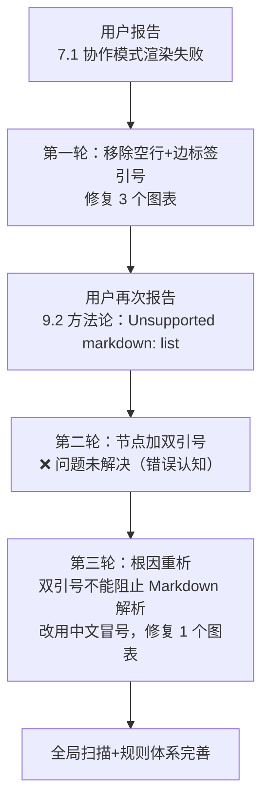

+++
id = "execution-retrospective"
source = "retrospective-mermaid-rendering-fix-20260626/README.md"
+++

# 执行复盘：Mermaid 渲染兼容性问题修复

## 一、事实回顾

### 1.1 时间线

| 轮次 | 问题 | 处理 | 结果 |
|------|------|------|------|
| 第一轮 | 7.1 协作模式渲染失败 | 移除空行、边标签加引号、修复 3 个图表 | 结构层问题解决 |
| 第二轮 | 9.2 "Unsupported markdown: list" | 节点文本加双引号包裹 | ❌ 仍失败 |
| 第三轮 | 重新分析根因 | 双引号不阻止内部Markdown解析；改用中文冒号 | ✅ 解决 |
| 收尾 | 全局扫描 | 更新项目记忆、开发规范、Lint脚本、CI | 规则体系完善 |

### 1.2 受影响图表

受影响文件：`docs/retrospective/reports/project-governance/retrospective-specweave-full-project-comprehensive-20260626/report.md`

| 位置 | 类型 | 问题 |
|------|------|------|
| 3.1 项目时间线 | flowchart TB（4 subgraph） | subgraph 间空行 |
| 7.1 协作模式 | flowchart LR（2 subgraph） | subgraph 间空行 + 边标签未加引号 |
| 9.2 方法论提炼 | flowchart TB | 空行 + 节点文本触发 Markdown 列表解析 |

### 1.3 修复问题模式

> 详细代码示例见 [mermaid-trap-cheatsheet.md](../../../../patterns/code-patterns/mermaid-trap-cheatsheet.md) 和 [mermaid-safe-coding-rules.md](../../../../patterns/code-patterns/mermaid-safe-coding-rules.md)。

| 模式 | 问题 | 修复 |
|------|------|------|
| A. subgraph 间空行 | Mermaid 将空行视为图表结束 | 删除空行 |
| B. 边标签特殊字符 | `@`/中文无引号触发解析歧义 | 改为 `-->&|"标签"|` |
| C. 边/style 间空行 | 空行中断解析 | 删除空行 |
| D. 节点"数字. "开头 | 内置Markdown解析为有序列表；**双引号无法阻止** | 改用中文冒号：`"1：文本"` |

**关键教训**：第二轮修复时错误假设"双引号可以阻止内部 Markdown 解析"。实际上双引号仅作用于 Mermaid 语法层，引号内文本仍经过 Markdown 渲染器。这一错误认知导致一次无效修复迭代。

## 二、根因分析

### 2.1 直接原因

| 问题模式 | 根因 |
|---------|------|
| subgraph 间空行 | Mermaid 解析器将空行视为图表定义结束标记 |
| 边标签特殊字符未加引号 | 无引号时 `@`、中文字符触发解析歧义 |
| 节点文本"数字.空格" | 内置 Markdown 解析器将 `1. ` 识别为有序列表；双引号无法阻止 |

### 2.2 深层原因

1. **知识缺口**：项目记忆未覆盖"空行导致解析中断"和"节点文本 Markdown 隐式解析"
2. **错误认知**：双引号仅保证 Mermaid 语法层正确，引号内文本仍经过 Markdown 渲染
3. **验证盲区**：现有验证链路不包含 Mermaid 语法校验
4. **渲染器差异**：不同平台（GitHub/飞书/VS Code）容错度不同，宽松环境下正常的代码在严格环境下失败
5. **分层屏蔽效应**：结构层错误（空行）修复后内容层错误才暴露（详见 [insight-06](insights/insight-06-layered-verification.md)）

### 2.3 影响评估

- **用户体验**：关键章节渲染失败，两轮不充分修复导致用户多次反馈
- **修复成本**：三轮修复共约 20 分钟，主要浪费在错误认知导致的无效迭代
- **无数据丢失**：问题仅在渲染层，源码完整

## 三、修复效果验证

- ✅ 3 个问题图表全部修复
- ✅ 项目记忆、开发规范、Lint脚本、CI 集成均已更新
- ✅ 全项目审计：653+ 文件扫描，0错误0警告
- ✅ 链接校验通过
