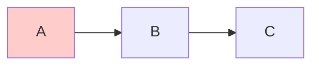

+++
id = "mermaid-insight-no-blank-lines"
date = "2026-06-26"
type = "insight"
rule_number = "1"
scope = "mermaid"
source = "../insight-extraction.md#一、发现1"
+++

# 洞察01：Mermaid 代码块内禁止空行

## 核心命题

Mermaid 代码块内的空行是**语法元素**而非排版元素，会被解析器误判为图表结束，导致后续内容渲染失败。

## 事实支撑

本次修复中 **3 个图表**的渲染失败均由空行导致：
- Subgraph 块之间的空行
- 边定义与 `style` 语句之间的空行

这些空行在人眼看来只是"排版留白"，但 Mermaid 解析器采用"空行即结束"的设计——这与 Markdown 段落分隔规则一致，但在代码块场景下反直觉。

## 深层含义

开发者习惯用空行提升代码可读性（分隔逻辑块），但在 Mermaid 中空行具有语法含义而非排版含义。这是一个典型的"直觉与语法冲突"陷阱。

## 规则说明

**规则 1：禁止空行** — Mermaid 代码块内不使用任何空行。

**错误示例**（subgraph 间空行）：
```
flowchart LR
    A --> B

    B --> C
    style A fill:#ffcccc
```
注意：`A --> B` 和 `B --> C` 之间的空行会导致解析中断。

**正确示例：**


**适用范围**：所有 Mermaid 图表类型（flowchart、sequenceDiagram、classDiagram、stateDiagram 等）。空行在 flowchart 中已确认导致解析中断，在其他图类型中行为未明，统一禁止最安全。

## 关联洞察

- [insight-06-layered-verification.md](insight-06-layered-verification.md) — 分层验证法将空行检查列为第一层（语法结构层）
- [trap-cheatsheet.md](trap-cheatsheet.md) — 空行在陷阱速查表中列为最高频陷阱

---
*来源：[Mermaid 渲染问题修复复盘](../README.md)*
