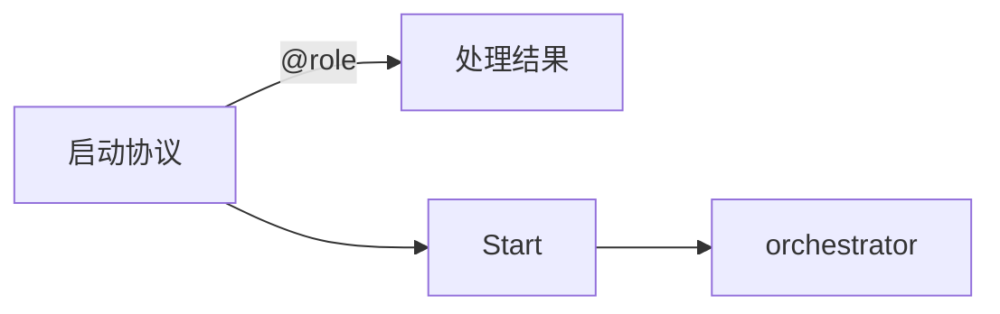

+++
id = "mermaid-insight-quote-principle"
date = "2026-06-26"
type = "insight"
rule_number = "2"
scope = "mermaid"
source = "../insight-extraction.md#二、规则2"
+++

# 洞察02：文本引号原则

## 核心命题

非纯英文单词的节点/边标签一律用双引号包裹。双引号解决 Mermaid **语法层**的特殊字符解析问题，但不能阻止引号内文本的 Markdown 解析（见规则2b）。

## 必须使用双引号的场景

- **含中文的文本**：`A["启动协议"]`
- **含特殊字符的文本**：`-->|"@role"|`、`-->|"数据与经验"|`
- **含空格的复合短语**：`A["Hello World"]`

## 可以省略引号的场景（纯英文单词）

- **标识符风格的单词**：`A[Start]`、`O[orchestrator]`
- **驼峰/短横线命名**：`A[myNode]`、`A[my-node]`

> ⚠️ **重要区分**：双引号解决的是 Mermaid 语法解析问题（告诉解析器这是一个完整文本），但引号内的文本仍会被 Mermaid 内置的 Markdown 渲染器处理。若需避免列表触发，见 [insight-03-markdown-list-avoidance.md](insight-03-markdown-list-avoidance.md)。

## 正确示例

## 关联洞察

- [insight-03-markdown-list-avoidance.md](insight-03-markdown-list-avoidance.md) — 引号不能阻止 Markdown 解析
- [insight-05-edge-label-format.md](insight-05-edge-label-format.md) — 边标签的引号规则
- [trap-cheatsheet.md](trap-cheatsheet.md) — 未加引号的陷阱条目

---
*来源：[Mermaid 渲染问题修复复盘](../README.md)*
