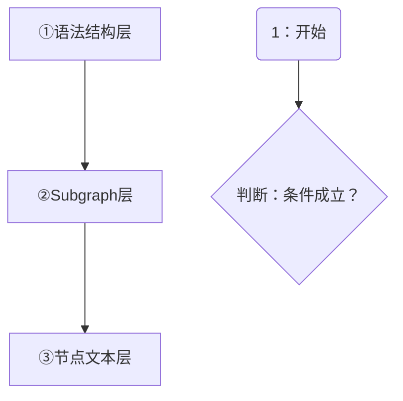

+++
id = "mermaid-insight-markdown-list-avoidance"
date = "2026-06-26"
type = "insight"
rule_number = "2b"
scope = "mermaid"
source = "../insight-extraction.md#一、发现2"
+++

# 洞察03：双引号不能阻止 Markdown 解析，须从内容层面规避列表触发

## 核心命题

双引号仅保证 Mermaid **语法层**解析正确（处理特殊字符、中文等），但引号内文本仍会经过 Mermaid 内置 Markdown 渲染器。要避免 "Unsupported markdown: list" 错误，必须在文本内容层面消除列表触发模式，而非依赖引号包裹。

## 事实支撑

第一轮修复时将 `[1. 启动协议]` 改为 `["1. 启动协议"]`（加了双引号），但飞书渲染器仍报 "Unsupported markdown: list"。最终修复方案是将 `1. 启动协议` 改为 `1：启动协议`（中文冒号替代英文句点）。

## 深层含义

Mermaid 节点文本的解析分为两个阶段：
1. **语法解析阶段**：双引号帮助 Mermaid 识别文本边界，正确处理特殊字符
2. **Markdown 渲染阶段**：提取引号内文本后，内置 Markdown 渲染器仍会解析列表等 Markdown 语法

两个阶段独立运作，引号无法穿透到第二阶段。

## 规则说明

**规则 2b：禁止 Markdown 列表触发格式**

即使使用双引号包裹，以下模式仍会触发列表识别：

| 禁止模式 | 错误示例 | 正确写法 |
|---------|---------|---------|
| 数字+英文句点+空格 | `A["1. 启动协议"]` | `A["1：启动协议"]`（中文冒号） |
| 短横线+空格（无序列表） | `A["- 项目A"]` | `A["-项目A"]` 或 `A["·项目A"]` |
| 星号+空格（无序列表） | `A["* 注意"]` | `A["*注意"]` 或 `A["⚠ 注意"]` |

**根本原则**：Mermaid 节点文本中不要使用 Markdown 列表语法。需要编号时使用中文冒号（`1：`）、全角句点（`1．`）、圈号数字（`①`）等不触发列表的格式。

## 正确示例

注意示例中编号使用了圈号数字 `①②③` 和中文冒号 `1：`，均不触发列表解析。

## 关联洞察

- [insight-02-quote-principle.md](insight-02-quote-principle.md) — 引号原则解决语法层问题，本洞察解决内容层问题
- [trap-cheatsheet.md](trap-cheatsheet.md) — 列表触发陷阱条目

---
*来源：[Mermaid 渲染问题修复复盘](../README.md)*
