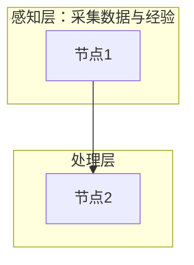
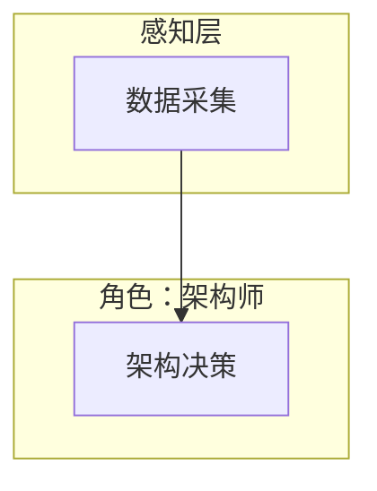

+++
id = "mermaid-insight-subgraph-format"
date = "2026-06-26"
type = "insight"
rule_number = "3"
scope = "mermaid"
source = "../insight-extraction.md#二、规则3"
+++

# 洞察04：Subgraph 安全格式

## 核心命题

Subgraph 必须使用英文 ID + 显式中文标题格式：`subgraph EN_ID ["中文标题"]`，禁止直接使用裸中文作为 subgraph ID。

## 格式规范



## 格式要点

- **ID 必须为英文标识符**：字母开头，不含中文、全角字符、特殊符号（含全角冒号 `：`）
- **中文标题放在双引号内**：格式为 `["标题文本"]`
- **ID 与方括号之间有空格**，方括号与引号之间无空格
- **Subgraph 块之间禁止空行**（参见规则1）

## 错误写法

```
subgraph 感知层
subgraph 角色：架构师
subgraph S1["感知层"]
```

以上写法的问题分别是：裸中文ID、ID含全角冒号、ID与方括号之间缺少空格。

## 正确写法对照



## 关联洞察

- [insight-01-no-blank-lines.md](insight-01-no-blank-lines.md) — Subgraph 块之间禁止空行
- [insight-02-quote-principle.md](insight-02-quote-principle.md) — 中文标题使用双引号包裹
- [trap-cheatsheet.md](trap-cheatsheet.md) — 中文裸 ID、全角冒号陷阱

---
*来源：[Mermaid 渲染问题修复复盘](../README.md)*
