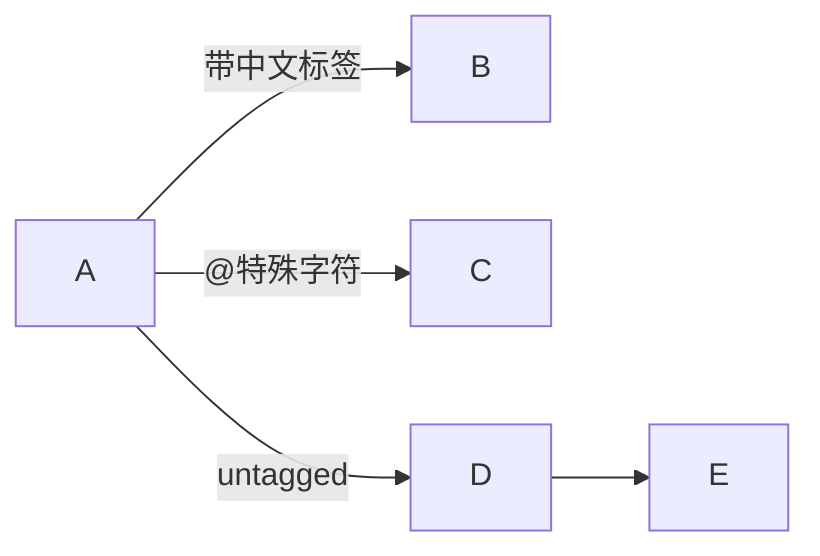

+++
id = "mermaid-insight-edge-label-format"
date = "2026-06-26"
type = "insight"
rule_number = "4"
scope = "mermaid"
source = "../insight-extraction.md#二、规则4"
+++

# 洞察05：边标签安全格式

## 核心命题

边标签统一使用 `-->|"标签"|目标` 格式，含中文/特殊字符的标签必须双引号包裹，纯英文标识符标签可省略引号。

## 格式规范

## 格式要点

- **含中文/特殊字符的标签**：双引号包裹，放在 `||` 内，如 `-->|"标签"|B`
- **纯英文标识符标签**：可省略引号，如 `-->|untagged|B`
- **标签与箭头之间无空格**：`-->|"标签"|` 是正确的，`--> |"标签"|` 是错误的
- **无边标签的箭头**：直接使用 `-->` 即可

## 错误写法对照

| 错误写法 | 问题 | 正确写法 |
|---------|------|---------|
| `-->|数据|B` | 中文标签未加引号 | `-->|"数据"|B` |
| `-->|@role|B` | 特殊字符未加引号 | `-->|"@role"|B` |
| `--> |"标签"| B` | 箭头与标签间有空格 | `-->|"标签"|B` |

## 关联洞察

- [insight-02-quote-principle.md](insight-02-quote-principle.md) — 引号原则的通用规则
- [trap-cheatsheet.md](trap-cheatsheet.md) — 边标签含特殊字符未加引号陷阱

---
*来源：[Mermaid 渲染问题修复复盘](../README.md)*
