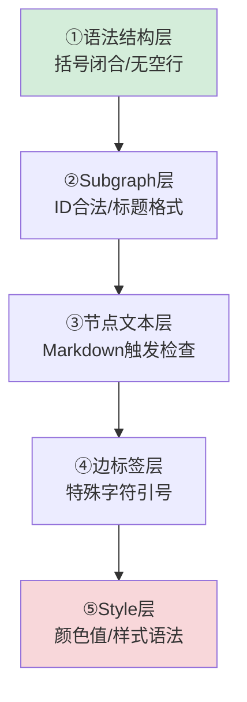

+++
id = "mermaid-insight-layered-verification"
date = "2026-06-26"
type = "insight"
rule_number = "5"
scope = "mermaid,debugging"
source = "../insight-extraction.md#一、发现3"
+++

# 洞察06：修复验证分层法与分层错误屏蔽效应

## 核心命题

Mermaid 渲染错误存在"分层屏蔽"效应——结构层错误会阻止解析器到达内容层，修复结构错误后内容层错误才会显现。修复时应按五层顺序逐层排查，并预期错误会"层层暴露"。

## 事实支撑

第一轮修复空行（结构层错误）后，第二轮才暴露节点文本问题（内容层错误）。修复一个错误后新错误出现，容易让人误以为"越修越错"，实际上是深层错误被表层错误屏蔽了。

## 深层含义：分层错误屏蔽

在多层解析系统（Markdown → Mermaid 语法 → Mermaid 渲染）中：
- 表层错误（语法断裂、标签不闭合）阻止解析器深入内层
- 修复表层后，内层错误才会暴露
- 这不是"引入了新错误"，而是"发现了被屏蔽的旧错误"

**心态要点**：不要因为修复后仍报错就认为方向错误，继续逐层排查直到自动化工具报告 0 错误。

## 五层排查顺序

修复 Mermaid 渲染错误的标准顺序：

| 层级 | 检查内容 | 典型错误 |
|------|---------|---------|
| ①语法结构层 | 括号/引号/direction 闭合、有无空行 | 空行截断、括号不匹配 |
| ②Subgraph层 | ID 合法性、标题格式 | 中文裸ID、全角冒号在ID中 |
| ③节点文本层 | 是否触发 Markdown 解析 | `数字. `、`- ` 触发列表 |
| ④边标签层 | 特殊字符是否加引号 | `@role`、中文标签无引号 |
| ⑤Style层 | 颜色值、样式语法 | 颜色名错误、fill格式错误 |

## 验证方法补充

五层排查之外，建议按以下环境逐层验证：
1. **Mermaid Live Editor**：验证基本语法
2. **本地 Markdown 预览**：VS Code 等本地环境
3. **目标平台**：GitHub/GitLab/飞书等实际部署环境
4. **自动化脚本**：运行 `python .agents/scripts/check-mermaid.py`

## 关联洞察

- [insight-01-no-blank-lines.md](insight-01-no-blank-lines.md) — 第一层检查：禁止空行
- [insight-04-subgraph-format.md](insight-04-subgraph-format.md) — 第二层检查：Subgraph 格式
- [insight-03-markdown-list-avoidance.md](insight-03-markdown-list-avoidance.md) — 第三层检查：列表触发
- [insight-05-edge-label-format.md](insight-05-edge-label-format.md) — 第四层检查：边标签

---
*来源：[Mermaid 渲染问题修复复盘](../README.md)*
