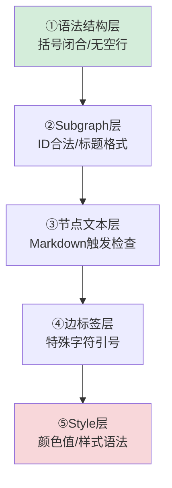

+++
id = "mermaid-insight-layered-verification"
date = "2026-06-26"
type = "insight"
scope = "mermaid,debugging"
source = "../insight-extraction.md#一、发现3"
archived_to = "docs/retrospective/patterns/methodology-patterns/root-cause-diagnosis.md#七、分层错误屏蔽效应"
+++

# 洞察06：分层错误屏蔽效应与Mermaid五层排查法

> 📖 **通用方法论已归档**：分层错误屏蔽效应作为根因诊断元概念，已补充至 [root-cause-diagnosis.md](../../../../../patterns/methodology-patterns/root-cause-diagnosis.md)（第七章）。
>
> 本文件保留 Mermaid 场景特有的五层排查顺序和事件发现过程。

## 事件发现

第一轮修复空行（结构层错误）后，第二轮才暴露节点文本问题（内容层错误）。修复一个错误后新错误出现，容易让人误以为"越修越错"——实际上是深层错误被表层错误屏蔽了。这一现象直接导致了三轮修复迭代。

## Mermaid 五层排查法

针对 Mermaid 渲染错误的具体排查顺序（按从表层到深层排列）：

| 层级 | 检查内容 | 典型错误 |
|------|---------|---------|
| ①语法结构层 | 括号/引号/direction 闭合、有无空行 | 空行截断、括号不匹配 |
| ②Subgraph层 | ID 合法性、标题格式 | 中文裸ID、全角冒号在ID中 |
| ③节点文本层 | 是否触发 Markdown 解析 | `数字. `、`- ` 触发列表 |
| ④边标签层 | 特殊字符是否加引号 | `@role`、中文标签无引号 |
| ⑤Style层 | 颜色值、样式语法 | 颜色名错误、fill格式错误 |

## 环境验证四层

排查通过后，按以下环境逐层验证：
1. **本地 Mermaid 预览**：VS Code 插件等本地环境
2. **Mermaid Live Editor**：验证基本语法正确性
3. **目标平台**：飞书/GitHub 等实际部署环境
4. **自动化脚本**：`python .agents/scripts/check-mermaid.py` 最终确认

## 心态要点

不要因为修复后仍报错就认为方向错误——在多层解析系统中，表层错误阻止解析器深入内层，修复表层后内层错误才会暴露。这是"发现了被屏蔽的旧错误"，而非"引入了新错误"。继续逐层排查直到自动化工具报告 0 错误。

## 关联洞察

- [insight-five-safe-coding-rules.md](insight-five-safe-coding-rules.md) — 五规则的发现过程（五层排查的具体规则内容）
- [insight-07-renderer-tolerance.md](insight-07-renderer-tolerance.md) — 渲染器容错度差异（解释为何本地验证不够）

---
*来源：[Mermaid 渲染问题修复复盘](../README.md)*
