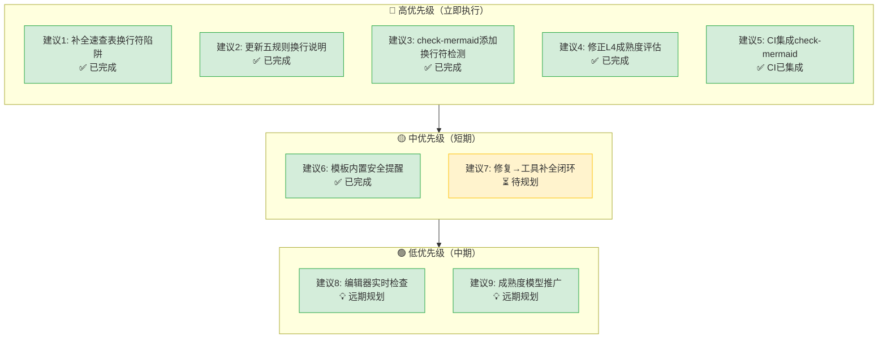

# 改进建议与行动计划

## 一、立即执行（本次提交内完成）

### 建议 1：补全 mermaid-trap-cheatsheet 的换行符陷阱

**优先级**：🔴 高
**责任角色**：developer
**状态**：✅ 本次执行

在速查表中新增"换行符陷阱"条目：
- flowchart/stateDiagram 节点内换行必须用 ` `，不能用 `\n`
- sequenceDiagram 中 `\n` 可正常使用（有独立渲染逻辑）
- 正反例对比

### 建议 2：更新 mermaid-safe-coding-rules 规则2

**优先级**：🔴 高
**责任角色**：developer
**状态**：✅ 本次执行

在五规则的"规则2：文本加引号"中补充换行符说明，或新增"规则2c"专门说明换行符规则。

### 建议 3：为 check-mermaid.py 添加 `\n` 换行符检测与自动修复

**优先级**：🔴 高
**责任角色**：developer
**状态**：✅ 本次执行

在 `_check_flowchart` 和 `_check_state_diagram` 中添加：
- 检测节点文本中是否包含 `\n`（排除 sequenceDiagram）
- `--fix` 模式下自动将 `\n` 替换为 ` `
- 注意：只替换节点文本内的 `\n`，不替换语法结构中的换行

### 建议 4：修正 mermaid-safe-coding-rules 的成熟度评估

**优先级**：🟡 中
**责任角色**：developer
**状态**：✅ 本次执行

将成熟度从 L4（标准化）调整为 L3（标准化+工具检查），理由：
- L4 要求"想犯错都难"（模板/DSL层面预防）
- 当前仍有违反规范的可能（如本次事件所示），需待强制执行机制完善后再升 L4

## 二、短期执行（1-2个迭代内）

### 建议 5：将 check-mermaid 集成到 CI 检查和提交前流程

**优先级**：🔴 高
**责任角色**：developer + orchestrator
**状态**：✅ 已完成（CI已集成，提交前检查需自觉执行）

具体措施：
1. ✅ `ci-check.ps1` / `ci-check.sh` 第4步已包含 `check-mermaid.py`，失败时 `exit 1` 阻断
2. ⏳ 在功能开发工作流（feature-development.md）中明确："涉及Mermaid修改的提交，必须先运行check-mermaid验证"
3. ⏳ pre-commit hook 未强制（Git hooks 为本地配置，不纳入版本控制）

**验收标准**：CI 流水线中的 Mermaid 检查失败会阻断合并。（ci-check 已满足，Git hooks 作为推荐实践）

### 建议 6：Mermaid 模板中内置安全规则注释

**优先级**：🟡 中
**责任角色**：developer
**状态**：✅ 已完成

已创建 `.agents/templates/mermaid-templates/safe-starter.md` 安全起步模板：
- 代码块内用 `%%` 注释内嵌六规则安全提醒（规则①-⑥），编辑时直接可见
- 示例节点全部使用 ` ` 多行文本展示正确写法
- 含完整填写指南、节点形状表、编号避坑表、陷阱排查流程
- 同步修复 check-mermaid.py 注释感知bug：`%%` 注释行中的 `\n` 不再误报
- 模板目录 README.md 已将 safe-starter.md 标记为 ⭐ 推荐首选模板，五规则升级为六规则

### 建议 7：建立"修复→工具补全"的强制闭环

**优先级**：🟡 中
**责任角色**：全部角色
**状态**：⏳ 待规划

在代码审查（reviewer角色）和阶段守卫中加入规则：
> 任何Mermaid渲染bug修复，如果check-mermaid.py未能自动检测到该类问题，必须同时更新check-mermaid.py添加对应检测规则。

这是"发现一个补一个"的制度化版本，确保工具覆盖度持续提升。

## 三、中期执行（架构层面）

### 建议 8：探索编辑器实时检查集成

**优先级**：🟢 低
**责任角色**：architect
**状态**：💡 远期规划

研究是否可通过 VS Code 扩展或 Language Server 在编辑时实时提示 Mermaid 语法问题，将"事后检查"前移为"实时提示"。

### 建议 9：将治理成熟度模型应用到其他规范领域

**优先级**：🟡 中
**责任角色**：architect + orchestrator
**状态**：💡 远期规划

本次萃取的"治理成熟度四级跃迁模型"和"规范遵守三道防线"可应用于：
- 硬编码治理规则
- Git提交规范
- 文档链接规范
- 命名约定

对每个规范领域评估当前成熟度等级，识别 L2→L3 的断层点。

## 四、改进建议优先级矩阵

## 五、经验教训

1. **规范不执行等于没有规范**：L1/L2 的规范建设如果没有 L3 的强制执行，只是在积累"技术债务（文档债务）"——给人一种"我们有规范"的虚假安全感。
2. **用户反馈是最后一道防线，不是第一道**：本次问题经过两轮用户反馈才完全修复，说明自动化防线完全失效。理想情况下，用户不应成为bug检测者。
3. **工具补全必须跟随bug修复**：每修复一个工具未覆盖的bug，必须同时更新工具。否则工具的覆盖率永远停留在"已知问题"层面。
4. **"用户报什么修什么"是反模式**：修复必须伴随对同类问题的系统性扫描，利用自动化工具而非人工检查。
