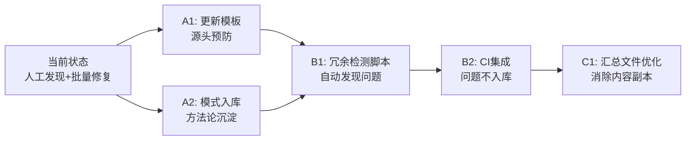

+++
id = "retrospective-report-document-dedup-insights-20260626-suggestions"
type = "suggestions"
date = "2026-06-26"
parent = "retrospective-report-document-dedup-insights-20260626"
+++

# 改进建议与模式入库计划

## 一、改进建议总表

| 问题 | 改进措施 | 优先级 | 预期效果 | 状态 |
|------|---------|--------|---------|------|
| 文档重复内容人工发现效率低 | 开发 `check-document-redundancy.py` 自动检测四类冗余 | 高 | 冗余检测自动化，提前发现问题 | 待规划 |
| 新创建文档仍可能携带冗余区块 | 更新原子化文档模板，明确"末尾不需要关联引用块" | 高 | 从源头预防结构熵产生 | 待规划 |
| frontmatter source字段缺失无检查 | 在CI中加入frontmatter完整性校验 | 中 | 确保溯源机制100%覆盖 | 待规划 |
| README多导航区块无检测 | 开发导航唯一性检测规则 | 中 | 避免双重导航造成用户困惑 | 待规划 |
| 汇总文件内容副本问题未解决 | 调研汇总文件的合理生成方式 | 低 | 消除内容副本，改为链接引用 | 待规划 |

## 二、模式入库计划

### 2.1 新增模式清单

本次萃取3个新模式，计划入库到 `docs/retrospective/patterns/methodology-patterns/`：

| 模式ID | 模式名称 | 成熟度 | 建议入库位置 | 关联现有模式 |
|--------|---------|--------|-------------|-------------|
| `pattern-document-dedup-five-phases` | 文档去重五阶段执行法 | L2 | methodology-patterns/ | `content-migration-workflow`、`scripted-batch-correction` |
| `pattern-redundancy-triangle-check` | 冗余判定三角验证法 | L2 | methodology-patterns/ | `document-entropy-three-strategies`、`entry-container-separation` |
| `pattern-remove-vs-simplify` | 移除vs精简二元决策模型 | L2 | methodology-patterns/ | `atomization-three-criteria-test`、`prove-usefulness-check` |

### 2.2 现有模式更新建议

| 现有模式 | 更新内容 | 原因 |
|---------|---------|------|
| `document-entropy-three-strategies.md` | 扩展"文档熵"概念，增加"结构熵"类型（重复区块累积），原模式主要覆盖"声明熵" | 本次发现结构熵是与声明熵并列的另一大类熵增现象 |

## 三、行动计划

### 高优先级行动项

| 序号 | 改进项 | 具体措施 | 建议时间 | 状态 |
|------|--------|---------|---------|------|
| A1 | 更新原子化文档模板 | 修改原子化模板文件，明确说明： 1. frontmatter必须包含source字段 2. 文档末尾不需要"关联模块"引用块 3. README仅保留一个核心导航表 | 2026-06-27 | 待规划 |
| A2 | 三个新模式入库 | 按标准格式编写3个模式文件，更新methodology-patterns/README.md索引 | 2026-06-27 | 待规划 |

### 中优先级行动项

| 序号 | 改进项 | 具体措施 | 建议时间 | 状态 |
|------|--------|---------|---------|------|
| B1 | 开发冗余检测脚本 | 新增 `.agents/scripts/check-document-redundancy.py`，检测： 1. 子模块文档末尾的关联引用块 2. README中的多导航区块 3. frontmatter source字段缺失 | 2026-06-28 | 待规划 |
| B2 | CI集成frontmatter检查 | 在 `ci-check.ps1`/`ci-check.sh` 中增加frontmatter完整性检查步骤 | 2026-06-29 | 待规划 |

### 低优先级行动项

| 序号 | 改进项 | 具体措施 | 建议时间 | 状态 |
|------|--------|---------|---------|------|
| C1 | 汇总文件副本问题调研 | 调研33个汇总文件的使用场景，确定是改为链接引用还是自动生成 | 2026-06-30 | 待规划 |
| C2 | 更新document-entropy-three-strategies | 扩展"结构熵"相关内容，完善文档熵分类体系 | 按需 | 待规划 |

## 四、工具化路线图

## 五、与现有工具体系的整合点

1. **与check-links.py的关系**：未来的 `check-document-redundancy.py` 可作为独立检查脚本，与check-links.py、check-mermaid.py等并列，共同构成文档质量检查工具链
2. **与原子化流程的整合**：在 `.agents/commands/atomization.md` 流程末尾增加"运行冗余检查"步骤，确保原子化拆分后的新文档不携带冗余区块
3. **与generate-nav.py的协同**：导航表由generate-nav.py自动生成时，可自动检测和移除手动添加的重复导航区块
4. **模式复用**：本次萃取的"五阶段执行法"可推广到其他大规模文档重构场景，不仅限于去重优化
