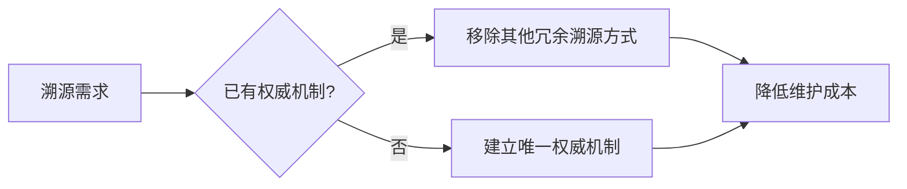
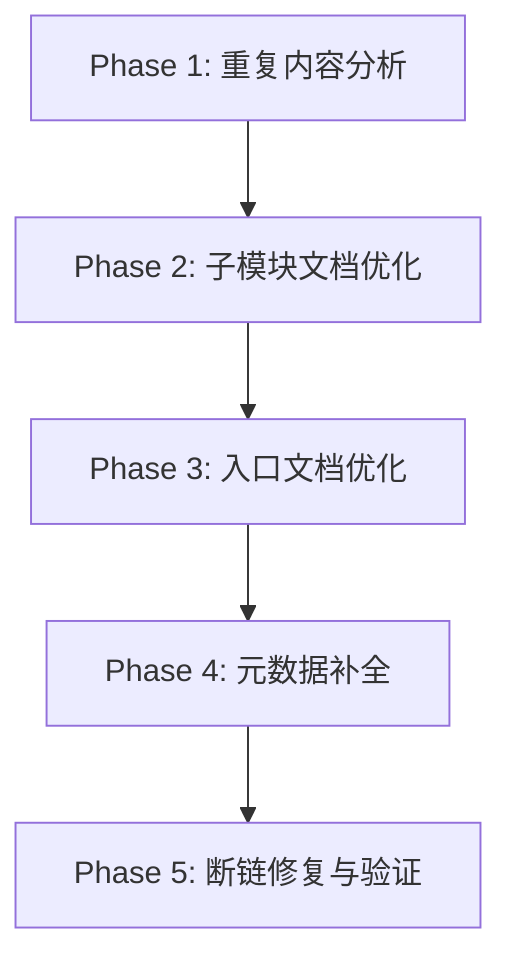
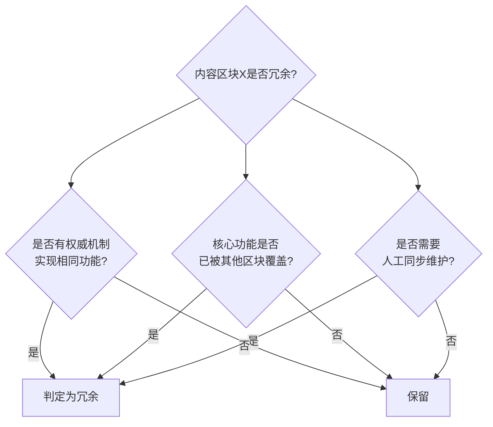

+++
id = "retrospective-report-document-dedup-insights-20260626-insights"
type = "insight"
date = "2026-06-26"
parent = "retrospective-report-document-dedup-insights-20260626"
maturity = "L2"
source = "../reports-duplication-optimization-report.md"
+++

# 洞察萃取 — 文档重复内容治理与去冗余方法论

## 一、关键发现

### 发现 1：文档冗余的四类典型来源

**事实支撑**：本次优化识别出100+文件存在重复内容，可系统归纳为4类：
- frontmatter source 重复引用（所有子模块文档）
- 文档末尾关联模块引用块（100个文件）
- README.md "关联报告"部分（32个文件）
- 汇总文件内容副本（33个文件，完全重复）

**深层含义**：文档冗余不是随机产生的，而是有明确的来源模式。这意味着可以建立系统化的检测和预防机制，而非零散地逐个修复。

### 发现 2：单一溯源机制原则 — 权威来源唯一化

**事实支撑**：每个子模块文档通过 frontmatter 的 `source` 字段已经建立了溯源关系，但文档末尾又重复放置关联模块引用块，造成功能重叠。优化后移除了55个文档的末尾引用块，保留 frontmatter source 作为唯一溯源机制。

**深层含义**：

当一个功能（溯源、导航、索引）已经有一个权威、自动化的实现机制时，其他手动维护的重复实现都属于冗余，应该移除。这是对 `document-entropy-three-strategies.md`（文档声明熵增三策）的扩展——不仅是统计数字，结构性重复内容同样遵循熵增规律。

### 发现 3：导航功能的唯一来源原则

**事实支撑**：README.md 中已有"子模块导航"表格作为核心导航功能，但又重复添加"关联报告"章节。优化中5个完全移除、27个精简该章节。

**深层含义**：
- 导航功能应该有**唯一的主入口**，避免用户在多个导航区块间困惑
- 子模块导航表是结构化、可维护的（有统一格式），优于自由文本的"关联报告"列表
- 当存在结构化导航机制时，非结构化的关联列表属于冗余

### 发现 4：去优化与验证必须闭环

**事实支撑**：执行5个阶段优化后，立即进行链接检查，发现并修复1个断链（路径错误），同时识别1个预存断链（AGENTS.en.md 未创建）。

**深层含义**：任何批量文档修改操作都必须：
1. 修改前先扫描基线状态
2. 修改后立即运行验证
3. 区分"本次引入的问题"和"历史预存问题"
4. 修复本次引入的问题，预存问题记录跟踪

## 二、可复用模式萃取

### 模式 1：文档去重五阶段执行法

**模式 ID**：pattern-document-dedup-five-phases
**成熟度**：L2（已在55+32个文件上验证）
**适用场景**：大规模文档体系的重复内容清理与优化

**执行流程**：

**各阶段详细操作**：

| 阶段 | 任务 | 关键动作 | 验证标准 |
|------|------|---------|---------|
| Phase 1 | 重复内容分析 | 全量扫描、分类统计、识别冗余类型 | 输出重复类型清单+数量统计 |
| Phase 2 | 子模块文档优化 | 批量移除冗余区块、统一格式 | 子模块文档冗余率降至0 |
| Phase 3 | 入口文档优化 | README导航精简、重复章节移除/精简 | 入口文档仅保留核心导航 |
| Phase 4 | 元数据补全 | 补充缺失的frontmatter、source字段 | 元数据完整率100% |
| Phase 5 | 断链修复与验证 | 链接检查、修复本次引入断链、记录预存问题 | 0个本次引入断链 |

**关键设计决策**：
1. **先分析后执行**：Phase 1 不做任何修改，只做扫描分类，避免盲目修改
2. **从子模块到入口**：先处理叶子节点文档，再处理入口README，避免入口变更导致子模块链接失效
3. **元数据补全前置**：在验证前补全frontmatter，确保溯源机制完整
4. **验证闭环**：最后必须做链接检查，不能假设批量修改是正确的

### 模式 2：冗余判定三角验证法

**模式 ID**：pattern-redundancy-triangle-check
**成熟度**：L2
**适用场景**：判断某一文档区块/内容是否属于冗余

**判定三角**：

**三个验证问题**：
1. **功能替代检查**：是否已有一个更权威、自动化程度更高的机制实现相同功能？（如 frontmatter source vs 末尾引用块）
2. **核心覆盖检查**：核心功能（如导航）是否已被另一个区块完整覆盖？（如子模块导航表 vs 关联报告列表）
3. **维护成本检查**：该内容是否需要人工同步维护，且不同步就会过时？

**判定规则**：三个问题中只要有两个回答"是"，即可判定为冗余，考虑移除或精简。

### 模式 3：移除vs精简二元决策模型

**模式 ID**：pattern-remove-vs-simplify
**成熟度**：L2
**适用场景**：判定冗余内容是完全移除还是部分精简

**决策矩阵**：

| 场景 | 操作 | 本次案例 |
|------|------|---------|
| 功能100%被覆盖、无独特价值 | **完全移除** | 5个README的"关联报告"章节 |
| 有部分独特价值、但存在冗余 | **精简保留** | 27个README的"关联报告"章节 |
| 元数据缺失导致溯源断裂 | **补全而非移除** | 5个缺失frontmatter的文件 |

**决策原则**：
- 当内容与其他区块**完全重复**时，果断移除
- 当内容有**部分新增信息**但整体冗余时，精简保留核心增量信息
- 当问题不是"冗余"而是"缺失"时，补全而非删除

## 三、规律认知升级

### 文档熵的两种类型

基于本次实践与之前的 `document-entropy-three-strategies.md`，可以将文档熵分为两类：

| 熵类型 | 表现 | 最优策略 | 本次案例 |
|--------|------|---------|---------|
| **声明熵** | 统计数字、条数声明过时 | 移除变量（第三策） | 头部行数统计过时 |
| **结构熵** | 重复区块、冗余引用累积 | 单一来源+去重 | 末尾关联引用块冗余 |

**结构熵的特点**：
- 不是"过时"，而是"重复"
- 产生原因：复制粘贴、过度设计、防御性引用
- 危害：增加阅读负担、提高维护成本、稀释核心信息密度
- 最优策略：建立唯一权威来源，移除重复实现

### 文档信息密度的U型曲线

文档优化存在一个U型曲线：
1. **信息不足**（左侧）：缺少必要的导航、溯源、元数据，文档难以使用
2. **最优区间**（中间）：核心功能完整、无冗余、信息密度高
3. **信息过载**（右侧）：重复导航、冗余引用、多个溯源机制，信息密度反而下降

本次优化就是将文档从"信息过载"侧拉回最优区间。

## 四、潜在机会

1. **自动化冗余检测脚本**：开发 `check-document-redundancy.py`，基于四类冗余来源模式自动检测文档中的重复区块
2. **frontmatter 完整性门禁**：在CI中加入检查，确保所有原子化文档都包含 `source` 字段
3. **导航唯一性验证**：检测README中是否存在多个导航区块，提醒维护者精简
4. **去重操作Playbook**：将"五阶段执行法"做成标准化脚本/清单，未来文档重构时直接复用
5. **原子化文档模板强化**：在原子化模板中明确"末尾不需要关联引用块，frontmatter source已承担溯源功能"，从源头预防冗余
