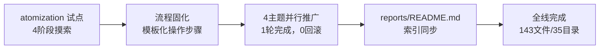

# 二、执行复盘

## 2.1 执行全景

## 2.2 推广策略：最小试点 → 批量并行

| 维度 | atomization（试点） | 其余 4 主题（推广） |
|------|---------------------|---------------------|
| 执行轮次 | 4 轮渐进式 | 1 轮并行 |
| Agent 数 | 1 | 4（同时） |
| 回滚次数 | 0 | 0 |
| 交互次数 | 2 次用户确认 | 0（全自动） |
| 核心成本 | 探索最优路径 | 执行已知路径 |

推广效率比 = 4轮交互 / 1轮执行 = **大幅缩短**。试点的价值不在于"做了多少"，而在于"让后续做同样的事不需要再思考"。

## 2.3 各主题处理详情

### roles-teams（3 目录）

- project-overview 合并：3/3。含无 1.1/1.2 结构的文件降级合并（跳过 TOML/标题/引用块后取全部内容）。
- 连接器合并：3/3 个连接器均无 TOML，直接删除 source 行后删除。

### insight-extraction（8 目录）

- project-overview 合并：8/8，全部标准 1.1/1.2 结构。
- 连接器合并：8/8 均无 TOML。

### spec-system（7 目录）

- project-overview 合并：7/7。
- 连接器合并：5 个无 TOML + 2 个有 TOML（`maturity-standard-creation`、`pattern-maturity-automation-closure`），有 TOML 的将 source 值注入 README。

### project-governance（7 目录，含 2 例外）

| 例外 | 处理 |
|------|------|
| `project-retrospective.md`（非标准命名） | 合并至 README 的 `## 项目复盘回顾` 章节，README 从 65→225 行 |
| `reports-duplication-optimization-report.md`（独立报告） | 完全保留，不动 |

## 2.4 量化对比

| 指标 | 推广前（4 主题） | 推广后（4 主题） | 全部 5 主题 |
|------|-----------------|-----------------|------------|
| 总文件 | ~153 | 103 | 143 |
| project-overview | 25 | 0 | 0 |
| 连接器 .md | 23 | 0 | 0 |
| 标准 4 文件目录 | 0 | 23 | 33 |
| 非标准目录 | — | 1（project-retrospective 合并后 6 文件） | 2（+ 独立报告） |

## 2.5 关键决策

| 节点 | 决策 | 依据 |
|------|------|------|
| 是否统一 project-retrospective 命名为 project-overview | 否，先记录为待办 | 避免在推广中引入额外变更 | 
| 无 TOML 连接器的 source 处理 | 直接删除 README 的 source 行 | 连接器即为原始报告，无更深源头可追溯 | 
| project-retrospective 内容归属 | 作为 `## 项目复盘回顾` 而非 `## 项目概览` | 其内容涵盖第 1~2 章，远超出"概览"范围 | 
