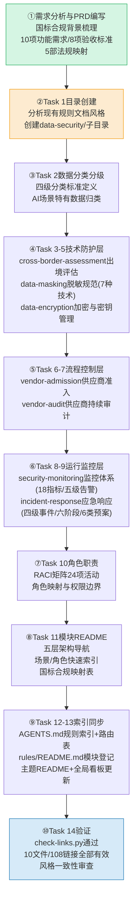

# 执行过程复盘

## 事实时间线

## 关键决策点分析

| 序号 | 决策点 | 选项 | 最终选择 | 理由 |
|------|--------|------|---------|------|
| D1 | 体系架构分层 | 平铺式文档列表 vs 五层架构 | **五层架构** | 基础层→技术防护层→流程控制层→运行监控层→组织保障层，逻辑依赖清晰，便于逐层落地 |
| D2 | 数据安全角色 | 新增独立DSO角色 vs 扩展现有角色 | **扩展现有角色** | 现有5角色体系已覆盖治理需求，新增角色会导致角色膨胀和职责重叠，通过RACI矩阵扩展更轻量 |
| D3 | 文档frontmatter | 添加TOML frontmatter vs 不加 | **不加** | 初期误判规则文档需要frontmatter，但检查现有治理规则文档（hardcode-governance、stage-guardrails等）均不使用frontmatter，"约定优于配置" |
| D4 | 文档粒度 | 合并为5个大文档 vs 拆分为10个独立文档 | **10个独立文档** | 初期考虑按层合并为5个文档，但发现每个模块关注点独立（如脱敏和加密是不同技术领域），拆分后更便于按场景查阅和单独更新 |
| D5 | 监控指标数量 | 精简10项核心指标 vs 全面18项指标 | **18项指标** | 数据安全监控需要覆盖数据流转全链路（采集、传输、存储、处理、出境、销毁），精简会遗漏关键风险点；配合五级告警分级避免告警疲劳 |
| D6 | 应急响应阶段 | 四阶段(发现-处置-恢复-复盘) vs 六阶段 | **六阶段** | 参考NIST网络安全框架，将"遏制"和"根除"独立为两个阶段，避免在未根除根因时仓促恢复导致二次泄露 |
| D7 | 供应商管理模型 | 准入一次性审查 vs 全生命周期管理 | **全生命周期(准入→审计→评级→处置)** | 一次性准入无法覆盖供应商安全能力退化风险，持续审计+评级+处置形成闭环管控 |

## 遇到的问题与修正

### 问题1：TOML frontmatter风格误判

- **现象**：Task 2-3编写时按spec中的NFR-1要求添加了TOML frontmatter（id/date/type/source字段），后在审查现有治理规则文档时发现`.agents/rules/`下的所有规则文档均不使用frontmatter
- **根因**：spec.md中NFR-1要求"TOML frontmatter"是基于模板惯性，但实际项目中治理规则文档采用"约定优于配置"，frontmatter仅在复盘报告、spec文档等元数据驱动的文档中使用
- **修正**：Task 11编写README时确认无frontmatter风格，回查已写文档并移除frontmatter；同时更新tasks.md中TR-2.4和TR-14.4，明确"无TOML frontmatter，与现有治理规则文档风格一致"
- **教训**：编写新文档前必须先读取同类现有文档确认风格，不能仅依赖spec描述——spec中的非功能需求也需要与实际代码库风格对齐验证

### 问题2：任务粒度过粗

- **现象**：初期规划Task时将Task 3-5（出境评估、脱敏、加密）合并为一个任务组，Task 6-7（供应商准入/审计）合并为一个任务组，导致单任务内多文档无法独立追踪进度和验证
- **根因**：按五层架构的"层"来划分任务，但技术防护层和流程控制层各自包含多个独立文档，合并后单个任务验收标准过于复杂
- **修正**：将合并任务拆分为独立Task，每个文档对应一个独立Task（最终14个Task：Task1目录 + Task2-10共9个核心文档 + Task11模块README + Task12索引同步 + Task13看板更新 + Task14验证），每个Task有独立的验收标准和测试要求
- **教训**：任务粒度应以"可独立验证的交付物"为单位，而不是按逻辑层次合并。一个Task对应一个可独立验收的产出物，避免"大泥球"任务

## 效率分析

### 与前期治理规则建设对比

| 对比维度 | 硬编码治理规则（首批） | 阶段守卫机制 | 本次数据安全治理 |
|---------|-------------------|------------|----------------|
| 交付文档数 | 5个模块 | 2个规则+1协议+1脚本 | 10个规则文档 |
| 文档行数 | ~1200行 | ~1500行（含脚本） | ~4000行 |
| 架构设计 | 平铺式 | 规则+日志+脚本三层 | 五层体系架构 |
| Spec质量 | 基础PRD | 借鉴竞品、7任务28子任务 | 合规驱动、10FR+7NFR、14Task |
| 验证方式 | 人工检查 | check-links + 自定义脚本 | check-links（108链接全通过） |
| 过程修正 | 无显著问题 | JUMP匹配bug（修复1次） | frontmatter+粒度问题（修正2次） |

### 效率提升因素

1. **方法论成熟**：经过前两次治理规则建设，已形成"Spec→分层设计→逐文档编写→索引同步→验证"的标准化流程
2. **五层架构复用**：基础层→技术防护层→流程控制层→运行监控层→组织保障层的分层模式提供了清晰的文档组织骨架，减少了架构设计犹豫时间
3. **合规驱动有锚点**：国标法规提供了明确的合规基线，减少了"从零设计"的不确定性（类似上次SpecForge竞品锚定效应）
4. **风格一致性意识增强**：经历了frontmatter误判后，"先读现有文档再写"成为自觉实践

### 耗时分布估算

| 阶段 | 耗时占比 | 主要活动 |
|------|---------|---------|
| 需求分析+Spec编写 | ~20% | 国标背景梳理、10FR定义、验收标准编写、14任务分解 |
| 核心规则编写(Task2-10) | ~50% | 10份规则文档编写（含Mermaid流程图、矩阵表格、checklist） |
| 模块README+索引同步(Task11-13) | ~15% | 五层架构导航、AGENTS.md更新、看板更新 |
| 验证+问题修正(Task14) | ~10% | 链接检查、frontmatter移除、任务拆分调整、风格审查 |
| 复盘文档编写 | ~5% | 本系列复盘报告 |

## 成功经验总结

1. **合规驱动的体系化设计**：以国家AI智能体互联国标为锚点，从法规要求→场景映射→规则编写→检查清单，自上而下推导，确保规则有据可依而非凭空设计
2. **五层架构分层清晰**：基础层（分类分级）→技术防护层（脱敏/加密）→流程控制层（出境/供应商）→运行监控层（监控/应急）→组织保障层（角色职责），每层内聚、层间松耦合，依赖关系单向无环
3. **"约定优于配置"的文档规范意识**：发现frontmatter不一致后及时修正，而不是坚持spec中的描述——实际代码库的约定优先级高于文档描述
4. **独立任务粒度管控**：拆分合并任务后，每个文档独立成Task，进度可追踪、验收可独立执行，避免了"大任务"的执行模糊性
5. **Mermaid可视化增强理解**：五层架构图、出境审批流程图、新API接入流程图、应急响应流程图等帮助理解复杂流程和依赖关系
6. **矩阵和checklist提升可操作性**：数据流转矩阵、脱敏要求矩阵、RACI矩阵、供应商评估checklist、应急响应时限表等让规则从"原则描述"变为"可执行清单"

## 不足与遗憾

1. **未同步设计安全检查脚本**：本次交付了10份规则文档但未配套类似check-stage-guardrails.py的自动化检查工具（如数据分级标注检查、脱敏规则合规性扫描），规则落地仍主要靠人工审查和自觉遵守，属于"有规范缺验证层"
2. **代码示例库缺失**：脱敏和加密规范仅描述了技术要求，未提供具体的代码实现示例（如PII脱敏的正则表达式、AES-256加密的代码片段），developer落地时仍需自行查找实现方案
3. **国标条文映射不够精细**：虽然列出了遵循的5部法规，但未做逐条国标条文→规则条款的精细映射表，合规审计时需要人工对照，增加了审计成本
