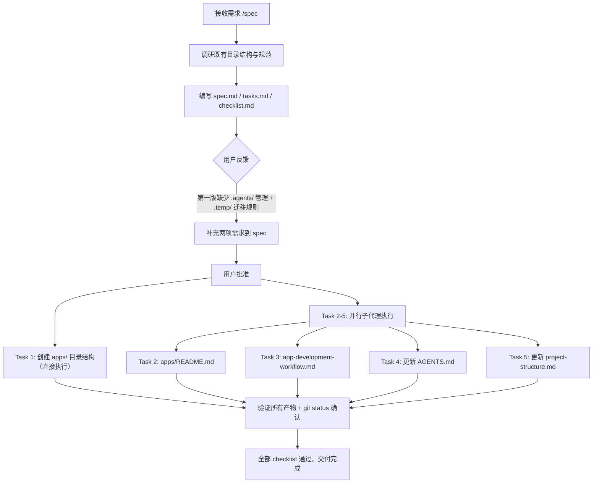

# 二、复盘环节

## 2.1 实施过程回顾

**时间线**：

| 阶段 | 动作 | 产出 |
|---|---|---|
| 调研 | 读取 project-structure.md、.gitignore、AGENTS.md、dependency-management.md | 理解既有目录命约、gitignore 规则、AGENTS.md 路由表结构、.temp/ 管理规范 |
| 规格设计（初版） | 编写 spec.md + tasks.md + checklist.md | 3 个 spec 文件 |
| 规格修订 | 根据用户反馈新增 .agents/ 管理 + .temp/ → apps/ 迁移规则 | spec 增加 2 项需求，tasks 从 3 个增至 5 个 |
| 实现 | 1 次直接目录创建 + 4 个并行子代理 | 6 个文件变更全部完成 |
| 验证 | 逐项检查 checklist 11 条 + git status 确认 | 全部通过 |

## 2.2 关键节点分析

#### 关键决策 1：app-development-workflow 的定位选择

- **决策依据**：用户要求 `.agents/` 中也需要添加对 `apps/` 的管理，同时约束"先在 `.temp/` 开发，逐步迁移到 `apps/`"。这本质上是一个**开发流程规范**。
- **技术挑战**：应将新文件放在 `worlds/environments/`（环境管理）、`protocols/`（协作协议）还是 `workflows/`（标准工作流）？
- **解决方案**：选择 `protocols/`。理由——(1) 既有的 `dependency-management.md` 也位于 `protocols/`，新协议与其存在强引用关系，放在同一目录利于互指；(2) 它定义的是跨角色协作规则（developer → tester → reviewer → orchestrator），比 `workflows/` 的单流程更具协议性；(3) `worlds/environments/` 侧重运行时环境，而本协议侧重开发生命周期的阶段转移。

#### 关键决策 2：用户反馈驱动的规格增量演进

- **决策依据**：初版 spec 仅覆盖目录创建与文档更新，用户补充了 `.agents/` 管理与 `.temp/` → `apps/` 迁移规则两项核心需求。
- **技术挑战**：增量式追加需求而非推翻重来，需确保新增需求与既有需求无冲突。
- **解决方案**：在 spec 中新增两项 ADDED Requirement（而非 MODIFIED），在 tasks 中新增 Task 3 和 Task 4，保持 Task 1、Task 2、Task 5 不变。这体现了**增量扩展优于全量重写**的原则。

#### 关键决策 3：并行子代理执行策略

- **决策依据**：Task 2-5 之间无依赖关系，可并行执行。
- **技术挑战**：Task 4 和 Task 5 均需修改现有文件（AGENTS.md 和 project-structure.md），但操作的是不同文件，不存在竞态。
- **解决方案**：Task 1 直接执行（mkdir + .gitkeep），Task 2-5 分别使用 4 个独立子代理并行执行。Task 4 和 Task 5 各自使用 SearchReplace 精确替换，互不干扰。

## 2.3 执行情况与结果数据

| 指标 | 数值 | 说明 |
|---|---|---|
| 新增文件数 | 4 | apps/、shared/.gitkeep、README.md、app-development-workflow.md |
| 修改文件数 | 2 | AGENTS.md、project-structure.md |
| 总文件变更 | 6 | 含目录创建 |
| 子代理调用次数 | 4 | 全部并行执行，零失败 |
| Spec 迭代次数 | 2 | 初版 → 修订版 |
| Checklist 通过率 | 100% (11/11) | 全部验收通过 |
| Mermaid 图表数 | 2 | 状态图 + 流程图（均在 app-development-workflow.md 中） |

## 2.4 成功经验

1. **Spec 先行，增量修正**：先出完整 spec 再请求批准，批准前的用户反馈仅需增量追加需求项，避免了推倒重来的浪费。这与项目既有的 Spec-driven 开发方法论一致。

2. **协议就近原则**：将 `app-development-workflow.md` 放在 `protocols/` 而非 `workflows/`，理由是它与 `dependency-management.md` 存在互引用关系，同目录利于维护。这体现了"相关性高于分类纯粹性"的务实策略。

3. **并行子代理最大化效率**：4 个独立任务并行分发给子代理，在同一轮工具调用中完成全部工作，显著缩短了实现阶段的整体耗时。

4. **协议与 README 双轨说明**：`apps/README.md` 面向人类读者提供概要说明，`app-development-workflow.md` 面向 AI 智能体提供详细规范——两者各司其职，符合项目"文档边界分离"原则。

## 2.5 存在问题

| 问题 | 根因分析 | 影响评估 |
|---|---|---|
| 初版 spec 未覆盖 `.agents/` 管理需求 | 对用户"在项目根目录下规划并创建"的表述理解过于字面化，未主动联想到 `.agents/` 治理体系需要同步扩展 | 导致一轮反馈修正，增加约 1 个回合的交互成本。影响可控，因为 spec 修正仅涉及增量追加，未影响已有设计 |

---