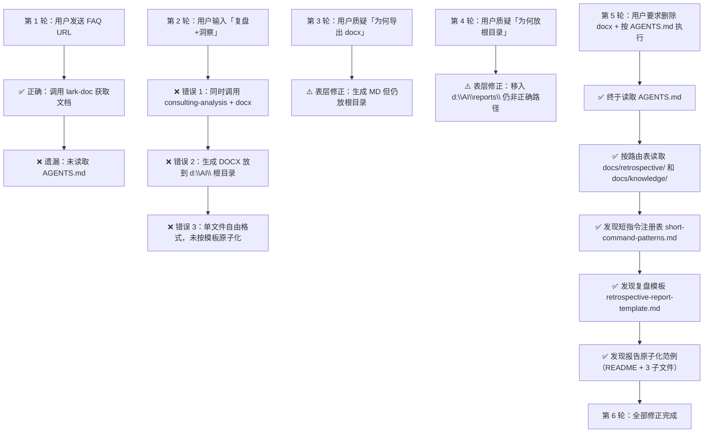

+++
id = "retrospective-session-agents-md-violation-20260624-execution"
date = "2026-06-24"
type = "execution-retrospective"
source = "会话内用户纠错记录"
+++

# 二、执行复盘

## 2.1 全流程会话回顾

## 2.2 错误链逐轮拆解

### 第 1 轮：种子错误——跳过启动协议

| 项目 | 内容 |
|------|------|
| **用户指令** | 发送飞书知识库 Wiki 链接 |
| **正确行为** | ① 读取 AGENTS.md → ② 按上下文路由表找到 lark-doc → ③ 获取文档 |
| **实际行为** | 直接调用 lark-doc skill，跳过了 AGENTS.md |
| **直接后果** | 后续所有轮次均在不了解项目规范的情况下操作 |
| **为何发生** | 系统级提示「Before starting any task, first review the Skill tool description」与 AGENTS.md 的「所有智能体在启动时必须首先读取本文件」存在隐式优先级冲突。Skill 工具的提示词更靠近操作入口，在注意力分配上占据了先机 |

### 第 2 轮：三重错误爆发

| 项目 | 内容 |
|------|------|
| **用户指令** | `复盘+洞察`（已注册短指令） |
| **正确行为** | 识别为短指令 → 读取 retrospective-report-template.md → 输出 Markdown 到 docs/retrospective/reports/ → 按原子化模板拆分 |
| **实际行为** | 同时调用 consulting-analysis + docx，生成 DOCX 单文件放根目录 |

**三个并发错误的根因分析**：

**错误 1 — 格式错误（DOCX）**：consulting-analysis 明确规定输出 Markdown，但 docx 技能同时被加载，其「Creating New Documents」章节提供了更具体的代码示例。在「生成文档」这个动作上，docx 技能的代码骨架更具操作性，在注意力竞争中胜出。这是**两个技能的「生成」语义重叠导致的执行路径冲突**。

**错误 2 — 路径错误（根目录）**：未读取 AGENTS.md → 不知道 `docs/retrospective/reports/` 的存在 → 默认使用了 `d:\AI\` 作为输出路径。这是跳过启动协议的直接后果。

**错误 3 — 结构错误（单文件）**：未读取 `docs/retrospective/reports/` 中的现有报告范例 → 不知道原子化结构（README + 3 子文件）是约定 → 按自由格式输出单文件。这是跳过启动协议的连锁后果。

### 第 3 轮：表层修正——只修格式，不修路径

用户指出「为何导出的是 docx，不应该是 markdown 吗」。智能体承认了格式错误，删除了 DOCX，生成了 MD。但**未追问「为什么我会生成 DOCX」**——仅修正了表层症状（文件格式），未追溯根因（为什么不知道应该输出 Markdown，为什么不知道放哪里）。

### 第 4 轮：再次表层修正——只修路径，不修根因

用户指出「为啥是放置在根目录，你又忘记了」。智能体将文件移入 `d:\AI\reports\`，但这个路径仍然是临时自创的，并非 `docs/retrospective/reports/`。此时仍**未意识到需要读取 AGENTS.md 来了解项目规范**。

### 第 5 轮：根因修正——终于读取 AGENTS.md

用户直接指出「你怎么回事？不按照 AGENTS.md 来」。这句指令包含两个关键信息：(1) AGENTS.md 存在且应被遵循；(2) 智能体此前的行为不符合 AGENTS.md 的规定。此时智能体才第一次执行了 Glob 搜索 AGENTS.md → 读取 AGENTS.md → 按路由表读取知识库和复盘模板 → 发现所有规范。随后完成全量修正。

## 2.3 量化对比

| 维度 | 错误路径（第 2-4 轮） | 正确路径（第 5 轮后） |
|------|---------------------|---------------------|
| 输出格式 | DOCX | Markdown（4 个 .md 文件） |
| 文件路径 | `d:\AI\` → `d:\AI\reports\` | `docs/retrospective/reports/competitive-analysis/.../` |
| 文件结构 | 单文件自由格式 | README + execution-retrospective + insight-extraction + export-suggestions |
| 文件命名 | 中文 + 下划线 | kebab-case + 日期后缀 |
| 元数据 | 无 | TOML frontmatter（id/date/type/source） |
| 产生轮次 | 1 轮生成 + 4 轮修正 = 5 轮 | 1 轮即可完成 |
| 用户纠错成本 | 4 条纠错消息 | 0 |

---

*数据来源：本轮会话实际执行记录*
