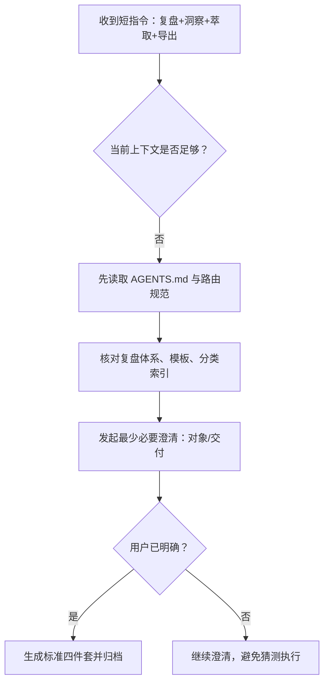

# 执行复盘 — 短指令跨会话上下文重建与参数澄清

## 一、实施过程回顾

### 1.1 事实时间线

| 阶段 | 事实输入 | 关键判断 | 产出 |
|------|----------|----------|------|
| S1 接收任务 | 用户仅输入 `复盘+洞察+萃取+导出` | 指令语义明确指向复盘工作流，但对象与交付形态缺失 | 转入协议读取与任务归类 |
| S2 协议读取 | 读取 `client/sdk/AI/AGENTS.md`、上下文路由、全局核心规则 | 本任务属于已注册短指令场景，且在新会话中必须先完成启动协议，再执行短指令 | 锁定复盘体系与命令入口 |
| S3 模板核对 | 读取 `docs/retrospective/README.md`、`reports/README.md`、复盘/洞察/导出指令与样例报告 | 标准交付结构为四件套；目录归类与 frontmatter 存在既定约束 | 明确产物结构与归档位置 |
| S4 结构化澄清 | 发起 2 个问题：处理对象、交付形态 | 短指令在上下文不足时应补齐最少参数，而非直接猜测 | 用户确认：`当前会话` + `标准四件套` |
| S5 归档执行 | 生成四件套并同步更新索引与模式验证记录 | 本次会话应归类为流程与合规治理中的“短指令上下文重建”案例 | 形成可追溯复盘资产 |

### 1.2 关键决策节点

### 1.3 关键决策说明

**决策 D1：不直接把短指令视为“可立即执行”**
- 决策依据：当前会话没有前置对象、时间范围、交付格式等上下文。
- 风险控制：避免把报告写错主题、写错目录，或错误落成“只给摘要”。

**决策 D2：先读协议，再读模板，再问问题**
- 决策依据：本仓库对复盘产物的目录、结构、frontmatter 和索引更新都有硬约束。
- 预期效果：先建立正确框架，再用最少提问补齐缺失参数，降低返工成本。

**决策 D3：澄清问题只保留两个槽位**
- 槽位 1：处理对象（当前会话 / 指定目录文件 / 已有报告 / 某次问题）
- 槽位 2：交付形态（四件套 / 摘要 / 只做洞察 / 带导出文件）
- 设计理由：在保留灵活性的同时，控制提问成本，避免短指令被过度打断。

## 二、问题定义与约束

### 2.1 本次核心问题

| 项目 | 内容 |
|------|------|
| 表面任务 | 生成“复盘+洞察+萃取+导出”结果 |
| 实际难点 | 新会话中短指令缺少对象与交付参数 |
| 主要风险 | 误判主题、误选产物结构、误放归档目录 |
| 正确策略 | 协议优先、模板核对、结构化澄清、再执行 |

### 2.2 本次做对的点

- **先协议后执行**：没有直接生成正文，而是先完成启动协议与相关路由读取。
- **澄清最小化**：只问两个问题就完成范围收敛，没有让用户重复描述整段需求。
- **样例驱动归类**：通过已有报告与索引样例确定目录结构，避免自造格式。

### 2.3 仍然暴露的治理空白

- **短指令完整性检查未显式产品化**：目前靠执行时自觉判断，尚未沉淀成固定检查节点。
- **命令指令与模式计数存在历史漂移**：`short-command-patterns.md` 的 frontmatter 计数落后于已记录实践，说明模式资产仍需要定期校准。
