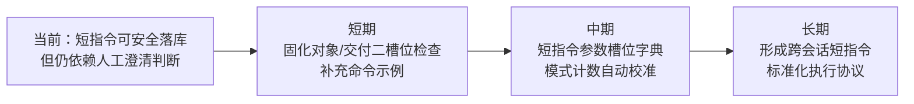

# 改进建议与行动计划

## 一、已完成的导出动作

| # | 动作 | 状态 | 说明 |
|---|------|------|------|
| 1 | 生成标准四件套 | 已完成 | 新建 `README.md`、`execution-retrospective.md`、`insight-extraction.md`、`export-suggestions.md` |
| 2 | 归档到流程与合规治理主题 | 已完成 | 将本次会话定位为“短指令上下文重建”案例 |
| 3 | 更新索引 | 已完成 | 同步 `reports/README.md`、`project-governance/README.md`、`process-and-compliance/README.md` |
| 4 | 校准模式记录 | 已完成 | 更新 `short-command-patterns.md` 的验证次数与使用原则 |

## 二、后续改进建议

### 2.1 近期建议

| # | 建议 | 优先级 | 预期收益 |
|---|------|--------|---------|
| 1 | 在短指令进入点增加“对象/交付”二槽位检查 | 高 | 将跨会话短指令的歧义成本控制在一次问答内 |
| 2 | 为复盘类短指令增加标准澄清模板 | 高 | 统一提问方式，减少不同会话间的执行漂移 |
| 3 | 定期校准模式 frontmatter 与报告引用计数 | 中 | 防止模式成熟度统计与实际验证轮次脱节 |
| 4 | 在命令文档中补充“跨会话澄清守则”示例 | 中 | 让命令规范覆盖真实边界条件，而非只覆盖理想路径 |

### 2.2 中长期建议

| # | 建议 | 优先级 | 预期收益 |
|---|------|--------|---------|
| 1 | 将“短指令完整性检查”沉淀为 AGENTS/命令集的固定步骤 | 中 | 从经验动作升级为仓库显式协议 |
| 2 | 为常见短指令建立参数槽位字典 | 低 | 让 `洞察`、`跟进行动项`、`导出报告` 等也具备统一澄清机制 |

## 三、模式验证更新

| 模式 | 变化 | 本次证据 | 处理 |
|------|------|---------|------|
| `short-command-patterns` | 验证次数 +1 | 用户以 `复盘+洞察+萃取+导出` 在新会话触发完整流程，并通过两步澄清稳定落库 | 已更新模式文档 |
| `review-insight-export-loop` | 再次复用 | 复盘、洞察、导出三段结构在本次四件套中完整落地 | 维持现状 |

## 四、后续方向

