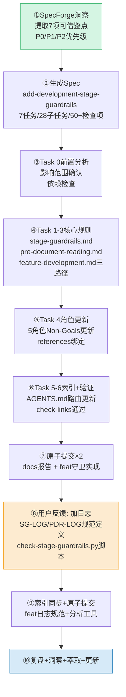

# 执行过程复盘

## 事实时间线

## 关键决策记录

| 序号 | 决策点 | 选项 | 最终选择 | 理由 |
|------|--------|------|---------|------|
| D1 | 借鉴SpecForge的范围 | 照搬GUARDRAILS实现 vs 吸收理念自研 | **吸收理念自研** | SpecForge面向个人零基础开发者，SpecWeave面向团队协作，场景不同需适配 |
| D2 | 阶段数设计 | SpecForge的6阶段 vs 扩展为8阶段 | **8阶段** | 新增"任务分配(S3)"和"合并代码(S7)"，适配多角色协作场景 |
| D3 | 功能开发工作流路径 | 单一路径 vs 三路径分类 | **三路径** | 新功能(8步)/扩展(6步轻量)/重构(7步重量)，避免一刀切 |
| D4 | 日志实现方式 | 纯文档规范 vs 规范+检查脚本 | **规范+脚本** | 纯文档靠智能体自觉遵守不可靠，配套离线检查脚本可回溯验证 |
| D5 | 日志格式选择 | 自由文本 vs 结构化键值对 | **结构化[SG-LOG]** | 键值对+ctx JSON既便于人类阅读，又便于机器解析 |
| D6 | 检查脚本复用 | 新建独立脚本 vs 扩展现有check框架 | **独立脚本** | 日志分析是离线分析工具，与CI检查场景不同，独立更清晰 |
| D7 | JUMP匹配逻辑 | 仅按to_stage匹配 vs session+to_stage+msg兜底 | **多层兜底匹配** | 不同session可能有相同跳转方向，同session无to_stage时从msg解析 |

## 问题与修复

### 问题1：JUMP_REQUEST/JUMP_APPROVAL匹配误报
- **现象**：check-stage-guardrails.py初版在demo测试时出现PENDING_JUMP和ORPHAN_APPROVAL误报
- **根因**：pending_jumps使用dict以(from,to)为key，不同session的相同跳转会冲突；JUMP_APPROVED的ctx中不总是携带to_stage
- **修复**：改为list存储+session过滤+多层匹配（精确to_stage → msg中解析→同session最近申请）
- **教训**：测试数据要覆盖跨session和字段缺失的边界场景

### 问题2：原子提交时混入无关文件
- **背景**：git status显示2个docs/retrospective/patterns/下的文件被修改（LF/CRLF换行符差异导致）
- **处理**：识别为非本次任务变更，排除在提交之外
- **教训**：原子提交前必须逐项确认变更归属，不能git add .盲目添加

### 问题3：PowerShell终端中文乱码
- **现象**：git commit输出中文显示为乱码（涓洪樁娈靛畧...）
- **根因**：Windows PowerShell默认编码非UTF-8
- **影响**：仅终端显示问题，Git仓库中提交信息编码正确
- **处理**：不阻塞提交，后续可设置git config i18n.commitEncoding

## 效率分析

| 阶段 | 耗时占比 | 主要活动 |
|------|---------|---------|
| 竞品洞察+Spec生成 | ~25% | 阅读SpecForge帖子、分析13个Skill、提炼借鉴点、撰写spec |
| 核心规则编写(T1-T3) | ~25% | 编写stage-guardrails、pre-document-reading、增强feature-development |
| 角色更新+索引+验证(T4-T6) | ~15% | 更新5个角色文件、AGENTS.md等索引、链接检查 |
| 日志规范+脚本开发 | ~25% | 定义SG-LOG/PDR-LOG格式、编写check脚本、demo调试修复匹配bug |
| 原子提交×3 | ~10% | 检查变更范围、分组暂存、撰写提交信息 |

## 成功因素

1. **前置Spec驱动**：先写spec（spec.md+tasks.md+checklist.md）再实现，避免边做边改
2. **竞品锚定**：SpecForge提供了具体的参考目标，减少了从零设计的不确定性
3. **原子提交纪律**：3次提交各自单一职责（报告/守卫/日志），历史清晰可回溯
4. **即时验证**：check-links和check-stage-guardrails --demo在每次修改后即时运行
5. **Mermaid可视化**：阶段流程图、事件节点图、时间线帮助理解复杂逻辑

## 可改进点

1. **脚本demo测试覆盖不足**：初版匹配bug本应在更早发现
2. **日志规范应在Task 1时就同步设计**：而不是功能完成后用户提醒才补充，属于"补防护"模式
3. **CRLF/LF换行符问题**：Windows环境反复出现，应配置.gitattributes统一处理
