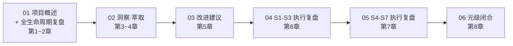

# AI 智能体开发规范体系 — 复盘·洞察·萃取 综合报告

> **模块化版本**：本目录将原 1000 行单文件综合报告拆分为 6 个独立模块，支持按主题定位和按需加载。
> **原始文件**：[retrospective-insight-extraction-comprehensive-20260623.md](../../insight-extraction/retrospective-insight-extraction-comprehensive-20260623.md)
> **复盘日期**：2026-06-23

---

## 报告模块导航



| # | 模块 | 文件 | 内容 | 知识层次 | 字数 |
|---|------|------|------|---------|------|
| 1 | 项目概述与复盘 | [project-retrospective.md](project-retrospective.md) | 第1~2章：项目概述、六阶段历程、关键节点分析、成功经验与问题 | 描述性 + 分析性 | ~3500 |
| 2 | 洞察与萃取 | [insight-extraction.md](insight-extraction.md) | 第3~4章：4 项关键发现、3 条规律、可复用资产、新模式（两栖定位） | 推理性 + 交易性 | ~2500 |
| 3 | 改进建议 | [improvement-suggestions.md](improvement-suggestions.md) | 第5章：10 条分级改进建议（3高+4中+3低）、行动计划 | 行动性 | ~800 |
| 4 | S1-S3 执行复盘 | [execution-s1-s3.md](execution-s1-s3.md) | 第6章：高优先级任务执行复盘、包结构杠杆效应、新模式（结构阅读先行） | 元级 | ~2500 |
| 5 | S4-S7 执行复盘 | [execution-s4-s7.md](execution-s4-s7.md) | 第7章：中优先级任务执行复盘、跨批次对比、新模式（差异驱动重构+渐进式模板化） | 元级 | ~3500 |
| 6 | 元级闭合 | [meta-closure.md](meta-closure.md) | 第8章：全会话元级复盘、4 项核心洞察、新模式（复盘加速效应）、资产盘点 | 元元级 | ~2500 |
| **合计** | | | **八章完整复盘** | **认知金字塔** | **~15000** |

## 阅读建议

### 按目标选择

| 阅读目标 | 建议模块 |
|---------|---------|
| 快速了解项目全貌 | project-retrospective.md → meta-closure.md（1+6） |
| 获取可复用资产 | insight-extraction.md（萃取章节：4.1-4.3） |
| 学习复盘方法论 | insight-extraction.md → meta-closure.md（洞察+元级） |
| 了解执行细节 | execution-s1-s3.md → execution-s4-s7.md |
| 完整阅读 | 按序阅读 01→02→03→04→05→06 |

### 知识层次递进

```
描述性（01） → 分析性（01） → 推理性（02） → 行动性（03） → 元级（04, 05） → 元元级（06）
```

## 核心产出摘要

| 类别 | 数量 | 位置 |
|------|------|------|
| 新增方法论模式 | 5 个 | 已原子化至 `patterns/methodology-patterns/` |
| 新增概念文档 | 3 个 | `concepts/self-referentiality.md`、`critical-mass-of-methods.md`、`meta-document-leverage.md` |
| 改进建议（已执行） | 7/10 | 高优先级（3/3）+ 中优先级（4/4） |
| 新增可运行工具 | 3 个 | lib/、generate-tests.py、agents.py |
| 本次会话新增文件 | 10 个 | 含报告/公共库/工具/国际化 |
| 报告总字数 | ~15,000 | — |

## 快速跳转

- [原始完整报告](../../insight-extraction/retrospective-insight-extraction-comprehensive-20260623.md)
- [导出卡片](../retrospective-export-20260623.md)
- [方法论模式库](../../../patterns/methodology-patterns/)
- [概念库](../../../concepts/)
- [资产清单](../../assets/asset-inventory.md)
