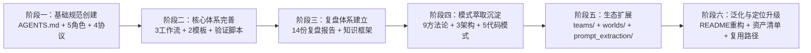

# AI 智能体开发规范体系 — 复盘·洞察·萃取 综合报告

> **所属系列**：[retrospective-comprehensive-20260623](README.md) · **模块 1/6**：项目概述与全生命周期复盘
> **复盘日期**：2026-06-23
> **来源**：从 `retrospective-insight-extraction-comprehensive-20260623.md` 第一~二章拆分

---

## 一、项目概述

### 1.1 项目背景

本项目是一套基于 [AGENTS.md 开放标准](https://agents.md) 构建的智能体开发规范体系。它定义了 AI 智能体在项目中的角色、职责边界、协作协议与工作流，使多智能体能够"按需加载、各司其职、协同交付"。项目托管于 AtomGit（`https://atomgit.com/daoCollective/AI`），采用 Apache 2.0 许可证。

本项目并非传统意义上的可执行应用，而是一个**元规范框架**——它不盖楼，但定义了楼该怎么盖、谁负责什么、如何协作、如何验证质量。`vendor/flexloop/` 下的 AgentForge 项目就是依照这套规范实际建造出的"楼"。

### 1.2 项目目标

1. 构建基于 AGENTS.md 开放标准的多智能体协作规范体系
2. 定义 7 个角色（5 核心 + 2 扩展）的职责与能力边界
3. 建立 4 项协作协议与 3 个标准工作流
4. 构建感知→认知→执行→治理四层闭环的八模块自我演进体系
5. 建设包含 14 份复盘报告、9 个方法论模式、3 个架构模式、5 个代码模式的完整知识资产库
6. 实现可迁移的泛化框架，将规范体系定位为"元规范框架"

### 1.3 交付物清单

| 层级 | 类别 | 数量 | 说明 |
|------|------|------|------|
| 规范层 | 角色定义 | 7 个 | orchestrator/architect/developer/reviewer/tester/co-founder/team-admin |
| 规范层 | 系统提示词 | 10 个 | 5 角色 × (system-prompt + few-shot) |
| 规范层 | 工具规范 | 4 个 | 文件操作/代码执行/搜索/通信 |
| 规范层 | 协作协议 | 4 个 | handoff/messaging/conflict-resolution/dependency-management |
| 规范层 | 标准工作流 | 3 个 | feature-development/code-review/testing |
| 规范层 | 模板资产 | 2 个 | task-template/handoff-template |
| 规范层 | 自我演进模块 | 8 个 | 感知/认知/执行/治理四层闭环 |
| 规范层 | 团队管理 | 5 个 | team-admin/team-management/permission-system/admin-verification/role-auto-creation |
| 规范层 | 协作世界 | 9 个 | collaboration(4) + environments(4) + 索引 |
| 工程层 | 验证脚本 | 7 个 | check-gitignore/check-spec-consistency/check-links/generate-nav/check-move/check-source-traceability/check-role-permissions |
| 工程层 | CI 脚本 | 2 个 | ci-check.ps1/ci-check.sh |
| 工程层 | 入口契约 | 2 个 | AGENTS.md/README.md |
| 知识层 | 项目文档 | 13 个 | docs/ 目录下的核心文档 |
| 知识层 | 复盘报告 | 14 份 | 含初版、深度版、洞察报告、综合报告 |
| 知识层 | 方法论模式 | 9 个 | spec-driven/review-loop/document-refactoring/等 |
| 知识层 | 架构模式 | 3 个 | 感知→检查→报告/多智能体并行/增量+回归 |
| 知识层 | 代码模式 | 5 个 | 路径解析/Git验证/元文档识别/Markdown解析/三段式检查 |
| 知识层 | 决策框架 | 4 个 | 目录命名/依赖管理/元文档处理/语义匹配阈值 |
| 知识层 | 知识概念 | 6 个 | 元文档/上下文感知/正交验证/零依赖原则/语义前缀/规范自举性 |
| 治理层 | Spec 文档 | 13 个 | .trae/specs/ 下的完整规格驱动文档 |
| 子项目 | 提示词萃取系统 | 1 个 | prompt_extraction/ Python 包 |
| 模板层 | README 模板 | 3 个 | 应用/库/规范体系三类模板 |
| 模板层 | 复盘模板 | 6 个 | checklist/spec/tasks/retrospective-report/role-marker-design/directory-readme |
| **合计** | | **70+ 个** | |

---

## 二、复盘环节

### 2.1 实施过程回顾

本项目经历了一个从"单一入口文件"逐步演化为"完整元规范框架"的发展历程，可概括为六个阶段：

| 阶段 | 核心事件 | 关键产出 |
|------|---------|---------|
| 阶段一 | 创建 AGENTS.md 作为全局契约入口，定义 orchestrator/architect/developer/reviewer/tester 五个角色与四项协作协议 | AGENTS.md + .agents/roles/ + .agents/protocols/ |
| 阶段二 | 新增工作流、模板、系统提示词与 few-shot 示例，建立 tool 规范体系和验证脚本 | .agents/workflows/ + .agents/prompts/ + .agents/tools/ + .agents/scripts/ |
| 阶段三 | 启动项目复盘，形成"复盘→洞察→导出"知识闭环，累计产出 14 份复盘报告 | docs/retrospective/reports/ + concepts/ + frameworks/ |
| 阶段四 | 从复盘报告和实践经验中萃取可复用模式，形成三层模式库 | docs/retrospective/patterns/ + assets/asset-inventory.md |
| 阶段五 | 扩展团队管理(teams/)、协作世界(worlds/)、提示词萃取系统(prompt_extraction/) | .agents/teams/ + .agents/worlds/ + prompt_extraction/ |
| 阶段六 | README.md 深入重构，定位从"项目描述"升级为"元规范框架"，同步更新 AGENTS.md | README.md（新增可复用模式体系、提示词萃取系统、泛化与资产复用三章）+ AGENTS.md（新增 5 条路由） |

### 2.2 关键节点分析

#### 节点一：AGENTS.md 入口架构决策

**决策依据**：项目需要单一入口避免上下文爆炸，须支持机器可读的角色绑定。

**技术方案**：采用"入口+容器"二元架构——AGENTS.md（路由+约束）+ .agents/（具体规范），分离关注点。

**关键挑战**：如何在有限上下文中覆盖足够信息以支持智能体做出正确路由决策。

**解决方案**：AGENTS.md 仅保留全局核心规则、角色索引、模块索引、能力边界声明、协议概要与上下文路由表，所有详细信息全部下沉到 .agents/。

**事后评估**：✅ 成功。AGENTS.md 作为唯一入口的路径已在实际中被验证有效。

#### 节点二：三层递进提示词体系的建立

**决策依据**：单层提示词不足以保证角色行为一致性，需要递进式加载。

**技术方案**：全局契约(AGENTS.md) → 角色定义(.agents/roles/*.md) → 精细化提示词(.agents/prompts/*/system-prompt.md + few-shot.md)。

**关键挑战**：如何保证三层之间的信息一致性且在角色扩展时保持体系可维护。

**解决方案**：使用 TOML frontmatter 声明绑定关系，角色文件通过 `bindings.rules` 和 `bindings.references` 字段声明与协议/工作流的关联。

**事后评估**：✅ 成功。TOML frontmatter 实现了机器可读的角色绑定，减少了维护成本。

#### 节点三：文档体系原子化重构

**决策依据**：README.md 随内容增长变得臃肿，阅读体验下降，且不利于按需加载。

**技术方案**：将 README.md 的 15 个章节拆分到 docs/ 下的 13 个独立文档，README.md 仅保留概要。

**关键挑战**：拆分后如何保证文档间的引用关系不断裂，以及如何让读者快速导航。

**解决方案**：使用 generate-nav.py 自动生成文档导航表，使用 check-links.py 验证链接有效性，以 TOML frontmatter 的 `source` 字段标注派生产物来源。

**事后评估**：✅ 成功。文档拆分后形成 `README.md → docs/*.md → docs/retrospective/*` 的三层文档树，既保留了入口可达性，又提高了文档定位的精度。

#### 节点四：从"项目规范"到"元规范框架"的定位升级

**决策依据**：项目已积累大量方法论模式、模板资产和验证工具，具有跨项目迁移的能力，但文档定位尚未充分体现这一特性。

**技术方案**：在 README.md 中新增"可复用模式体系""提示词萃取系统""泛化与资产复用"三个章节，将定位从"本项目的规范"升级为"可以迁移到任何项目的元规范框架"。

**关键挑战**：如何在不过度泛化而失去具体性的同时，体现充分的通用性。

**解决方案**：通过三层递进方式展示泛化能力——资产清单（具体可复用项）→ 泛化路径（三维泛化方向）→ 已有复用案例（vendor/flexloop/AgentForge 落地证据）。

**事后评估**：✅ 成功。形成了"既具体又通用"的定位表述。但泛化路径的图示仍是概念性的，离真正的"泛化引擎"尚有距离。

### 2.3 执行情况与结果数据

| 指标 | 数值 | 说明 |
|------|------|------|
| 文件总数 | 70+ | 涵盖规范层/工程层/治理层/知识层/子项目 |
| 角色数量 | 7 | 5 核心 + 2 扩展 |
| Spec 驱动任务 | 13 个 | 每个包含 spec.md + tasks.md + checklist.md |
| 复盘报告总量 | 14 份 | 含 5 类（初版/深度版/洞察版/综合版/执行版） |
| 方法论模式 | 9 个 | 形成"开发→复盘→优化→治理→自动化→度量"完整闭环 |
| 验证脚本 | 7 个 | 覆盖忽略规则/一致性/链接/导航/路径/溯源/权限 |
| Git 提交（保守估计） | 40+ 次 | 遵循 Conventional Commits，中文描述 |

### 2.4 成功经验

| 经验 | 支撑事实 |
|------|---------|
| Spec-driven 开发确保质量基线 | 13 个 spec 目录均含完整的 spec.md/tasks.md/checklist.md 三件套，所有变更可追溯 |
| 文档原子化避免上下文爆炸 | README.md 从单体文档拆分为 13 个独立文档后，每个文档聚焦单一主题，智能体可按需加载 |
| 复盘→萃取→模式沉淀形成正向循环 | 14 份复盘报告驱动了 9 个方法论模式、3 个架构模式、5 个代码模式的产出 |
| TOML frontmatter 实现机器可读的绑定 | 角色文件通过 bindings 字段声明绑定关系，配合 check-spec-consistency.py 实现自动校验 |
| 临时依赖三重治理杜绝误提交 | .gitignore + pre-commit hook + check-gitignore.py 形成完整的防护链 |
| 元工具体系实现"用工具治理工具" | 7 个验证脚本形成工具链，每个解决前一个工具的摩擦点，熵减效果明显 |

### 2.5 存在问题

| 问题 | 根因分析 | 影响评估 |
|------|---------|---------|
| 自我演进八模块未真正实现可执行 | 八模块目前仅停留在"规范定义"层（.agents/modules/*.md），缺乏实际运行代码 | 影响了"Mermaid 系统规划"向"可运行系统"的转化 |
| prompt_extraction/ 与规范体系耦合松散 | 独立的 Python 子项目缺乏与 .agents/ 规范体系的显式绑定 | 新加入者难以理解两个系统之间的关系 |
| 复盘报告命名不统一 | 早期报告使用 `retrospective-report-*`，后期使用 `retrospective-insight-extraction-*`，缺乏统一前缀规范 | 文件检索时容易遗漏，影响知识资产的可发现性 |
| 泛化路径停留在概念层面 | README.md 中的泛化路径图描述了方向，但缺少具体的"泛化引擎"实现 | 影响了从"声明可迁移"到"真正可迁移"的跨越 |
| 缺少 CI 管道实际运行记录 | ci-check.ps1/ci-check.sh 已定义但未在 CI 平台(如 GitHub Actions)上实际运行 | 验证脚本的覆盖率难以保证 |
| 角色定义存在冗余描述 | roles/ 与 prompts/system-prompt.md 之间存在内容重复，角色职责在被重复定义 | 同步更新时可能出现不一致 |

---

> **下一模块**：[insight-extraction.md](insight-extraction.md) — 洞察环节 + 萃取环节
