+++
id = "retrospective-daily-20260629"
date = "2026-06-29"
type = "daily-retrospective"
scope = "iteration"
classification = "project-governance"
+++

# 2026-06-29 单日全面复盘

> **CMD-LOG** `cmd=retrospective step=S4 session=retr-20260630-daily-review event=REPORT_GENERATED`

## 一、复盘概览

| 维度 | 数据 |
|---|---|
| 复盘日期 | 2026-06-29 |
| 复盘范围 | 单日全量变更（iteration级） |
| 总提交数 | 71 次 |
| 新增行数 | 44,418 行 |
| 删除行数 | 3,139 行 |
| 净增行数 | 41,279 行 |
| 涉及主题 | 7 大领域 |
| 新增大文件(>500行) | 15 个 |
| 专项复盘报告 | 11 份 |
| 新增可复用模式 | 18+ 个 |

## 二、7大工作主题全景

### 主题1：治理体系大基建（核心主线）

**交付物：**
- 阶段守卫（Stage Guardrails）三层体系：规范定义(B1) → 离线分析工具(B2 `--strict`) → 运行时强制执行层(C1，10个文件4734行) → 可视化仪表盘(C2，861行)
- SG-LOG/PDR-LOG结构化日志规范与离线分析
- RACI治理规范体系（三大强制规则 + 五层审批模型，20文件1312行）
- AI智能体数据安全治理五层架构（12文件4089行：分类分级/出境评估/脱敏加密/供应商管理/监控应急/角色职责）
- Skill开发补充规范与五要素模型模板

### 主题2：vendor/flexloop 子模块协同框架

**交付物：**
- flexloop git submodule 协同集成框架建立
- 三层路由治理体系（SpecWeave → vendor → flexloop）
- 治理模式从"第三方只读"调整为"自有协作模式"
- flexloop 角色映射表与团队操作手册
- 反向依赖链接修复脚本（221行）
- 跨项目嵌套路由与协同规范文档

### 主题3：Skill命令门面系统

**交付物：**
- 5个命令门面Skill：retrospective-cmd、insight-cmd、export-report-cmd、atomization-cmd、atomic-commit-cmd
- forum-posting技能定义与双方案架构升级
- Skill五要素模型模板（固化最佳实践）
- Skill发现协议SOP（治理方法论模式）
- Onboarding入门指南（L0层）

### 主题4：Mermaid治理闭环

**交付物：**
- Mermaid渲染回归bug修复（节点内换行` `、Markdown list解析冲突）
- Mermaid安全起步模板（内置`%%`注释安全提醒）
- Mermaid完整操作指南（337行）
- Mermaid治理闭环执行：安全模板+注释感知修复+一站式操作指南，治理成熟度达L3

### 主题5：论坛自动化体系

**交付物：**
- forum-bot.py Playwright自动化脚本（1099行）
- Discourse API研究文档（464行）+ 论坛自动化知识库（355行）
- 本地Playwright脚本测试运行计划（313行）
- forum-posting Skill双方案架构升级与合规修复
- 从论坛自动化萃取3个可复用模式

### 主题6：竞品学习与洞察萃取

**交付物：**
- SpecForge竞品分析洞察报告与借鉴建议
- Firecrawl深度学习复盘（8洞察+6行动项，已原子化）
- Claude Tag文章学习复盘（团队共享AI同事模式等5洞察）
- v12迭答复盘（16条叙事洞察原子化 + 5个方法论模式入库）
- 架构优先级评估复盘（诊断范式错配并输出重构路线图）

### 主题7：工程基础设施与质量保障

**交付物：**
- CI脚本统一入口重构，删除一次性verify-atomization.py
- Windows GBK终端UnicodeEncodeError修复，CI脚本编码安全完善
- file:///链接解析bug修复，消除82个断链
- check-pattern-quality.py方法论模式质量检查脚本（624行）
- frontmatter解析库支持YAML双格式
- CRLF/LF行尾符规范化
- 文档行尾符统一处理

## 三、时间线概览

```mermaid
gantt
    title 2026-06-29 工作时间线
    dateFormat HH:mm
    axisFormat %H:%M

    section 上午早段(08-10)
    v12迭答复盘+报名帖增强     :08:14, 45m
    Mermaid渲染bug修复         :09:27, 60m
    阶段守卫+B1规范+前置文档   :09:14, 70m
    vendor子模块框架建立       :09:09, 25m
    SpecForge竞品分析          :09:13, 30m

    section 上午中段(10-12)
    Mermaid治理闭环+安全模板   :10:08, 50m
    Mermaid一站式指南          :10:31, 25m
    阶段守卫运行时层C1         :11:31, 30m
    论坛bot脚本+C2仪表盘       :11:35, 10m
    阶段守卫strict模式B2       :11:32, 10m
    vendor治理模式调整         :11:33, 10m

    section 午间(12-13)
    编码修复+CI优化+链接修复   :12:04, 40m
    forum-posting Skill定义    :12:10, 5m
    3份复盘+9模式入库          :12:09, 5m
    flexloop路由补齐           :12:40, 10m

    section 下午早段(13-15)
    团队模块+Trae边界处理      :13:34, 30m
    启动协议增强+Skill五要素   :14:06, 20m
    forum-posting升级+Firecrawl :14:07, 25m
    Claude Tag学习复盘         :14:12, 15m
    架构优先级评估复盘         :14:57, 5m
    数据安全治理体系(4089行)   :14:57, 25m

    section 晚间(20)
    RACI治理规范体系           :20:23, 10m
    5个命令门面Skill+Onboarding :20:25, 10m
    方法论模式+Skill发现SOP    :20:27, 5m
```

## 四、交付物清单索引

### 4.1 新增核心规则/规范文档
| 文件 | 行数 | 说明 |
|---|---|---|
| [.agents/rules/stage-guardrails.md](file:///d:/spaces/SpecWeave/.agents/rules/stage-guardrails.md) | 314+201 | 阶段守卫规则定义（B1） |
| [.agents/rules/data-security/](file:///d:/spaces/SpecWeave/.agents/rules/data-security/) | ~4089 | AI智能体数据安全治理五层架构（10文件） |
| [.agents/rules/raci-governance-standards.md](file:///d:/spaces/SpecWeave/.agents/rules/raci-governance-standards.md) | - | RACI治理规范（三大强制规则+五层审批） |
| [.agents/rules/skill-development.md](file:///d:/spaces/SpecWeave/.agents/rules/skill-development.md) | - | Skill开发补充规范 |
| [docs/knowledge/stage-guardrails-guide.md](file:///d:/spaces/SpecWeave/docs/knowledge/stage-guardrails-guide.md) | 511 | 阶段守卫使用指南（K1） |

### 4.2 新增核心工具/脚本
| 文件 | 行数 | 说明 |
|---|---|---|
| [.agents/scripts/check-stage-guardrail-runtime.py](file:///d:/spaces/SpecWeave/.agents/scripts/check-stage-guardrail-runtime.py) | 525 | 阶段守卫运行时门面(C1) |
| [.agents/scripts/lib/stage_guardrails/](file:///d:/spaces/SpecWeave/.agents/scripts/lib/stage_guardrails/) | 4734(5模块) | 阶段守卫运行时核心库 |
| [.agents/scripts/generate-sg-dashboard.py](file:///d:/spaces/SpecWeave/.agents/scripts/generate-sg-dashboard.py) | 861 | SG日志可视化仪表盘(C2) |
| [.agents/scripts/forum-bot.py](file:///d:/spaces/SpecWeave/.agents/scripts/forum-bot.py) | 1099 | 论坛自动化Playwright脚本 |
| [.agents/scripts/check-pattern-quality.py](file:///d:/spaces/SpecWeave/.agents/scripts/check-pattern-quality.py) | 623 | 方法论模式质量检查 |
| [.agents/scripts/check-skill-quality.py](file:///d:/spaces/SpecWeave/.agents/scripts/check-skill-quality.py) | 511 | Skill质量检查脚本 |

### 4.3 新增团队/协作模块
| 文件 | 行数 | 说明 |
|---|---|---|
| [.agents/teams/flexloop-team.md](file:///d:/spaces/SpecWeave/.agents/teams/flexloop-team.md) | - | flexloop治理团队定义 |
| [.agents/teams/flexloop-team-operations.md](file:///d:/spaces/SpecWeave/.agents/teams/flexloop-team-operations.md) | 518 | flexloop团队操作手册 |
| [.agents/teams/trae-edge-case-handler.md](file:///d:/spaces/SpecWeave/.agents/teams/trae-edge-case-handler.md) | 853 | Trae边界情况处理团队 |
| [vendor/AGENTS.md](file:///d:/spaces/SpecWeave/vendor/AGENTS.md) | - | vendor区域入口路由 |

## 五、关联专项复盘

昨日产出的专项复盘报告（本报告为总览元复盘）：

| 专项复盘 | 分类 | 核心主题 |
|---|---|---|
| retrospective-mermaid-rendering-regression-20260629 | project-governance | Mermaid渲染回归治理失效 |
| retrospective-mermaid-governance-closure-20260629 | project-governance | Mermaid治理闭环L3达成 |
| retrospective-stage-guardrails-logging-20260629 | project-governance | 阶段守卫机制落地 |
| retrospective-vendor-flexloop-governance-adjustment-20260629 | project-governance | flexloop子模块治理模式调整 |
| retrospective-forum-bot-logging-20260629 | project-governance | 论坛自动化脚本开发 |
| retrospective-forum-posting-skill-optimization-20260629 | project-governance | 论坛发帖Skill优化 |
| retrospective-forum-automation-full-workflow-20260629 | project-governance | 论坛自动化全流程 |
| retrospective-ai-agent-data-security-governance-20260629 | project-governance | 数据安全治理体系 |
| retrospective-raci-governance-matrix-20260629 | project-governance | RACI责任矩阵落地 |
| retrospective-specforge-insight-20260629 | competitive-analysis | SpecForge竞品分析 |
| retrospective-claude-tag-article-learning-20260629 | competitive-analysis | Claude Tag文章学习 |
| retrospective-firecrawl-learning-20260629 | insight-extraction | Firecrawl深度学习（原子化） |
| retrospective-architecture-priority-20260629 | insight-extraction | 架构优先级评估 |
