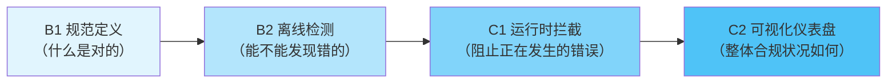
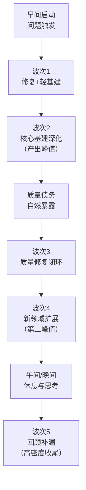

+++
id = "retrospective-daily-20260629-insights"
date = "2026-06-29"
source = "retrospective-daily-20260629/README.md#洞察萃取"
maturity = "L2"
+++

# 洞察萃取

> **CMD-LOG** `cmd=retrospective step=S3 event=KEY_FINDING msg="提炼元级洞察：从71次提交中识别跨主题模式"`

## 一、元洞察（跨主题模式）

### 洞察1：治理基建的"四层递进"交付模型

**观察：** 阶段守卫机制在2小时内完成了规范(B1)→检测(B2)→拦截(C1)→可视化(C2)四层交付，这不是偶然的顺序，而是治理基建的内在递进逻辑。

**模式提炼：**



**Why有效：**
- 规范层是共识基础，没有规范检测无依据
- 离线层是安全网，先在事后验证检测能力，不直接拦截生产流程
- 运行时层是强制执行，需要离线层验证无误后再上线
- 可视化层是反馈闭环，让团队看到治理效果

**适用场景：** 任何流程合规类治理机制建设（代码规范、文档规范、安全规范、提交规范等）。

**反模式：** 直接跳到C1运行时拦截，没有经过B2离线验证阶段，容易产生误拦截和团队抵触。

### 洞察2：问题触发的"治理闭环"六步模型

**观察：** Mermaid渲染bug的处理经历了从"点修复"到"治理闭环"的演进：
1. Bug修复（改换行符）→ 发现还有问题 → 2. 二次修复（list解析）→ 3. 根因分析 → 4. 安全模板 → 5. 检测工具增强 → 6. 操作指南+模式萃取

**模式提炼：**

```
点修复 → 二次问题暴露 → 根因分析 → 预防工具 → 检测机制 → 知识沉淀
  ↓         ↓            ↓          ↓         ↓         ↓
 改症状    发现偏误      找本质    建模板    自动化    入模式库
```

**Why有效：** 第一次修复通常只解决表面症状（"换行符不对"），二次问题暴露后才会意识到是系统性问题（"缺乏安全约束机制"），此时推动治理闭环的阻力最小、动力最强。

**触发条件：** 同一领域出现第二次修复/回归时，必须停下来做根因分析和治理闭环，而不是继续点修复。

### 洞察3：高密度工作日的"五波次"能量曲线

**观察：** 昨日71次提交呈现明显的五波次节奏，而非均匀分布：

| 波次 | 时间段 | 持续 | 核心特征 | 产出占比 |
|---|---|---|---|---|
| 1 | 08:14-10:00 | 1h46m | 问题触发+双轨（修复+基建） | ~15% |
| 2 | 10:00-12:00 | 2h | 治理体系深化（连锁反应） | ~40% |
| 3 | 12:00-13:30 | 1h30m | 质量修复与生态补齐 | ~10% |
| 4 | 13:30-15:20 | 1h50m | 多线并行能力扩展 | ~30% |
| 5 | 20:23-20:27 | 4m | 晚间回顾补漏（极高密度） | ~5% |

**模式提炼：**



**Why有效：**
- 波次2和波次4是两个产出峰值，符合"深度工作→修复→新深度工作"的认知节奏
- 波次3的修复是自然节奏：大规模基建后质量债务必然暴露，主动修复优于被动积累
- 波次5的高密度收尾体现了"背景加工"效应：白天的问题在潜意识中继续处理，晚间形成清晰的解决方案后快速输出

**启示：** 不必追求均匀产出，识别和利用波次峰值期做核心基建，波谷期做质量修复和文档同步。

### 洞察4："就近直觉偏差"的防御机制

**观察：** 昨日新增了vendor区域"任务类型预检"机制（步骤2.0），防范"只看工作目录附近文件而忽略vendor中更成熟方法论资产"的认知偏差。

**模式提炼：** 跨项目/跨目录协作时，Agent容易被"就近文件"锚定，忽略其他位置更权威的规范来源。防御机制包括：

1. **任务类型预检**（步骤2.0）：在路由前先检查任务类型是否命中vendor方法论资产
2. **三层路由强制**：SpecWeave→vendor→flexloop，嵌套目录优先读取子模块AGENTS.md
3. **索引表而非搜索**：用结构化的路由表和资产索引替代语义搜索的"就近直觉"
4. **自检检查点**（步骤3.5）：加载Skill前逐项确认是否已读取所有相关规范

**Why重要：** "就近直觉"是Agent的系统性认知偏差——语义搜索天然倾向于返回工作目录附近的文件，导致"在错误的地方找答案"。路由表作为"显式知识地图"可以对抗这种隐性偏差。

### 洞察5：复盘的"即时沉淀"模式

**观察：** 昨日产出11份专项复盘报告，覆盖了当天所有主要模块。每个模块完成后几乎立即产出复盘，而非等到周末/里程碑统一复盘。

**优势：**
- **上下文新鲜度**：刚完成的工作记忆清晰，细节不丢失
- **反馈即时性**：复盘发现的问题可以在下一波次立即修正（如Mermaid点修复→治理闭环）
- **模式萃取时效性**：当天萃取的模式可以当天被其他模块复用
- **降低认知负荷**：不需要事后回忆大量细节，每次复盘聚焦单一主题

**前提条件：** 复盘模板和流程必须足够轻量化（四文件标准结构），否则"每次开发后都写复盘"会成为负担而非助力。

## 二、可复用模式（待入库）

### 模式1：治理四层递进模型（L2）
- **触发条件：** 建设任何流程合规类治理机制
- **核心步骤：** B1规范→B2离线检测→C1运行时拦截→C2可视化
- **验证标准：** 每层交付后通过验证才进入下一层
- **反模式：** 跳过离线检测直接上运行时拦截

### 模式2：二次暴露触发治理闭环（L2）
- **触发条件：** 同一领域出现第二次问题/回归
- **核心步骤：** 停止点修复→根因分析→预防工具→检测机制→模式入库
- **验证标准：** 有明确的预防工具和检测机制，而非仅修复当前问题

### 模式3：波次式工作日节奏（L1）
- **触发条件：** 高密度开发日规划
- **核心节奏：** 启动→核心基建（峰值1）→质量修复→新领域扩展（峰值2）→回顾补漏
- **启示：** 不追求均匀产出，识别峰值期做核心工作，谷期做修复和同步

### 模式4：任务类型预检防偏差（L2）
- **触发条件：** 多模块/多项目/多子模块协作
- **核心步骤：** 在文件搜索前先做任务类型匹配，命中vendor资产则强制读取
- **防御对象：** Agent的"就近直觉"认知偏差

### 模式5：即时复盘沉淀（L2）
- **触发条件：** 每个独立模块/功能完成后
- **核心要求：** 使用轻量模板快速产出，不等里程碑统一复盘
- **前提：** 复盘模板标准化（四文件结构），降低写作成本

## 三、关键数据发现

### 3.1 代码/文档比例

昨日44,418行新增中：
- Python脚本（工具/检查/运行时）：约11,000行（~25%）
- Markdown文档（规则/指南/复盘/模式）：约33,000行（~75%）

**发现：** 文档:代码 ≈ 3:1，反映当前阶段以治理体系建设和知识沉淀为主，而非业务功能开发。

### 3.2 大文件分布

15个>500行的大文件中：
- Python脚本：7个（forum-bot、sg-dashboard、trae_edge_case_handler、stage_guardrails库4个、check-pattern-quality、check-skill-quality）
- Markdown文档：8个（data-masking、incident-response、skill-discovery-protocol、flexloop-team-operations、stage-guardrails-guide、3个测试文件）

### 3.3 修复类提交占比

71次提交中：
- feat(新功能)：约25次（35%）
- docs(文档/复盘/模式)：约28次（40%）
- fix(修复)：约8次（11%）
- refactor/chore/test：约10次（14%）

fix占比11%处于健康区间，说明虽然产出密度高，但质量控制较好。
