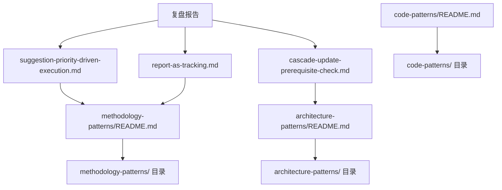

+++
id = "retrospective-report-suggestion-execution-and-pattern-import-export"
date = "2026-06-23"
type = "export-suggestions"
source = "docs/retrospective/reports/retrospective-report-suggestion-execution-and-pattern-import.md#七、改进建议"
+++

# 导出建议

## 改进建议

### 🔴 高优先级

**建议 1：建立模式成熟度客观评估标准** ✅ 已完成

- 问题：模式成熟度标注依赖主观判断，缺乏量化指标
- 建议：建立成熟度评估矩阵：验证次数 ≥ 2 为 L2，复用次数 ≥ 1 为 L3
- 预期收益：成熟度标注客观化，便于后续复用判断
- 实施方案：
  1. 在 patterns/README.md 中新增成熟度评估标准章节
  2. 定义量化指标（验证次数、复用次数、文档化程度）
  3. 在每个模式文件 frontmatter 中新增 `validation_count`、`reuse_count` 字段
- 执行结果：
  - 已创建 [patterns/README.md](../../../patterns/README.md) 总索引，含成熟度评估标准章节
  - 已更新三个子目录 README.md，添加总索引引用
  - 已更新 6 个模式文件 frontmatter，补充 `validation_count`、`reuse_count`、`documentation_level` 字段

### 🟡 中优先级

**建议 2：在复盘报告模板中增加「建议执行追踪表」章节** 📋 待规划

- 问题：复盘报告改进建议章节格式不统一，追踪表缺失
- 建议：在复盘报告模板中增加标准化的建议执行追踪表
- 预期收益：报告格式统一，建议执行进度一目了然

### 🟢 低优先级

**建议 3：将本次复盘报告关联至前序报告** ✅ 已完成

- 问题：本次报告与前序报告（retrospective-report-readme-collab-scenario-migration.md）关联关系未明确
- 建议：在本次报告 frontmatter 中新增 `related_report` 字段
- 预期收益：报告链路清晰，便于追溯
- 执行结果：已在 frontmatter 中标注 `关联报告` 字段

## 附录

### A. 产出文件清单

| 文件 | 类型 | 状态 |
|------|------|------|
| methodology-patterns/suggestion-priority-driven-execution.md | 方法论模式 | 新建 |
| methodology-patterns/report-as-tracking载体.md | 方法论模式 | 新建 |
| architecture-patterns/cascade-update-prerequisite-check.md | 架构模式 | 新建 |
| code-patterns/README.md | 目录索引 | 新建（补全历史遗漏） |
| architecture-patterns/README.md | 目录索引 | 新建（补全历史遗漏） |
| methodology-patterns/README.md | 目录索引 | 更新（新增 2 个模式条目） |

### B. 引用拓扑图

### C. 验证结果

| 验证项 | 脚本 | 结果 |
|--------|------|------|
| 链接有效性 | check-links.py | ✅ 通过（1 个预存断链无关） |

### D. 模式库现状

| 目录 | 模式数 | README 状态 |
|------|--------|------------|
| methodology-patterns/ | 12 | ✅ 已存在并更新 |
| code-patterns/ | 1 | ✅ 新建补全 |
| architecture-patterns/ | 2 | ✅ 新建补全 |