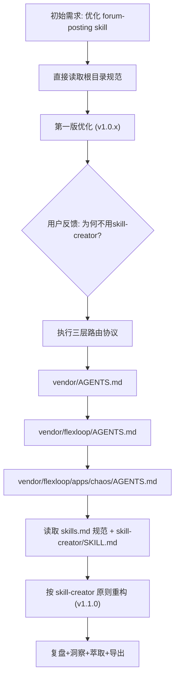

# forum-posting Skill 优化（v1.0.0 → v1.1.0）复盘

> **复盘范围**：单会话任务（forum-posting skill 优化，包含三层路由违规纠错）
> **复盘日期**：2026-06-29
> **执行模式**：单智能体单会话，用户主动纠错 + AI 迭代修正
> **报告类型**：Skill 开发规范合规性复盘（已原子化）

## 项目概览

本次任务目标是优化 [forum-posting skill](../../../../../../.agents/skills/forum-posting/SKILL.md)。在初始优化完成后，用户明确指出：**没有使用 vendor 区域的 skill-creator 技能**。这暴露了一个典型的三层路由违规问题——直接在 SpecWeave 根目录下工作，未遵循 `SpecWeave → vendor → flexloop` 三层嵌套路由规则，导致错过了 vendor 子模块中更成熟的 skill 开发方法论。随后按三层路由协议读取了 vendor/flexloop/apps/chaos/.agents/ 下的 skill 规范和 skill-creator 技能，重新按最佳实践重构了 SKILL.md。

### 核心发现

**"就近规范"陷阱**：开发者容易只读取当前工作目录下的规范（.agents/skills/），而忽略 vendor 子模块中通过三层路由可访问的更成熟、更权威的方法论资产。vendor/flexloop/apps/chaos 中的 skill-creator 包含了 description 优化、渐进式披露、length 控制等经过多轮验证的最佳实践，这些是根目录 .agents/skills/ 中没有的。

### 技术演进路径

### 关键数据

| 指标 | v1.0.x（路由违规版） | v1.1.0（合规版） | 变化 |
|------|---------------------|-----------------|------|
| 支持方案数 | 1（仅 MCP） | 2（forum-bot.py + MCP） | +100% |
| 操作类型覆盖 | 3（edit/reply/clean） | 6（read/edit/prepend/reply/clean/login） | +100% |
| 可复用 JS 工具函数 | 0 | 4 | +4 |
| 错误码覆盖 | 8 | 10 | +2 |
| 安全机制文档 | 无（仅操作步骤） | dry-run + 幂等检查 + 决策树 + 检查清单 | 显著增强 |
| description 触发词 | 少（容易 undertrigger） | 完整关键词 + "必须使用" | 解决 undertrigger |
| 文档行数 | ~207（内容不全） | 307（控制在500以内） | 合理增长 |

## 子模块导航

| 章节 | 文件 | 说明 |
|------|------|------|
| 执行复盘 | [execution-retrospective.md](execution-retrospective.md) | 时间线、三层路由违规分析、关键决策、问题根因 |
| **洞察萃取（已原子化）** | [insights/](insights/) | 14个原子化洞察文件：5个关键发现+3个规律+6个元洞察，按单一职责拆分 |
| 洞察萃取（原文件） | [insight-extraction.md](insight-extraction.md) | 原始完整洞察文档，原子化内容见insights/目录 |
| 导出建议 | [export-suggestions.md](export-suggestions.md) | 改进建议、行动计划、模式萃取建议、经验教训总结 |
