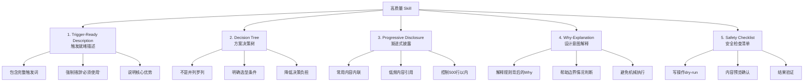

> ⚠️ **本文档已原子化**：详细的单一主题洞察已拆分至 [insights/](insights/) 目录，包含：
> - 5个关键发现（finding-01~05）
> - 3个规律认知（law-01~03）
> - 6个Meta级洞察（meta-01~06）
>
> 本文档保留完整原始叙事，单主题阅读请访问 [insights/README.md](insights/README.md) 索引。

# 洞察萃取 — Skill 优化方法论与三层路由执行陷阱

## 一、关键发现

### 发现1：三层路由的"非对称触发"陷阱 → [原子文件](insights/finding-01-three-layer-routing-non-symmetric-trigger.md)

| 维度 | 分析 |
|------|------|
| 现象 | 工作目录在 SpecWeave 根目录（`.agents/skills/`）时，容易认为"不需要进入 vendor"，从而错过 vendor 子模块中的成熟方法论资产 |
| 根因 | AGENTS.md 中三层路由的触发条件描述为"若任务工作目录位于 vendor/ 内"，这导致一个反向盲区：**工作目录不在 vendor/ 内，但任务类型需要 vendor 资产的场景**，没有被显式覆盖 |
| 深层含义 | 三层路由应该是**任务类型驱动**而非仅**工作目录驱动**。当任务涉及"创建/优化 skill"、"子模块协同"等类型时，无论当前工作目录在哪里，都需要主动检查 vendor 区域是否有对应规范或技能 |
| 验证 | 本次任务中，工作目录在根目录 `.agents/skills/forum-posting/`，但 vendor/flexloop/apps/chaos 中的 skill-creator 才是该任务类型最权威的方法论来源 |

### 发现2：Skill description 是"触发广告"而非"功能文档" → [原子文件](insights/finding-02-skill-description-seo.md)

| 维度 | 分析 |
|------|------|
| 现象 | 初版 description 简洁但触发词不足，存在严重 undertrigger 风险 |
| 根因 | 不了解 Claude skill 触发机制：模型倾向于"谨慎触发"（undertrigger），description 需要包含足够的触发关键词和强制性措辞才能可靠触发 |
| 深层含义 | Skill description 的首要目标是**让模型在合适场景下想到使用这个 skill**，其次才是告诉用户这个 skill 做什么。这类似于搜索引擎优化（SEO），需要考虑模型的"触发决策过程" |
| skill-creator 指导原则 | description 应该：(1) 包含所有可能的触发关键词和同义词；(2) 明确说"必须使用此技能"；(3) 简要说明核心能力和优势；(4) 控制长度但不要过于简洁 |

### 发现3：Skill 文档的"解释Why"原则 → [原子文件](insights/finding-03-why-explanation-principle.md)

| 维度 | 分析 |
|------|------|
| 现象 | 初版 SKILL.md 主要是操作步骤列表（MUST 规则），缺乏设计决策的解释 |
| 根因 | 传统 API 文档思维——只告诉你"怎么做"，不告诉你"为什么这么做" |
| 深层含义 | Skill 文档的读者是 AI 模型，模型在面对边界情况时需要理解规则背后的**意图**才能做出正确判断。如果只知道"不能用 :has-text()"而不知道"为什么"（因为它不是标准DOM API，browser_evaluate 中不可用），模型在遇到类似选择器时可能犯同样错误 |
| 实施方式 | 在关键规则后加 `> **为什么？**` 引用块，解释设计决策的原因（如"为什么双方案"、"为什么要多信号检测"、"为什么dry-run是最重要防线"） |

### 发现4：渐进式披露（Progressive Disclosure）的上下文节省效应 → [原子文件](insights/finding-04-progressive-disclosure.md)

| 维度 | 分析 |
|------|------|
| 现象 | skill-creator 建议控制在500行以内，但 SKILL.md 需要覆盖双方案、参数表、操作步骤、错误处理、选择器速查等大量内容 |
| 解决方案 | 将详细参数表、完整故障排查、@discourse/mcp 长期方案配置等**引用**到知识库文档（[forum-automation.md](../../../../../../docs/knowledge/operations/forum-automation.md)），SKILL.md 只保留最常用的速查内容和决策逻辑 |
| 深层含义 | 这不是简单的"内容搬家"，而是**按使用频率分层**：常用内容（操作步骤、工具函数、检查清单）内联在 SKILL.md 中，低频但必要的内容（完整参数、故障排查树）引用外部文档按需加载 |

### 发现5：双方案共存需要"决策树"而非"并列罗列" → [原子文件](insights/finding-05-dual-scheme-decision-tree.md)

| 维度 | 分析 |
|------|------|
| 现象 | 初版只列了MCP方案（单方案无选择困难），但加入forum-bot.py后面临"什么时候用哪个"的问题 |
| 设计决策 | 不是简单列个表格对比两个方案，而是提供**决策树**："在IDE内临时操作→MCP；需要独立运行/CI/dry-run→脚本；首次使用未登录→先login" |
| 深层含义 | 当 Skill 提供多种执行方案时，Agent 需要明确的**选择逻辑**而非仅仅是**选项列表**。决策树降低了 Agent 的决策负担，减少了方案选择错误 |

## 二、规律认知

### 规律1：Skill 开发的五要素模型 → [原子文件](insights/law-01-skill-five-elements-model.md)

从本次优化和 skill-creator 方法论中，可以提炼出高质量 Skill 的五个核心要素：



### 规律2：三层路由协议的"任务类型预检"补充 → [原子文件](insights/law-02-three-layer-routing-task-type-precheck.md)

三层路由不应仅由"工作目录是否在 vendor/ 内"触发，还应增加**任务类型预检**步骤：

```
收到任务 → 检查AGENTS.md全局路由表
  ├─ 工作目录在 vendor/ 内？ → 是 → 执行嵌套路由（vendor→flexloop→...）
  └─ 工作目录不在 vendor/ 内？
       └─ 任务类型是否涉及 vendor 已有资产领域？
            ├─ 是（如skill创建/优化、子模块协同等）→ 主动检查vendor路由
            └─ 否 → 按根目录规范执行
```

vendor 区域作为"方法论文物库"的常见任务类型包括：
- skill 创建/优化 → vendor/flexloop/apps/chaos/.agents/skills/skill-creator
- 跨项目子模块协同 → vendor/flexloop（VENDOR-INTEGRATION）
- 其他待补充...

### 规律3：浏览器自动化 Skill 的通用模式 → [原子文件](insights/law-03-browser-automation-general-pattern.md)

从 forum-posting 的双方案设计中，可以提炼出浏览器自动化类 Skill 的通用设计模式：

1. **检测层**：多信号组合检测状态（登录/页面就绪/元素存在），不依赖单一选择器
2. **操作层**：封装原子操作函数（设置内容、点击按钮、等待导航），内联错误处理
3. **安全层**：dry-run预览 + diff确认 + 幂等检查，多层防护防止误操作
4. **验证层**：操作后刷新/snapshot验证结果，不假设操作一定成功
5. **清理层**：自动清理副作用（如Discourse自动草稿）

## 三、可复用模式识别

> 📌 **模式候选最终状态**：以下3个早期模式候选在后续萃取中已处理——模式1/2整合进Skill五要素模型对应要素，模式3（代码级）待后续跨案例验证。

### 模式候选1：Skill Description SEO 模式 → [已整合进五要素模型要素1](insights/law-01-skill-five-elements-model.md)

- **成熟度**：L1（本次验证有效）
- **核心思想**：description 是触发的唯一入口，需要像SEO文案一样设计，包含触发关键词和强制措辞
- **复用场景**：所有新建/优化 Skill 时的 description 编写
- **模板结构**：`{领域/平台}操作。当用户需要{触发词列表}时，必须使用此技能。支持{核心能力}，{核心优势}。覆盖{功能范围}。`
- **最终状态**：✅ 已整合进 [skill-five-elements-model.md](../../../../patterns/methodology-patterns/ai-collaboration/skill-five-elements-model.md) 要素1（Trigger-Ready Description），不单独入库

### 模式候选2：浏览器自动化多方案决策树模式 → [已整合进五要素模型要素2](insights/law-01-skill-five-elements-model.md)

- **成熟度**：L1（本次验证有效）
- **核心思想**：浏览器自动化常存在多种方案（MCP/脚本/API），需要明确决策树而非并列罗列
- **复用场景**：所有涉及浏览器自动化的 Skill 设计
- **决策维度**：运行环境（IDE内/CI/命令行）、是否需要可重复执行、是否需要dry-run、登录状态管理需求
- **最终状态**：✅ 已整合进 [skill-five-elements-model.md](../../../../patterns/methodology-patterns/ai-collaboration/skill-five-elements-model.md) 要素2（Decision Tree），不单独入库

### 模式候选3：MCP browser_evaluate 安全工具函数模式 → ⏸️ 待后续评估

- **成熟度**：L1（本次验证有效）
- **核心思想**：为 MCP 操作封装可复用的 JavaScript 工具函数，减少重复代码和出错概率
- **核心函数**：setTextareaContent（触发事件）、multi-signal detection（多信号检测）、idempotent prepend（幂等追加）
- **复用场景**：所有使用 integrated_browser MCP 进行网页操作的 Skill
- **最终状态**：⏸️ 代码级模式，本次先不入库，待后续更多浏览器自动化Skill案例验证后再评估

## 四、Meta 级洞察（从执行复盘本身提取）

以下洞察不是直接从"做了什么"提取，而是从"执行过程中发生了什么元层面事件"提取：

### 发现6："凭经验做对"与"按方法论做对"的本质区别 → [原子文件](insights/meta-01-process-vs-experience.md)

| 维度 | 分析 |
|------|------|
| 事实 | 违规版（v1.0.x）实际上已经做了不少正确的事：整合了forum-bot.py双方案、封装了JS工具函数、设计了安全机制——这些最终也出现在了合规版（v1.1.0）中 |
| 关键区别 | 违规版的正确性来自**开发者经验直觉**，合规版的正确性来自**skill-creator方法论框架**。经验直觉是不可复用的——下次优化另一个skill时，同一个开发者未必能想起所有最佳实践；方法论框架是可复用的——任何智能体按skill-creator指导都能产出高质量结果 |
| 深层含义 | **流程合规的价值不在于"这次能不能做对"，而在于"每次都能稳定做对"**。即使结果看起来一样，走对流程的产出具有可预测性和可审计性，而走捷径的产出质量取决于当天的状态和记忆 |
| 量化证据 | 违规版虽然做对了双方案和JS函数，但description仍然存在undertrigger问题、缺乏Why解释、没有决策树——这些正是经验直觉容易遗漏但方法论系统覆盖的点 |

### 发现7：路由违规的纠偏成本呈非线性 → [原子文件](insights/meta-02-nonlinear-correction-cost.md)

| 维度 | 分析 |
|------|------|
| 事实 | 用户纠错后，需要：(1)读取3层AGENTS.md（vendor→flexloop→chaos），(2)读取skills.md规范，(3)读取skill-creator/SKILL.md，(4)基于新方法论重新审视和修改已写好的内容，(5)重新验证一致性 |
| 成本分析 | 如果一开始就走对路径，步骤(1)-(3)是一次性成本（约5-8分钟）；但走错路径后再纠偏，除了(1)-(3)，还要承担"已写内容的重构成本"——即把凭经验写的内容对照方法论逐项检查和修正，这是额外的返工 |
| 深层含义 | **协议违规的成本不是"少读了几个文件"，而是"所有基于错误前提的工作都需要rework"**。这类似于建筑中的地基错误——上层建筑做得再好，地基错了就要推倒重来 |
| 推广 | 启动协议的设计初衷就是"前置小成本避免后续大成本"。跳过启动协议看似节省了5分钟，实际可能造成30分钟以上的返工 |

### 发现8：上下文丢失（Context Compression）放大了"就近直觉"偏差 → [原子文件](insights/meta-03-context-compression-cognitive-narrowing.md)

| 维度 | 分析 |
|------|------|
| 事实 | 本次会话是"continues a previous conversation that lost its context"，前半段的决策上下文通过summary压缩恢复 |
| 影响链 | 上下文丢失 → 智能体对"项目全局结构"的认知降级为"当前可见文件" → 更容易只关注工作目录附近的文件 → 不去主动探索vendor子模块中的资产 |
| 深层含义 | **上下文压缩不仅是"信息丢失"，更是"认知视野收窄"**。当上下文窗口有限时，智能体倾向于处理"手边的信息"（最近读取的文件、当前目录），而不是建立完整的项目全局视图。这使得启动协议（强制读取全局路由表）在上下文不完整时更加重要——它是防止视野收窄的结构性保障 |
| 启示 | 在长会话或context恢复场景中，应该**主动重新执行启动协议**，而不是假设summary中包含了所有必要的路由信息 |

### 发现9：用户纠错的"问题措辞"是诊断线索 → [原子文件](insights/meta-04-feedback-wording-diagnosis.md)

| 维度 | 分析 |
|------|------|
| 事实 | 用户问的不是"你为什么这样优化"（结果导向），而是"为何没有使用skill-creator"（流程导向） |
| 信号解读 | 这个问题措辞本身揭示了问题性质：**不是结果质量问题，而是流程合规问题**。即使用户没有明说"你违反了三层路由"，"为何没有使用X"这个句式直接指向"存在一个既定的X应该被使用但你没用" |
| 深层含义 | **用户反馈的措辞包含诊断信息**。"为什么没有X"=流程缺失；"X不好用"=质量问题；"X应该是Y"=需求理解偏差。正确解读反馈措辞可以快速定位问题类型，避免在错误方向上排查 |
| 应用 | 收到用户反馈时，首先分析反馈的"问题类型"（流程/质量/需求），再决定响应方式 |

### 发现10："就近直觉"是一种系统性认知偏差，不是粗心大意 → [原子文件](insights/meta-05-availability-heuristic-structural-guard.md)

| 维度 | 分析 |
|------|------|
| 现象 | 容易把路由违归因于"粗心"或"没认真看AGENTS.md"，但根因更深层 |
| 根因 | 这是**可得性启发（Availability Heuristic）**的体现：人类和AI都倾向于使用最容易获取的信息（工作目录下的文件），而不是最权威但获取成本更高的信息（vendor子模块三层路由后的文件） |
| 深层含义 | 既然这是系统性认知偏差，就不能靠"更认真"来解决，必须靠**结构性机制**来防范：(1)启动协议中增加显式的"vendor资产预检"检查点，(2)AGENTS.md路由表增加任务类型索引，(3)Skill创建/优化场景自动路由到skill-creator |
| 推广 | 类似的系统性偏差还包括："最近修改的文件更重要"（近因偏差）、"大文件更重要"（显著性偏差）、"熟悉的模式优先"（确认偏差）——这些都需要结构性防范而非个人警惕 |

### 发现11：启动协议缺少"完成自检"检查点 → [原子文件](insights/meta-06-startup-protocol-self-checkpoint.md)

| 维度 | 分析 |
|------|------|
| 事实 | AGENTS.md启动协议列出了步骤1-4（读AGENTS.md→按路由表确定规范→读取规范→执行任务），但没有步骤5"自检"——即加载Skill/开始生成前，确认"我是否已经读完了所有相关规范？" |
| 后果 | 步骤执行容易"跳步"或"浅尝辄止"——读了AGENTS.md但没有认真匹配路由表，或者读了路由表但只选了最明显的入口而忽略了vendor资产 |
| 改进方向 | 在步骤4之前增加自检问题：(1)当前任务类型是否匹配某个vendor子模块的方法论资产？(2)我是否已经读取了所有对应角色定义和工作流规范？(3)是否有相关skill应该被加载？ |

## 五、潜在机会

> ✅ **落地状态**：以下7项潜在机会已全部落地完成。

1. **路由表增强**：在 AGENTS.md 上下文路由表中增加"任务类型→vendor资产"的显式映射，减少此类遗漏 → ✅ 已完成（AGENTS.md步骤2.0+vendor方法论资产表）
2. **Skill 模板脚手架**：基于本次提炼的五要素模型，创建一个 Skill 模板，新 Skill 可以直接套用结构 → ✅ 已完成（.agents/skills/SKILL-TEMPLATE.md）
3. **Skill lint 工具**：开发一个检查脚本，自动检测 Skill 是否符合最佳实践（description触发词、长度、是否有Why解释、是否有检查清单等） → ✅ 已完成（.agents/scripts/check-skill-quality.py）
4. **三层路由预检清单**：在启动协议中增加"任务类型预检"步骤的显式检查项 → ✅ 已完成（AGENTS.md步骤2.0）
5. **启动协议自检检查点**：在步骤4（加载Skill执行任务）前增加结构化自检问题，防止跳步 → ✅ 已完成（AGENTS.md步骤3.5）
6. **Context恢复场景的协议重执行**：在检测到session是context continuation时，提示重新执行启动协议以重建全局视野 → ✅ 已完成（AGENTS.md步骤2.2+context-recovery-protocol模式）
7. **反馈类型分类框架**：建立用户反馈的快速分类机制（流程缺失/质量问题/需求偏差），加速问题定位 → ✅ 已完成（feedback-wording-diagnosis模式入库）
