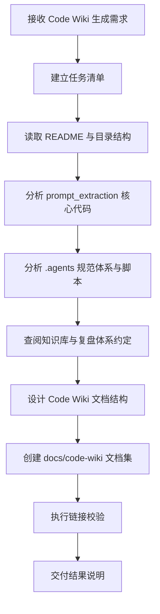

# 二、复盘环节

## 2.1 实施过程回顾



## 2.2 关键节点分析

#### 关键节点一：识别仓库是"规范体系 + Python 子项目"的复合结构

初始观察显示仓库中既有大量 `.agents/`、`docs/`、`.trae/specs/` 文档资产，也有 `prompt_extraction/` 可执行 Python 子项目。若按传统代码仓库方式只分析 Python 源码，会遗漏项目最核心的智能体规范体系。

**处理方式**：将 Code Wiki 的组织思路从"源码 API 文档"扩展为"项目认知 Wiki"，覆盖架构、规范、文档、代码、依赖和运行验证。

#### 关键节点二：采用"先总览、再深入"的分析顺序

执行过程中先读取 `README.md`、目录结构、`.agents/README.md`、`docs/project-structure.md`、`docs/tech-stack.md`，建立项目全景，再深入 `prompt_extraction/pipeline.py`、`models.py`、`ui/app.py` 和核心模块文件。

**处理方式**：避免从单个代码文件出发造成局部理解偏差，先建立资产分层，再进入函数级分析。

#### 关键节点三：使用既有知识库约定约束文档形态

任务执行前查阅了 `docs/knowledge/README.md` 与 `docs/retrospective/README.md`，确认仓库偏好模块化、结构化、kebab-case 命名、Mermaid 图示和资产索引。

**处理方式**：新建 `docs/code-wiki/` 目录，生成 7 个模块化 Markdown 文件，而不是单个长文档。

#### 关键节点四：以链接校验作为文档质量门禁

Code Wiki 内部包含 27 个本地引用。文档生成后执行：

```powershell
python .agents\scripts\check-links.py --path docs\code-wiki
```

校验结果显示所有链接有效。

## 2.3 执行情况与结果数据

| 指标 | 数值 | 说明 |
|---|---:|---|
| 新增 Code Wiki 文件 | 7 个 | 覆盖总览、架构、模块、API、依赖、运行等主题 |
| 文档目录 | 1 个 | `docs/code-wiki/` |
| Mermaid 图 | 多处 | 用于架构、流水线、依赖与验证关系表达 |
| 本地链接 | 27 个 | 全部通过校验 |
| 链接校验结果 | 通过 | `check-links.py --path docs\code-wiki` 返回退出码 0 |
| 涉及源码主模块 | 8+ 个 | `input`、`preprocessing`、`extraction`、`assessment`、`optimization`、`ui`、`constants`、`tests` |

## 2.4 成功经验

1. **先建立仓库资产地图，再进入代码细节**  
   对文档型、规范型、代码型混合仓库，直接从源码入口切入会造成认知偏差。先识别项目资产类型，有助于生成更完整的 Code Wiki。

2. **按读者阅读路径拆分文档**  
   本次将 Code Wiki 拆分为总览、架构、模块、API、依赖、运行指南，降低了单文档过长带来的阅读负担。

3. **使用 Mermaid 固化结构理解**  
   架构关系、流水线流程、依赖关系通过 Mermaid 表达，比纯文字更适合作为长期维护的 Wiki 内容。

4. **链接校验应成为文档交付门禁**  
   文档内大量相对链接容易出错，使用现有 `check-links.py` 能快速提升交付可信度。

## 2.5 存在问题

| 问题 | 根因 | 影响 | 后续建议 |
|---|---|---|---|
| Code Wiki 未自动注册到主导航 | 本次优先完成文档集，未运行导航生成 | README 导航中暂未出现 Code Wiki 入口 | 后续可运行 `generate-nav.py` 并审查导航变更 |
| 既有工作区存在无关修改 | 任务开始前已有未提交变更 | Git 状态中混杂非本次文件 | 后续应在复盘中明确区分"本次新增"和"既有变更" |
| CI 脚本与脚本清单存在潜在不一致 | `ci-check.ps1` 引用 `check-filename-convention.py`，但脚本清单读取时未确认该文件存在 | 综合 CI 运行可能失败 | 需单独核查 CI 脚本与实际脚本目录一致性 |

---