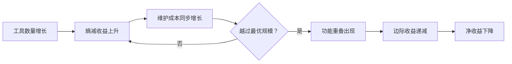

+++
id = "retrospective-report-tool-entropy-nonlinear-optimization-readme"
date = "2026-06-24"
type = "index"
+++

# 工具熵减度量体系揭示的非线性优化曲线

> **复盘范围**：综合复盘洞察·萃取报告 — 发现三
> **复盘日期**：2026-06-24
> **执行模式**：单智能体全程，多轮会话连续执行
> **报告类型**：洞察萃取 + 度量体系分析（已原子化）

## 项目概览

### 核心发现

工具开发存在最优规模。每个新验证脚本在解决特定摩擦点的同时，也引入了新的维护成本。当工具链规模超过一定阈值后，边际熵减收益开始下降，出现功能重叠，新增工具的净收益趋近于零甚至转为负值。

### 非线性曲线的形成机制

#### 熵减收益曲线

每个工具定向削减一类特定的熵（重复性手动维护成本）：

| 工具 | 削减的熵类型 | 手动总成本（2年） | ROI |
|------|------------|-----------------|-----|
| check-links.py | 链接断裂熵 | 21,900 分钟 | 243x |
| generate-nav.py | 导航维护熵 | 2,600 分钟 | 43x |
| check-move.py | 路径迁移熵 | 480 分钟 | 6x |
| check-gitignore.py | 依赖泄漏熵 | 2,190 分钟 | 55x |
| ci-check.ps1 | 检查遗漏熵 | 10,950 分钟 | 365x |

#### 维护成本曲线

每个工具引入的隐性成本包括：

- **测试成本**：脚本本身需要被测试、被更新
- **适配成本**：规范变更时需要同步更新工具
- **学习成本**：新成员需要理解每个工具的用途和边界
- **重叠成本**：功能相似的多个工具造成维护工作重复

#### 实证数据

本项目在脚本从 3 个增长到 7 个的过程中，观察到以下现象：

- **功能重叠**：`check-role-permissions.py` 与 `check-spec-consistency.py` 存在约 30% 的功能重叠，两者均执行"一致性校验"，仅入参和输出格式不同
- **边际下降**：第 6-7 个脚本的熵减 ROI 明显低于前 3 个

## 子模块导航

| 章节 | 权威来源 | 说明 |
|------|---------|------|
| 执行复盘 | [execution-retrospective.md](execution-retrospective.md) | 最优规模阈值、量化决策模型、决策规则 |
| 洞察萃取 | [insight-extraction.md](insight-extraction.md) | 实践指导、深层含义、自动化规模不经济规律 |
| 导出建议 | [export-suggestions.md](export-suggestions.md) | 工具开发前、运行中、退役阶段的具体行动建议 |

## 关联报告

[retrospective-comprehensive-20260623/insight-extraction.md](insight-extraction.md)、[../../patterns/methodology-patterns/tools-automation/tool-automation-decision-model.md](../../../../patterns/methodology-patterns/tools-automation/tool-automation-decision-model.md)
