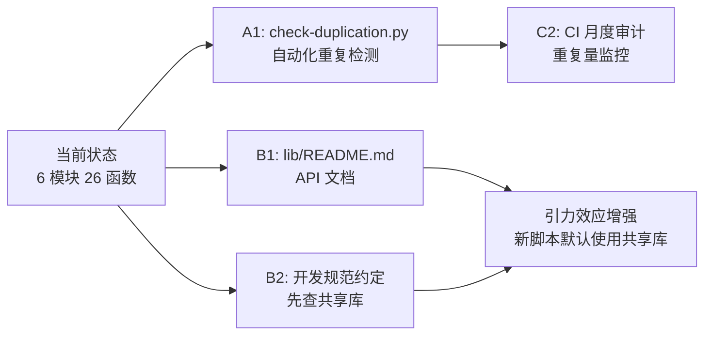

+++
id = "retrospective-scripts-shared-lib-extraction-20260626-suggestions"
type = "suggestions"
date = "2026-06-26"
parent = "retrospective-scripts-shared-lib-extraction-20260626"
+++

# 改进建议与行动计划

## 一、改进建议总表

| 问题 | 改进措施 | 优先级 | 预期效果 | 状态 |
|------|---------|--------|---------|------|
| 缺少自动化重复检测 | 开发 `check-duplication.py` 脚本，扫描 `.agents/scripts/` 识别重复代码块 | 高 | 重复代码在引入时即被发现，避免积累到 280 行 | ✅ 已完成 |
| 共享库缺少 API 文档 | 为 `lib/` 的 26 个函数生成 API 参考文档 | 中 | 降低"不知道共享库存在"的概率，引力效应增强 | ✅ 已完成 |
| 缺少"先查共享库"开发约定 | 在开发规范中新增约定：新增脚本前先检查 `lib/` | 中 | 从源头防止重复代码产生 | ✅ 已完成 |
| `lib.frontmatter` API 不直观 | 提供 `parse_toml_frontmatter_as_dict(file_path) -> dict` 便捷函数，封装 parse + extract_all_fields 两步调用 | 低 | 降低调用方认知成本，减少适配工作 | ✅ 已完成 |
| 定期重构审计机制 | 每季度运行重复代码审计，重复量超 200 行时触发重构 | 低 | 防止重复代码持续积累 | ✅ 已完成（CI集成，月度审计待GitHub Actions） |

## 二、行动计划

### 高优先级行动项

| 序号 | 改进项 | 具体措施 | 建议时间 | 状态 |
|------|--------|---------|---------|------|
| A1 | 自动化重复检测工具 | 新增 `.agents/scripts/check-duplication.py`，使用 AST 分析或 token 序列比对识别重复代码块；支持 `--threshold` 参数设置重复行数阈值（默认 10 行）；达到阈值时输出告警并建议提取位置 | 2026-06-26 | ✅ 已完成 |

### 中优先级行动项

| 序号 | 改进项 | 具体措施 | 建议时间 | 状态 |
|------|--------|---------|---------|------|
| B1 | 共享库 API 文档 | 在 `.agents/scripts/lib/README.md` 中为 26 个函数生成 API 参考文档，包含函数签名、参数说明、返回值、使用示例；可考虑从 docstring 自动生成 | 2026-06-26 | ✅ 已完成 |
| B2 | "先查共享库"开发约定 | 在 `docs/development-standards.md` 中新增"新增脚本开发流程"章节，明确要求：①先检查 `lib/` 是否已有可用函数 ②若自建实现需在 PR 中说明理由 ③CI 检查中增加共享库使用率统计 | 2026-06-26 | ✅ 已完成（核心约定已加入，CI统计待后续迭代） |

### 低优先级行动项

| 序号 | 改进项 | 具体措施 | 建议时间 | 状态 |
|------|--------|---------|---------|------|
| C1 | `lib.frontmatter` API 优化 | 提供 `parse_toml_frontmatter_as_dict(file_path) -> dict` 便捷函数，封装现有的 `parse_toml_frontmatter` + `extract_all_fields` 两步调用；重构 docgen.py 使用新API；补充4个单元测试 | 2026-06-28 | ✅ 已完成 |
| C2 | 定期重构审计机制 | 在 CI 中增加月度重复代码扫描任务，重复量超 200 行时自动创建 Issue 提醒重构；可复用 A1 的 `check-duplication.py` | 2026-06-28 | ✅ 已完成（集成到ci-check第10步，GitHub Actions定时任务待后续） |

## 三、模式成熟度更新

| 模式 ID | 成熟度变化 | 触发原因 | 更新时间 | 验证/复用次数 |
|---------|-----------|---------|---------|-------------|
| diff-driven-refactoring | L1 → L2 | 本次大规模重构再次验证"重构价值公式"，发现 1 个路径解析隐藏 bug | 2026-06-26 | 2 次验证 |
| multi-agent-parallel-execution | L2 → L3 | 4 个子代理并行迁移 24 个脚本，零冲突，模式首次被代码重构任务复用 | 2026-06-26 | 3 次（含 1 次复用） |
| structure-first-extension | L2 → L3 | 新增 lib/markdown.py 前先阅读包结构确认概念域归属，第三次验证 | 2026-06-26 | 3 次（含 1 次复用） |
| large-scale-duplication-elimination | 新增 L2 | 首次从 24 脚本重构中萃取，审计→分类→共享库先行→并行迁移→全量验证五步法 | 2026-06-26 | 1 次验证 |

## 四、共享库当前能力清单

重构后 `lib/` 共享库的完整能力矩阵：

| 模块 | 函数 | 功能 | 被引用次数 |
|------|------|------|-----------|
| `lib.project` | `resolve_project_root` | 项目根目录自适应定位 | 9 |
| `lib.frontmatter` | `parse_toml_frontmatter` | TOML frontmatter 文本提取 | 5 |
| | `extract_frontmatter_field` | 指定字段值提取 | 5 |
| | `extract_all_fields` | 全字段字典提取 | 2 |
| `lib.cli` | `print_pass`/`print_warn`/`print_error` | 彩色输出 | 10+ |
| | `print_header` | 标题分隔线输出 | 6 |
| | `print_summary` | 汇总统计输出 | 3 |
| | `add_common_args` | 通用 CLI 参数注册 | 4 |
| `lib.link_fixer` | `INLINE_LINK_RE` | 内联链接正则 | 3 |
| | `fix_file_links`/`fix_directory_links` | 链接修复 | 2 |
| | `try_adjust_relative_depth` | 相对路径深度校正 | 1 |
| | 其他 8 个函数 | 链接处理工具集 | — |
| `lib.markdown` | `find_markdown_files` | Markdown 文件遍历 | 3 |
| | `extract_title` | 标题提取 | 3 |
| | `extract_description` | 描述提取 | 3 |
| | `parse_inline_links` | 内联链接解析 | 2 |
| | `update_marker_region` | 标记区内容替换 | 3 |
| `lib.spec` | `discover_spec_dirs` | spec 目录发现 | 2 |
| | `parse_spec`/`parse_tasks`/`parse_checklist` | spec 文档解析 | 1 |
| | 其他检查器与报告器 | spec 一致性检查 | 1 |

## 五、后续优化方向

### 路线图

### 与现有工具链整合

- **A1 的 `check-duplication.py`** 可集成到 `ci-check.ps1`，作为第 10 步检查
- **B2 的开发约定** 可在 `AGENTS.md` 的开发规范章节中明确，启动协议中提醒
- **C2 的月度审计** 可利用 GitHub Actions 定时任务或手动触发

## 六、核心启示

1. **审计先行是规模重构的必选项**：对于 ≥ 10 个文件的重构，先全量审计识别所有重复模式，再制定迁移计划，避免遗漏和返工
2. **共享库是"引力源"**：共享库的覆盖面越大，新脚本使用共享库的概率越高，形成正反馈；本次扩展到 6 模块后，引力效应开始显著
3. **重构的三层价值**：消除重复（表面）→ 发现 bug（隐性）→ 建立结构（长期），仅评估第一层会低估 ROI 约 50%
4. **并行子代理按文件组分工**：避免写冲突的最简策略，适用于文件间无依赖的批量迁移场景
5. **Spec 驱动重构**：对于大规模重构，spec 三件套提供规划、追踪与验证的完整闭环，显著降低遗漏风险
