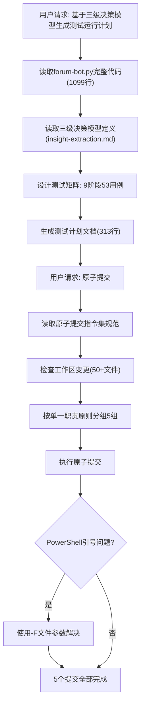

# 执行复盘 — 测试运行计划生成与原子提交执行

## 一、实施过程回顾

### 1.1 时间线

### 1.2 关键决策点

#### 决策1：测试矩阵的阶段划分

**背景**：需要将forum-bot.py的所有命令（login/read/edit/reply/clean-drafts）和参数（--debug/--dry-run/--headless）转化为可执行的测试用例。

**决策依据**：
- 三级决策模型Level 2（本地独立脚本）的典型风险点：登录状态管理、Cookie持久化、DOM选择器稳定性、频率限制
- forum-bot.py的5个命令 × 3种输入方式 × 2种运行模式 = 理论组合空间
- dry-run机制提供了安全的测试路径

**最终方案**：9阶段53用例，按"环境→功能→辅助→质量"递进
- P0阻塞级（18个）：环境验证、登录、核心读写
- P1核心级（21个）：边界条件、日志系统、异常处理
- P2辅助级（14个）：幂等性、安全、频率限制

#### 决策2：原子提交的分组策略

**背景**：工作区有50+文件变更，涵盖forum-bot.py、知识库文档、复盘报告、模式萃取、Spec文档、阶段守卫、vendor子模块等多个不相关主题。

**决策依据**：原子提交指令集的"单一职责原则"——每个提交只做一件事。

**最终方案**：按主题分为5组（仅提交本次会话相关文件）
1. `feat(forum-bot)`: 核心脚本（1文件）
2. `docs(knowledge)`: 知识库文档（2文件）
3. `docs(patterns)`: 模式萃取+Spec文档（7文件）
4. `docs(retrospective)`: 复盘报告（4文件）
5. `test(forum-bot)`: 测试计划（1文件）

**关键取舍**：阶段守卫、vendor子模块等不相关变更未纳入本次提交，留给对应会话的原子提交处理。

### 1.3 量化统计

| 阶段 | 耗时(估) | 产出 | 关键操作 |
|------|---------|------|---------|
| 代码阅读 | ~3min | forum-bot.py全量分析 | 识别5命令+3参数+7核心分支 |
| 模型定位 | ~1min | insight-extraction.md三级决策模型 | 确认Level 2覆盖范围 |
| 矩阵设计 | ~5min | 9阶段53用例 | P0/P1/P2优先级划分 |
| 文档生成 | ~2min | 313行测试计划 | Mermaid流程图+冒烟测试命令集 |
| 提交分组 | ~3min | 5组文件分类 | 排除不相关变更 |
| 提交执行 | ~8min | 5个原子提交 | 解决3个工具链问题 |

## 二、问题与根因分析

### 问题1：PowerShell多行commit message引号转义失败

**现象**：使用`git commit -m "多行\n中文\n消息"`时，嵌套引号和反斜杠导致git报错`pathspec did not match`或`Aborting commit due to empty commit message`。

**根因**：PowerShell对双引号字符串的处理与bash不同：
- PowerShell中`"..."`会进行变量插值和转义解析
- 嵌套引号（如`\"`）在PowerShell中不是有效的转义方式
- here-string（`@"..."@`）通过管道传递时编码可能丢失

**解决方案**：
1. 单行消息：直接使用`-m "..."`（简单场景）
2. 多行消息：写入临时文件，使用`git commit -F <file>`
3. 避免在commit message中使用嵌套引号

**影响**：导致2次提交失败重试，浪费约3分钟。

### 问题2：控制台中文显示乱码

**现象**：git log和git commit输出中，中文显示为乱码（如`鏂板`应为`新增`），但实际提交内容正确。

**根因**：Windows控制台默认使用GBK编码，而git输出UTF-8编码的中文，编码不匹配导致显示乱码。这不影响实际提交内容。

**解决方案**：无需修复，实际提交内容正确。如需查看可设置`chcp 65001`或使用`git log --oneline`（纯ASCII哈希）。

### 问题3：沙箱会话隔离导致git add失效

**现象**：先执行`git add <files>`，再执行`git commit`时，暂存区为空，提示`no changes added to commit`。

**根因**：沙箱环境的每次命令执行可能在独立的shell会话中，git的暂存区状态（index文件）未跨会话保持。

**解决方案**：将`git add`和`git commit`用`;`连接在同一命令中执行，确保在同一shell会话内完成。

## 三、成功经验

### 经验1：dry-run优先的测试安全策略

测试计划中所有写操作（edit/reply）的测试用例都先使用`--dry-run`模式验证，确认流程无误后再考虑实际提交测试。冒烟测试命令集6条全部为dry-run或只读操作，确保"一键执行无副作用"。

这一策略让用户可以放心执行冒烟测试，无需担心误编辑帖子或误发布回复。

### 经验2：三级决策模型作为测试边界界定工具

三级决策模型不仅用于技术选型，在测试计划设计中同样有效：
- **Level 1不覆盖**：IDE内MCP操作不在本测试范围（排除6个潜在用例）
- **Level 2全覆盖**：本地脚本的所有命令和参数组合
- **Level 3不覆盖**：REST API/MCP Server不在本测试范围（排除4个潜在用例）

模型将53个用例的测试空间从理论上的63+个组合中精确界定出来，避免了过度测试。

### 经验3：原子提交的"会话边界"原则

当工作区存在多个不相关会话的变更时，原子提交应遵循"会话边界"原则：只提交当前会话产生的变更，其他会话的变更留给对应的原子提交处理。这避免了将不相关变更混入同一提交，也避免了"替别人提交"的责任混乱。
