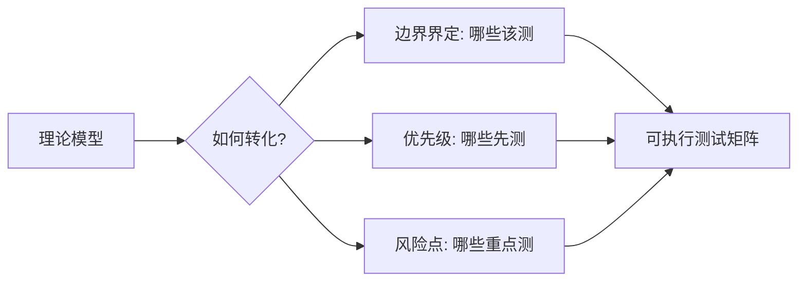
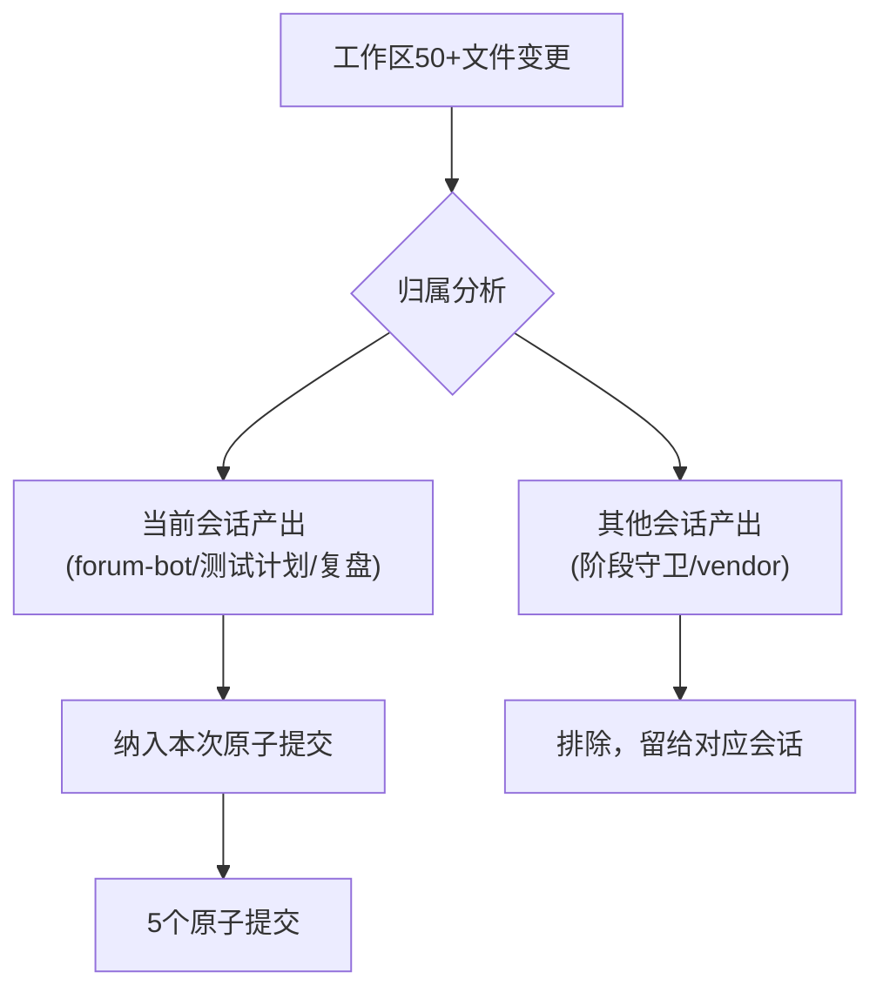
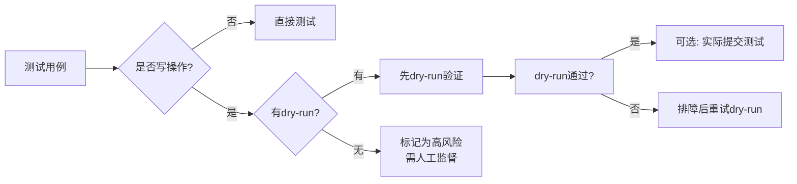

# 洞察萃取 — 理论模型转化与原子提交实践

## 洞察一：理论模型的可执行转化路径

### 发现

三级决策模型（IDE内MCP / 本地脚本 / REST API）本身只是一个选型框架，但在生成测试计划时，模型展现了超出选型的价值：它提供了**测试边界的精确界定**和**优先级分配的依据**。

### 深层含义



理论模型→可执行产物的转化需要三个步骤：
1. **边界界定**：模型的每个层级定义了清晰的"不做什么"，直接转化为测试用例的排除规则
2. **优先级映射**：模型层级的风险特征映射为测试优先级（Level 2的Cookie持久化风险→P0）
3. **风险点展开**：模型中隐含的技术约束（如Playwright的headless反爬、DOM选择器脆弱性）展开为具体测试场景

**通用规律**：任何理论模型的价值不在于模型本身，而在于它能否提供可执行的转化路径。一个无法转化为具体行动的模型只是"看起来聪明的废话"。

### 应用模式

| 模型元素 | 转化产物 | 转化方法 |
|---------|---------|---------|
| 层级定义 | 测试边界 | 每个层级→一组排除规则 |
| 技术方案特征 | 风险点清单 | 方案的技术约束→测试场景 |
| 选型标准 | 优先级依据 | 核心选型标准→P0用例 |

---

## 洞察二：原子提交的会话边界原则

### 发现

当工作区存在多个不相关会话的变更（50+文件）时，原子提交面临一个关键决策：是否将所有变更一次性提交？答案是**遵循会话边界**——只提交当前会话产生的变更。

### 深层含义

原子提交的"单一职责"不仅指**功能维度的单一**（一个提交只做一件事），还包含**责任维度的单一**（一个提交只归属一个会话/一个作者）。



**违反会话边界的风险**：
- **责任混乱**：替其他会话的变更负责，出问题时难以追溯
- **回滚困难**：一个提交混合多个会话的变更，无法选择性回滚
- **审查负担**：代码审查者需要理解不相关的上下文

### 防护模式

在执行原子提交前，先做一次"归属分析"：
1. 列出所有变更文件
2. 标注每个文件的来源会话
3. 只暂存当前会话的文件
4. 其他文件留给对应会话处理

---

## 洞察三：Windows PowerShell的引号转义陷阱

### 发现

在Windows PowerShell环境下执行`git commit -m "多行中文消息"`时，嵌套引号和特殊字符导致提交失败。这是一个跨平台开发中常被忽视的工具链兼容性问题。

### 深层含义

| 场景 | bash | PowerShell | 风险 |
|------|------|-----------|------|
| 单行消息 | `-m "text"` | `-m "text"` | ✅ 兼容 |
| 多行消息 | `-m "line1\nline2"` | ❌ 转义失败 | ⚠️ 需用-F |
| 嵌套引号 | `-m "say \"hi\""` | ❌ pathspec错误 | ⚠️ 需用单引号或-F |
| here-string | `$(cat <<'EOF'...)` | `@"..."@` | ⚠️ 管道编码丢失 |

**通用规律**：跨平台脚本/工具链的引号处理差异是隐蔽但高频的陷阱。在Windows环境下开发时，应优先使用文件参数（`-F`）而非内联参数（`-m`）传递多行文本。

### 防护模式

```powershell
# ❌ 危险：PowerShell下多行-m参数容易失败
git commit -m "标题`n`n正文`n更多内容"

# ✅ 安全：写入临时文件，用-F参数传递
$msg | Out-File -Encoding utf8 .temp/commit-msg.txt
git commit -F .temp/commit-msg.txt
Remove-Item .temp/commit-msg.txt
```

---

## 洞察四：dry-run优先的测试安全分级

### 发现

测试计划中所有写操作（edit/reply）的测试用例都设计了dry-run验证路径，冒烟测试命令集6条全部为dry-run或只读操作。这一设计让用户可以"无脑执行"冒烟测试而不担心副作用。

### 深层含义



**测试安全分级原则**：
1. **零风险**：只读操作（read/help/status）→ 可自由执行
2. **低风险**：dry-run写操作 → 可自由执行，无副作用
3. **中风险**：实际写操作到测试环境 → 需确认后执行
4. **高风险**：实际写操作到生产环境 → 需人工监督

这一分级不仅适用于论坛自动化脚本，也适用于任何有写操作的工具测试。

### 应用价值

dry-run机制是测试安全的"保险丝"：
- **降低心理门槛**：用户无需仔细审查每条命令即可执行冒烟测试
- **提供验证路径**：dry-run通过是实际操作的前提条件
- **支持CI/CD**：dry-run测试可安全纳入CI流水线
