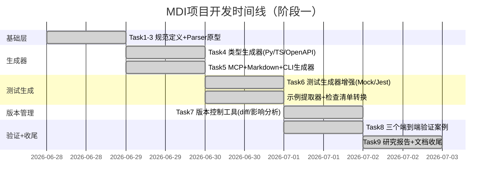

# MDI项目复盘 - 阶段一：事实数据（2026-06-28 ~ 2026-07-02）

## 1. 代码产出统计

| 指标 | 数值 |
|------|------|
| MDI核心Python模块 | 28个文件，8,501行代码 |
| 单元测试文件 | 7个文件，2,308行测试代码 |
| 单元测试用例 | 259个，全部通过（7.69s） |
| Git Commits | 19个MDI相关提交（含本次4个原子提交） |
| 生成器目标 | 9种输出格式（Python/TypeScript/OpenAPI/MCP/Markdown/CLI/pytest/Jest/文档） |
| 验证案例 | 3个端到端案例（user-api/todo-api/file-cli） |
| 案例输出产物 | 26个生成文件 |
| 研究报告 | 8章，≥7000字，7张Mermaid图 |
| 核心模块测试覆盖率 | parser 80% / validator 88% / generator 97% / checklist_converter 94% / example_extractor 88% / versioning 78% / models 100% |

## 2. 架构产出

MDI核心模块位于 [.agents/scripts/mdi/](../../../../../.agents/scripts/mdi/)：

| 模块 | 文件 | 职责 |
|------|------|------|
| 模型层 | [models.py](../../../../../.agents/scripts/mdi/models.py) | MDIDocument/Interface/Parameter/Response/ErrorCode数据类 |
| 解析层 | [parser.py](../../../../../.agents/scripts/mdi/parser.py) | Markdown→Block→结构化模型（含MyST Directive解析，ALLOWLIST待拆分） |
| 验证层 | [validator/](../../../../../.agents/scripts/mdi/validator/) | Profile检测+12项规则验证+评分系统（已拆分为core.py+rules/子包，9模块） |
| 生成层 | [generators/](../../../../../.agents/scripts/mdi/generators/) | 9种目标格式生成器（jest_gen/pytest_gen已拆分为子包） |
| 测试工具 | [mock_data.py](../../../../../.agents/scripts/mdi/mock_data.py) | 语义化Mock数据生成 |
| 测试工具 | [example_extractor.py](../../../../../.agents/scripts/mdi/example_extractor.py) | 代码块示例提取（JSON/Python/curl/HTTP） |
| 测试工具 | [checklist_converter.py](../../../../../.agents/scripts/mdi/checklist_converter.py) | 检查清单→测试断言步骤转换 |
| 版本管理 | [versioning/](../../../../../.agents/scripts/mdi/versioning/) | 结构化diff+影响分析+SemVer版本建议（已拆分为5模块包） |
| MCP领域 | [mcp_domain/](../../../../../.agents/scripts/mdi/mcp_domain/) | MCP Server领域模型（已拆分为7模块包） |
| Profile层 | [profiles/](../../../../../.agents/scripts/mdi/profiles/) | 5种Profile实现（webapi/skill/cli/graphql/clitool） |
| CLI入口 | [__main__.py](../../../../../.agents/scripts/mdi/__main__.py) | validate/gen/diff三个子命令 |
| 公共API | [__init__.py](../../../../../.agents/scripts/mdi/__init__.py) | parse()/validate()/generate()/diff_files()统一入口 |

## 3. 任务时间线

## 4. Bug修复记录

开发过程中发现并修复的关键Bug：

| # | Bug描述 | 根因 | 修复方式 |
|---|---------|------|---------|
| 1 | `{endpoint}` directive参数不支持`:query/:path/:body/:header`前缀 | Directive正则只匹配`:param`无类型前缀 | 扩展正则支持location前缀 |
| 2 | 参数location推断错误（query vs body混淆） | 推断逻辑没有区分GET/POST方法 | 添加HTTP方法感知的location推断 |
| 3 | checklist_converter关键词分类遗漏"verify"等 | 关键词列表不完整 | 扩充前置/断言/后置关键词集合 |
| 4 | pytest_gen中example匹配失败无日志 | 缺少调试日志导致排查困难 | 在关键转换点添加DEBUG日志 |
| 5 | versioning新增必填参数未标记MAJOR | severity错误设置为MINOR | 修复参数对比逻辑 |
| 6 | versioning的`parse_text`参数不匹配 | 传了`base_dir`但方法签名是`source_name` | 修正参数名 |
| 7 | 删除接口影响分析缺少"破坏性变更"标记 | impact_analysis方法遗漏 | 添加破坏性变更标记 |
| 8 | CLI Gen中`--long,-s`别名解析失败 | flag别名正则不支持逗号分隔 | 重写flag选项解析逻辑 |
| 9 | markdown_gen中`CheckItem.get()`方法bug | 字典方法调用错误 | 修正为正确属性访问 |
| 10 | directive后续子章节被同级标题截断 | Block tokenizer的section构建逻辑 | 修复section树递归终止条件 |

## 导航

| 上一章 | 目录 | 下一章 |
|--------|------|--------|
| [00-execution-overview.md](00-execution-overview.md) | [README.md](README.md) | [02-phase1-analysis.md](02-phase1-analysis.md) |

## Changelog

<!-- changelog -->
- 2026-07-03 | docs | v2.0：原子化拆分，从01-phase1-development.md独立为阶段一事实数据文件
