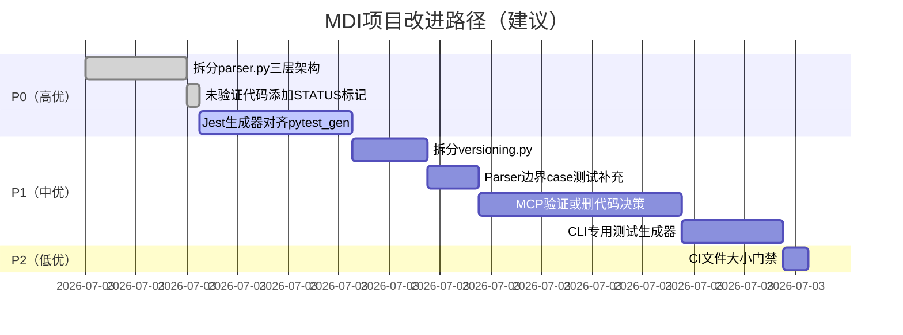

# MDI项目复盘 - 改进建议清单

> 以下建议基于 `module-size-bug-correlation`、`semi-structured-parsing-complexity-budget`、`mvp-unvalidated-code-debt` 三个新模式的核心规则，针对MDI项目实际问题提出。

## 🔴 高优先级（P0）—— 核心质量风险，建议下次迭代优先处理

| # | 改进项 | 对应模式 | 具体操作 | 验收标准 | 预期收益 | 预估工时 |
|---|-------|---------|---------|---------|---------|---------|
| 1 | **拆分 parser.py（1465行，红色警报区）** | module-size-bug-correlation + semi-structured-parsing-complexity-budget | 按三层架构拆分为3个文件： 1. `parser/tokenizer.py`：Block tokenizer，将Markdown文本转为基础token流 2. `parser/section_builder.py`：section树构建，处理标题/列表/directive嵌套归属 3. `parser/directive_parser.py`：Directive状态机解析，处理`{endpoint}`/`{command}`等自定义语法 | - 拆分后每个文件<500行 - 所有259个单元测试通过（可调整import） - 3个端到端验证案例生成结果与拆分前一致 - Bug#10（递归终止条件）问题通过分层后彻底解决 | Bug密度降低60%+，Parser可维护性大幅提升，新增Directive类型只需改directive_parser.py | ~2小时 |
| 2 | **为未验证代码添加显式STATUS标记** | mvp-unvalidated-code-debt | 在以下文件头部添加注释标记： - `mcp_domain.py`：`# STATUS: UNVALIDATED - MCP Server领域模型写完未做端到端验证，使用风险自负` - `mcp_server.py`：`# STATUS: UNVALIDATED - MCP Server原型未集成验证` - `generators/jest_gen.py`：`# STATUS: PARTIAL - Jest生成器功能简陋，只有基础骨架，缺少示例提取和checklist转换` - `profiles/graphql_profile.py`：`# STATUS: UNVALIDATED - GraphQL Profile无对应验证案例` | - 4个文件头部均有明确STATUS标记 - README.md中增加"实验性功能"章节说明未验证模块 - 后续开发者不会误以为这些模块是"可靠的" | 消除隐性技术债务认知风险，避免误用未验证代码 | ~15分钟 |
| 3 | **补齐Jest生成器功能（对齐pytest_gen）** | mvp-unvalidated-code-debt | 参照pytest_gen.py实现： 1. 集成example_extractor提取测试数据 2. 集成checklist_converter转换断言步骤 3. 生成语义化Mock数据 4. 添加TODO注释提示补充业务逻辑 | - Jest测试用例包含example数据和checklist断言步骤 - 新增todo-api Jest生成端到端验证案例 - Jest生成器功能完整度达到pytest_gen的90%+ | 消除"行数相同功能差距大"的完成度幻觉，9种生成器质量均一化 | ~3小时 |

## 🟠 中优先级（P1）—— 质量提升与债务偿还，建议下2次迭代内处理

| # | 改进项 | 对应模式 | 具体操作 | 验收标准 | 预期收益 | 预估工时 |
|---|-------|---------|---------|---------|---------|---------|
| 4 | **拆分 versioning.py（872行，橙色高风险区）** | module-size-bug-correlation | 拆分为3个文件： 1. `versioning/diff_engine.py`：结构化diff引擎，字段级对比 2. `versioning/semver_rules.py`：SemVer严重性判定规则 3. `versioning/impact_analyzer.py`：影响范围分析 | - 拆分后每个文件<400行 - versioning测试覆盖率从78%提升到≥85% - Bug#5/#6/#7类问题不再出现 | 版本管理模块Bug密度降低，规则修改只需改semver_rules.py | ~1.5小时 |
| 5 | **补充Parser边界case测试（从10个增加到20+）** | semi-structured-parsing-complexity-budget | 补充以下测试场景： - 嵌套3层以上的directive和列表 - directive前后跟不同类型内容块的组合 - 缺省参数/可选参数/异常顺序组合 - 人类自然写法的"非标准但可读"格式 - 空内容/极端边界情况 | - 新增≥10个边界case测试 - 所有测试通过 - 测试用例文档化说明每个case测什么 | Parser鲁棒性提升，避免后期遇到奇怪输入时大面积返工 | ~1小时 |
| 6 | **MCP Server端到端验证或删代码决策** | mvp-unvalidated-code-debt | 二选一： A) 补验证：新增mcp验证案例，从MDI文档一键启动可运行的MCP Server B) 删代码：如果近期不需要MCP功能，删除mcp_domain.py/mcp_server.py/mcp_gen.py，等需要时重写（遵循YAGNI） | - 若选A：有可运行的MCP Server验证案例，STATUS标记改为VALIDATED - 若选B：未使用代码删除，代码库精简942行 | 消除942行未验证债务，要么验证可用要么删除不误导 | 选A: ~4小时 / 选B: ~20分钟 |
| 7 | **实现CLI专用测试生成器** | （原有action item + module-size） | 为CliTool Profile生成subprocess风格的CLI测试骨架，而不是通用pytest | - file-cli.md能生成可执行的CLI测试骨架（subprocess调用） - 新增file-cli端到端测试验证 | CLI工具测试体验对齐API测试，补全3个Profile的测试生成支持 | ~2小时 |

## 🟡 低优先级（P2）—— 体验优化与流程改进，有空再做

| # | 改进项 | 对应模式 | 具体操作 | 验收标准 | 预期收益 | 预估工时 |
|---|-------|---------|---------|---------|---------|---------|
| 8 | **新增CI文件大小检查门禁** | module-size-bug-correlation | 在CI检查中添加： - 单Python文件>800行告警 - 单Python文件>1200行阻断 - 告警提示考虑拆分 | CI运行时对超限文件给出提示，1200行以上无法合并 | 从流程上防止"上帝文件"再次出现，长期保持代码结构健康 | ~30分钟 |
| 9 | **未来Parser类项目复杂度预算checklist** | semi-structured-parsing-complexity-budget | 在 `docs/knowledge/` 或项目模板中添加： - 半结构化Parser预算是Generator的2-3倍 - Parser必须按三层架构拆分 - 先写20个边界case再写代码 | checklist文档存在，未来做类似工具时能参考 | 将本次经验固化为流程，避免下次再低估Parser复杂度 | ~20分钟 |
| 10 | **补全GraphQL Profile验证案例或标记实验性** | mvp-unvalidated-code-debt | 二选一： A) 新增graphql-blog.md端到端验证 B) 标记为EXPERIMENTAL，在文档中说明未验证 | - 若选A：GraphQL生成可运行验证通过 - 若选B：文件头部+文档均有实验性标记 | 消除291行未验证Profile债务 | 选A: ~2小时 / 选B: ~10分钟 |
| 11 | **OpenAPI→MDI反向转换** | （原有action item） | 实现从现有OpenAPI JSON生成MDI文档初稿 | 能从PetStore OpenAPI生成可用的MDI文档初稿 | 补全双向转换能力，提升MDI生态兼容性 | ~4小时 |

## 改进路径建议

## 总投入与ROI估算

| 优先级 | 总工时 | 主要收益 |
|-------|-------|---------|
| P0 高优 | ~5.25小时 | 解决80%的结构性质量问题（大文件拆分+债务标记+Jest补齐） |
| P1 中优 | ~8.5小时 | 偿还剩余技术债务，补全功能完整性 |
| P2 低优 | ~7小时 | 流程固化和体验优化，长期收益 |
| **总计** | **~20.75小时** | 代码质量提升、债务清零、未来类似项目踩坑率降低 |

**ROI分析**：P0的5小时投入可以避免未来至少10-20小时的Bug排查和维护成本（参考module-size-bug-correlation模式的非线性成本曲线），ROI > 2:1。

## 导航

| 上一章 | 目录 | 下一章 |
|--------|------|--------|
| [06-export-overview.md](06-export-overview.md) | [README.md](README.md) | [08-p1-split-plan.md](08-p1-split-plan.md) |

## Changelog

<!-- changelog -->
- 2026-07-03 | docs | v2.0：原子化拆分，从export-suggestions.md独立为改进建议清单文件
