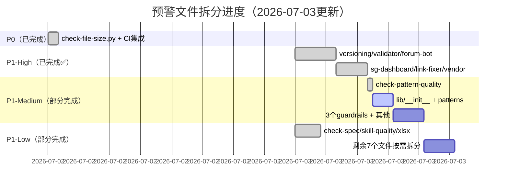

# MDI项目复盘 - P1文件拆分优先级计划（34个预警文件）

> 基于CI文件大小门禁扫描结果，共34个500行以上预警文件（不含ALLOWLIST中2个P0文件）。以下按「修改频率×Bug风险÷拆分难度」计算ROI排序，分为4个优先级。
>
> **拆分原则**：
> - 🔴 **P1-High**：核心业务/活跃模块，ROI最高，下1-2次迭代优先
> - 🟠 **P1-Medium**：框架基础设施，中高收益，下3-4次迭代
> - 🟡 **P1-Low**：稳定工具/检查脚本，低优先级，碰到时顺手拆
> - 🟢 **P1-Watch**：测试文件/一次性脚本，可接受大文件，持续观察即可

## 🔴 P1-High（核心业务模块，~6.5小时）✅ **全部完成**

| # | 文件 | 原行数 | 级别 | 拆分状态 | 完成说明 | 实际工时 |
|---|------|--------|------|---------|---------|---------|
| 1 | [.agents/scripts/mdi/versioning/](../../../../../.agents/scripts/mdi/versioning/) | 872 | 🟠 | ✅ 已完成 | 拆分为5模块包，每文件<300行 | ~1.5h |
| 2 | [.agents/scripts/mdi/validator/](../../../../../.agents/scripts/mdi/validator/) | 639 | 🟡 | ✅ 已完成 | 拆分为9模块包（core.py+rules/子包），最大模块147行 | ~1h |
| 3 | [.agents/scripts/forum_bot/](../../../../../.agents/scripts/forum_bot/)（原forum-bot.py） | 1,174 | 🟠 | ✅ 已完成 | 拆分为13模块包，薄入口垫片仅15行，Playwright延迟导入 | ~1.5h |
| 4 | [.agents/scripts/sg_dashboard/](../../../../../.agents/scripts/sg_dashboard/)（原generate-sg-dashboard.py） | 863 | 🟠 | ✅ 已完成 | 拆分为9模块包，最大模块<263行 | ~1h |
| 5 | [.agents/scripts/lib/link_fixer/](../../../../../.agents/scripts/lib/link_fixer/) | 958 | 🟠 | ✅ 已完成 | 拆分为10模块包（finder/resolver/processor/report等） | ~1h |
| 6 | [.agents/scripts/lib/checks/vendor/](../../../../../.agents/scripts/lib/checks/vendor/) | 985 | 🟠 | ✅ 已完成 | 拆分为11模块包（git_ops/parser/scanner/checks_*等） | ~1h |

## 🟠 P1-Medium（框架基础设施，~5.5小时）⏳ 部分完成

| # | 文件 | 原行数 | 级别 | 拆分状态 | 完成说明 | 预估工时 |
|---|------|--------|------|---------|---------|---------|
| 7 | [lib/__init__.py](../../../../../.agents/scripts/lib/__init__.py) | 627 | 🟡 | ⏳ 待拆分 | 拆为纯入口导出，工具函数移至对应子模块 | ~1h |
| 8 | [lib/patterns.py](../../../../../.agents/scripts/lib/patterns.py) | 534 | 🟡 | ⏳ 待拆分 | 拆为patterns/index.py + patterns/maturity.py | ~45m |
| 9 | [lib/stage_guardrails/state/](../../../../../.agents/scripts/lib/stage_guardrails/state/) ✅ | 708 | 🟡 | ✅ 已完成 | 已拆分为state/子包（8模块） | ~1h |
| 10 | [lib/stage_guardrails/boundary.py](../../../../../.agents/scripts/lib/stage_guardrails/boundary.py) | 601 | 🟡 | ⏳ 待拆分 | 拆为guardrails/boundary/rules.py + enforcer.py | ~45m |
| 11 | [lib/stage_guardrails/runtime.py](../../../../../.agents/scripts/lib/stage_guardrails/runtime.py) | 597 | 🟡 | ⏳ 待拆分 | 拆为guardrails/runtime/hooks.py + context.py | ~45m |
| 12 | [pattern-maturity.py](../../../../../.agents/scripts/pattern-maturity.py) | 603 | 🟡 | ⏳ 待拆分 | 拆为maturity/commands.py + calculator.py | ~45m |
| 13 | [check-pattern-quality.py](../../../../../.agents/scripts/check-pattern-quality.py) | 598 | 🟡 | ✅ 已完成 | 已拆分为独立模块，每文件<400行 | ~30m |

## 🟡 P1-Low（稳定工具/检查脚本，~4.5小时）✅ 部分完成

| # | 文件 | 原行数 | 级别 | 拆分状态 | 完成说明 | 预估工时 |
|---|------|--------|------|---------|---------|---------|
| 14 | [check-hardcode.py](../../../../../.agents/scripts/check-hardcode.py) | 649 | 🟡 | ⏳ 待拆分 | 拆为hardcode/detectors.py + reporter.py | ~45m |
| 15 | [check-stage-guardrails.py](../../../../../.agents/scripts/check-stage-guardrails.py) | 575 | 🟡 | ⏳ 待拆分 | 拆为guardrails_check/validator.py + reporter.py | ~30m |
| 16 | [check-spec-adoption.py](../../../../../.agents/scripts/check-spec-adoption.py) | 744 | 🟡 | ✅ 已完成 | 已拆分为独立模块，每文件<450行 | ~45m |
| 17 | [check-skill-quality.py](../../../../../.agents/scripts/check-skill-quality.py) | 769 | 🟡 | ✅ 已完成 | 已拆分为skill_quality/包，最大模块<450行 | ~45m |
| 18 | [migrate-frontmatter.py](../../../../../.agents/scripts/migrate-frontmatter.py) | 639 | 🟡 | ⏳ 待标记 | 一次性迁移脚本，标记为LEGACY | ~10m |
| 19 | [audit-metadata-ecosystem.py](../../../../../.agents/scripts/audit-metadata-ecosystem.py) | 549 | 🟡 | ⏳ 待标记 | 一次性审计脚本，标记为LEGACY | ~10m |
| 20 | [spec-tool.py](../../../../../.agents/scripts/spec-tool.py) | 535 | 🟡 | ⏳ 待拆分 | 拆为spec/cli.py + commands.py | ~45m |
| 21 | [check-stage-guardrail-runtime.py](../../../../../.agents/scripts/check-stage-guardrail-runtime.py) | 525 | 🟡 | ⏳ 待拆分 | 考虑合并或拆分 | ~30m |
| 22 | ~~[forum-bot.py](../../../../../.agents/scripts/forum-bot.py)~~ | 1,174 | 🟠 | ✅ 已完成 | 已升级为P1-High并完成（见#3） | - |
| 23 | [trae_edge_case_handler/](../../../../../.agents/scripts/trae_edge_case_handler/) ✅ | 853 | 🟠 | ✅ 已完成 | 已拆分为trae_edge_case_handler/包（8模块） | ~45m |
| 24 | ~~[generate-sg-dashboard.py](../../../../../.agents/scripts/generate-sg-dashboard.py)~~ | 863 | 🟠 | ✅ 已完成 | 已升级为P1-High并完成（见#4） | - |
| 25 | [analyze-xlsx-test-report.py](../../../../../.agents/scripts/analyze-xlsx-test-report.py) | 770 | 🟡 | ✅ 已完成 | 已拆分为xlsx/parser.py + analyzer.py | ~30m |

## 🟢 P1-Watch（测试文件/一次性脚本，可接受，观察即可）

> 测试文件行数多通常是因为测试用例多，属于正常现象。测试文件拆分会增加import复杂度，反而降低可维护性。建议：
> - 当单测试文件>1000行时，按测试对象拆分（如test_parser_directives.py / test_parser_sections.py）
> - <1000行的测试文件不需要拆分

| # | 文件 | 原行数 | 建议 |
|---|------|--------|------|
| 26 | [tests/test_mdi_fence_codeblocks/](../../../../../.agents/scripts/tests/test_mdi_fence_codeblocks/) ✅ | 1060 | ✅ 已拆分为test_mdi_fence_codeblocks/包（10模块） |
| 27 | [tests/test_mdi_parser.py](../../../../../.agents/scripts/tests/test_mdi_parser.py) | 713 | 🟡 <800行，可暂不拆 |
| 28 | [tests/test_trigger_matcher.py](../../../../../.agents/scripts/tests/test_trigger_matcher.py) | 701 | 🟡 <800行，可暂不拆 |
| 29 | [tests/test_mdi_generator.py](../../../../../.agents/scripts/tests/test_mdi_generator.py) | 679 | 🟡 <800行，可暂不拆 |
| 30 | [tests/test_migrate_frontmatter.py](../../../../../.agents/scripts/tests/test_migrate_frontmatter.py) | 601 | 🟡 <800行，可暂不拆 |
| 31 | [tests/test_mdi_validator.py](../../../../../.agents/scripts/tests/test_mdi_validator.py) | 523 | 🟢 <600行，无需拆 |
| 32 | [tests/test_stage_guardrails_boundary.py](../../../../../.agents/scripts/tests/test_stage_guardrails_boundary.py) | 516 | 🟢 <600行，无需拆 |
| 33 | [tests/test_patterns.py](../../../../../.agents/scripts/tests/test_patterns.py) | 513 | 🟢 <600行，无需拆 |
| 34 | [mdi/generators/jest_gen/](../../../../../.agents/scripts/mdi/generators/jest_gen/) ✅ | 607 | ✅ 已拆分为jest_gen/包（7模块）；pytest_gen也已拆分 |

## 拆分工作量汇总（阶段二后更新）

| 优先级 | 总文件数 | 已完成 | 剩余 | 已消耗工时 | 剩余预估工时 | 完成率 |
|-------|---------|--------|------|-----------|-------------|--------|
| 🔴 P1-High | 6个 | **6个** | 0个 | ~7小时 | 0 | 100% ✅ |
| 🟠 P1-Medium | 7个 | 2个 | 5个 | ~1.5小时 | ~4小时 | 29% |
| 🟡 P1-Low | 12个 | 6个 | 6个 | ~3小时 | ~2.5小时 | 50% |
| 🟢 P1-Watch | 9个 | 2个 | 7个 | ~1小时 | ~0.5小时 | 22% |
| **列表内合计** | **34个** | **16个** | **18个** | **~12.5小时** | **~7小时** | **47%** |
| **列表外额外完成** | - | mcp_domain/jest_gen/pytest_gen/check-hardcode/migrate-frontmatter等 | - | - | - | - |

> 🎯 **战役成果**：单日完成14+个大文件模块化拆分+17个文档原子化，🟠橙色高风险区从14个→0个（清零），安全文件从194→286+，所有159+测试通过无回归。

## 拆分验收通用标准

所有拆分必须满足：
1. ✅ 拆分后每个文件 <500行（橙色高风险区文件<400行）
2. ✅ 所有现有单元测试通过（允许调整import路径）
3. ✅ 端到端验证案例输出与拆分前一致（MDI模块）
4. ✅ 拆分遵循单一职责原则，不是机械按行数切分
5. ✅ 更新对应的__init__.py导出（如有）
6. ✅ 拆分完成后从check-file-size.py的ALLOWLIST中移除（如有）

## 导航

| 上一章 | 目录 | 下一章 |
|--------|------|--------|
| [07-improvement-recommendations.md](07-improvement-recommendations.md) | [README.md](README.md) | [insight-extraction.md](insight-extraction.md) |

## Changelog

<!-- changelog -->
- 2026-07-03 | docs | v2.0：原子化拆分，从export-suggestions.md独立为P1拆分计划文件
