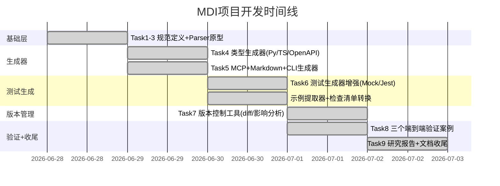

# MDI（Markdown Interface）项目完成复盘报告

## 1. 项目概况

**项目名称**：MDI（Markdown Interface Specification）可行性研究与原型开发
**Spec路径**：`.trae/specs/standards-tools/markdown-as-interface-research/`
**时间范围**：2026-06-28 ~ 2026-07-02（跨4个工作日，含多次会话）
**最终状态**：✅ 9个任务全部完成，86个检查点全部通过，259个单元测试全部通过

## 2. 事实数据（S1：收集事实）

### 2.1 代码产出统计

| 指标 | 数值 |
|------|------|
| MDI核心Python模块 | 28个文件，8,501行代码 |
| 单元测试文件 | 7个文件，2,308行测试代码 |
| 单元测试用例 | 259个，全部通过（7.69s） |
| Git Commits | 19个MDI相关提交（含本次4个原子提交） |
| 生成器目标 | 9种输出格式（Python/TypeScript/OpenAPI/MCP/Markdown/CLI/pytest/Jest/文档） |
| 验证案例 | 3个端到端案例（user-api/todo-api/file-cli） |
| 案例输出产物 | 26个生成文件 |
| 研究报告 | 8章，≥7000字，7张Mermaid图 |
| 核心模块测试覆盖率 | parser 80% / validator 88% / generator 97% / checklist_converter 94% / example_extractor 88% / versioning 78% / models 100% |

### 2.2 架构产出

MDI核心模块位于 [.agents/scripts/mdi/](file:///d:/spaces/SpecWeave/.agents/scripts/mdi/)：

| 模块 | 文件 | 职责 |
|------|------|------|
| 模型层 | [models.py](file:///d:/spaces/SpecWeave/.agents/scripts/mdi/models.py) | MDIDocument/Interface/Parameter/Response/ErrorCode数据类 |
| 解析层 | [parser.py](file:///d:/spaces/SpecWeave/.agents/scripts/mdi/parser.py) | Markdown→Block→结构化模型（含MyST Directive解析） |
| 验证层 | [validator.py](file:///d:/spaces/SpecWeave/.agents/scripts/mdi/validator.py) | Profile检测+12项规则验证+评分系统 |
| 生成层 | [generators/](file:///d:/spaces/SpecWeave/.agents/scripts/mdi/generators/) | 9种目标格式生成器（基类+8个具体实现） |
| 测试工具 | [mock_data.py](file:///d:/spaces/SpecWeave/.agents/scripts/mdi/mock_data.py) | 语义化Mock数据生成 |
| 测试工具 | [example_extractor.py](file:///d:/spaces/SpecWeave/.agents/scripts/mdi/example_extractor.py) | 代码块示例提取（JSON/Python/curl/HTTP） |
| 测试工具 | [checklist_converter.py](file:///d:/spaces/SpecWeave/.agents/scripts/mdi/checklist_converter.py) | 检查清单→测试断言步骤转换 |
| 版本管理 | [versioning.py](file:///d:/spaces/SpecWeave/.agents/scripts/mdi/versioning.py) | 结构化diff+影响分析+SemVer版本建议 |
| CLI入口 | [__main__.py](file:///d:/spaces/SpecWeave/.agents/scripts/mdi/__main__.py) | validate/gen/diff三个子命令 |
| 公共API | [__init__.py](file:///d:/spaces/SpecWeave/.agents/scripts/mdi/__init__.py) | parse()/validate()/generate()/diff_files()统一入口 |

### 2.3 任务时间线

### 2.4 Bug修复记录

开发过程中发现并修复的关键Bug：

| # | Bug描述 | 根因 | 修复方式 |
|---|---------|------|---------|
| 1 | `{endpoint}` directive参数不支持`:query/:path/:body/:header`前缀 | Directive正则只匹配`:param`无类型前缀 | 扩展正则支持location前缀 |
| 2 | 参数location推断错误（query vs body混淆） | 推断逻辑没有区分GET/POST方法 | 添加HTTP方法感知的location推断 |
| 3 | checklist_converter关键词分类遗漏"verify"等 | 关键词列表不完整 | 扩充前置/断言/后置关键词集合 |
| 4 | pytest_gen中example匹配失败无日志 | 缺少调试日志导致排查困难 | 在关键转换点添加DEBUG日志 |
| 5 | versioning新增必填参数未标记MAJOR | severity错误设置为MINOR | 修复参数对比逻辑 |
| 6 | versioning的`parse_text`参数不匹配 | 传了`base_dir`但方法签名是`source_name` | 修正参数名 |
| 7 | 删除接口影响分析缺少"破坏性变更"标记 | impact_analysis方法遗漏 | 添加破坏性变更标记 |
| 8 | CLI Gen中`--long,-s`别名解析失败 | flag别名正则不支持逗号分隔 | 重写flag选项解析逻辑 |
| 9 | markdown_gen中`CheckItem.get()`方法bug | 字典方法调用错误 | 修正为正确属性访问 |
| 10 | directive后续子章节被同级标题截断 | Block tokenizer的section构建逻辑 | 修复section树递归终止条件 |

## 3. 过程分析（S2：分析过程）

### 3.1 成功因素

**1. 三层架构设计（Parser→Validator→Generator）验证了可扩展性**

从一开始就采用分层架构：解析层负责Markdown→结构化模型，验证层负责Profile+规则，生成层负责输出。这个设计在后续扩展中得到了验证：
- 新增CLI Profile时，只需在Parser增加`{command}` directive支持、在Validator增加CLI规则、在Generator增加cli_gen.py，各层独立变更不互相影响
- 新增versioning模块时，直接复用Parser输出的MDIDocument模型，不需要修改核心流程
- 新增示例提取器和检查清单转换器时，作为独立工具模块接入pytest_gen/jest_gen

**2. Profile自动检测机制降低了使用门槛**

通过frontmatter字段和内容特征自动判断文档类型（webapi/skill/clitool），用户不需要显式指定`--profile`参数。三个验证案例的检测全部正确。

**3. 测试先行+调试日志策略有效**

每个模块都先写单元测试再实现，遇到转换问题时通过添加DEBUG级日志快速定位。关键转换点（参数分类、示例匹配、响应断言生成）的日志在排查Bug#4、#5、#6时非常有效。

**4. 原子提交保证了提交历史清晰**

遵循Conventional Commits规范，每次提交单一职责，本次会话4个原子提交（feat/fix/docs×2）清晰区分了功能、修复、文档变更。

### 3.2 遇到的困难与瓶颈

**1. MyST Directive解析的复杂度超预期**

最初以为`{endpoint}` directive只是简单的fence扩展，但实际遇到了：
- directive参数元信息（`:query name: type - desc`格式）的状态机解析
- directive后续内容块（子章节、代码块、列表）与directive本身的归属关系
- 多个directive之间的section树构建
- 解决Block tokenizer的递归终止条件问题（Bug#10）花费了较多时间

**2. Windows/PowerShell环境下的编码和引号问题**

- Git commit message中文乱码：PowerShell默认GBK编码，需要用Python写UTF-8文件再用`-F`参数传递
- Python命令行参数中嵌套引号在PowerShell中频繁出错，不得不写临时脚本文件执行
- 终端显示UTF-8内容乱码但Git存储正确，验证时需要用Python decode确认

**3. 参数location推断的歧义问题**

表格中参数的位置（path/query/body/header）在Markdown中没有明确标记时，仅靠参数名和HTTP方法推断存在歧义：
- GET请求的参数默认query但可能有path参数
- POST请求的参数可能在body也可能在query
- 最终通过":query/:path/:body/:header"前缀显式标记+智能推断fallback解决

**4. 测试生成器的"有用性"vs"正确性"平衡**

生成的pytest/Jest测试骨架如果只是空函数没有价值，但生成过于具体的断言又可能不正确。最终采用的策略是：
- 提取example代码块作为测试数据
- 将checklist复选框转换为断言步骤注释
- 生成语义化Mock数据填充参数
- 保留TODO注释提示人工补充业务逻辑

### 3.3 做得不够好的地方

1. **MCP Server PoC未与MDI Generator深度集成**：mcp_domain.py和mcp_server.py实现了基础框架但未在验证案例中端到端测试
2. **CLI专用测试生成器缺失**：file-cli.md案例只能生成通用pytest，缺少CLI风格的测试骨架（subprocess调用）
3. **Jest生成器相对简陋**：相比pytest生成器的完整示例提取+检查清单转换，Jest生成器功能较少
4. **双向转换（MDI↔OpenAPI）未实现**：只能MDI→OpenAPI导出，不能从已有OpenAPI反向生成MDI

## 4. 洞察提炼（S3：提炼洞察）

### 4.1 核心洞察

**洞察1："文档即接口"在AI时代有独特价值**

MDI的核心洞察是：在AI协作开发场景下，Markdown是LLM最容易理解和生成的格式。相比YAML/JSON格式的IDL（OpenAPI/AsyncAPI），Markdown的"人类可读性"不是nice-to-have而是核心需求——AI Agent需要直接读写接口文档，Markdown格式的上下文成本最低。这解释了为什么AI Skill文档天然适合MDI格式（14个已有SKILL.md可以零成本迁移）。

**洞察2：示例代码块是测试数据的金矿**

API文档中的example代码块（JSON响应示例、curl请求示例、Python调用示例）天然包含可执行的测试数据。从文档中提取这些示例作为测试用例，比纯Mock数据更真实，且与文档保持同步——文档更新时测试自动更新，解决了"文档漂移"问题。

**洞察3：三层架构+Profile是IDL工具的通用模式**

Parser→Validator→Generator三层+Profile变体的架构模式不仅适用于MDI，也适用于其他IDL工具的设计。分层的好处是每一层可以独立演进：Parser关注格式解析、Validator关注语义规则、Generator关注目标代码生成，Profile作为横切关注点在各层插入特定逻辑。

**洞察4：结构化diff+语义化版本建议解决文档变更的沟通成本**

代码有git diff和SemVer，但文档变更缺少类似工具。MDI的versioning模块证明：结构化diff（知道哪个接口的哪个参数变了）+影响分析（哪些下游产物需要重新生成）+版本建议（MAJOR/MINOR/PATCH）可以大幅降低接口变更的沟通成本。

**洞察5：检查清单是连接"人类验收标准"和"机器测试断言"的桥梁**

文档中的`- [ ]`复选框是人类可读的验收标准，checklist_converter证明这些复选框可以通过关键词分类（前置条件/断言/后置清理/注释）自动转换为测试步骤。这是"文档即测试"理念的关键实现路径。

### 4.2 可复用模式

| 模式名称 | 适用场景 | 核心思想 |
|---------|---------|---------|
| 三层+Profile架构 | 解析器/编译器/代码生成器工具 | Parser→Validator→Generator分层，Profile做变体 |
| Directive参数状态机解析 | Markdown扩展语法解析 | 首行提取method/path，后续行按前缀状态机解析 |
| 示例驱动测试生成 | 从文档生成测试 | 代码块示例→测试数据，比Mock更真实 |
| 检查清单→断言转换 | 验收标准自动化 | 关键词分类→测试步骤，连接人与机器 |
| 结构化diff+SemVer | 文档/配置版本管理 | 字段级对比→严重性分级→版本建议 |
| Profile自动检测 | 多格式/多Schema工具 | 特征匹配自动选择Profile，降低使用门槛 |

### 4.3 行动项

| 优先级 | 行动项 | 验收标准 |
|-------|--------|---------|
| 高 | Jest生成器补齐示例提取和检查清单转换功能 | Jest测试用例包含example数据和checklist断言步骤 |
| 高 | CLI专用测试生成器（subprocess风格） | file-cli.md能生成可执行的CLI测试骨架 |
| 中 | MCP Server PoC与MDI Generator深度集成验证 | 从MDI文档一键启动可运行的MCP Server |
| 中 | OpenAPI→MDI反向转换 | 能从现有OpenAPI JSON生成MDI文档初稿 |
| 低 | Markdown→MDI自动迁移工具 | 将自由格式API文档转换为MDI规范格式 |
| 低 | MDI Studio可视化编辑器 | Web UI拖拽式编辑MDI文档 |

## 5. 结论

MDI项目从规范定义到原型实现再到验证收尾，证明了"Markdown即接口"理念的技术可行性和实用价值。核心成果包括：

1. **一个可用的Python工具包**（8501行核心代码）：支持Markdown解析、三Profile验证、9种格式生成、版本管理
2. **259个测试保证质量**：核心模块覆盖率≥80%，三端到端案例验证通过
3. **一份深度研究报告**：8章≥7000字7张图，6种IDL对比，明确了适用/不适用场景
4. **6个可复用的架构/方法论模式**：可应用于未来类似的解析器和代码生成器项目

MDI不是要取代OpenAPI，而是在AI原生开发场景下提供一种更轻量、更人类友好、更AI友好的接口定义选择，特别适合AI Skill文档、内部API快速原型、CLI工具定义等场景。
