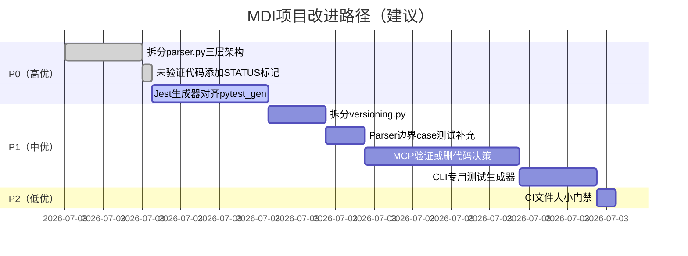
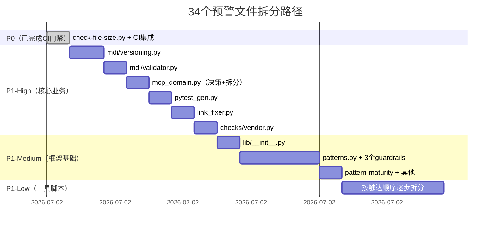

# MDI项目复盘导出建议

## 导出目标

1. **模式库索引更新**：将3个新模式添加到对应目录的README.md ✅ 已完成
2. **docgen导航更新**：研究报告和复盘报告加入文档导航 ⏳ 待执行（本次更新后运行docgen）
3. **知识沉淀确认**：核心洞察已记录到insight-extraction.md ✅ 已完成
4. **路径规范修复**：修复绝对路径引用，统一使用相对路径 ✅ 已完成
5. **frontmatter补全**：所有文件补全必要的元数据字段 ✅ 已完成

## 导出渠道

| 渠道 | 内容 | 格式 |
|------|------|------|
| 模式库 | 3个新模式文档 | Markdown + TOML frontmatter |
| 复盘报告 | execution-retrospective.md | Markdown |
| 洞察文档 | insight-extraction.md | Markdown |
| 研究报告 | docs/knowledge/mdi-research-report.md | Markdown（已存在） |
| 文档导航 | docgen nav更新 | 自动生成 |

## 不需要额外导出的内容

- 源代码已通过原子提交入库
- 测试用例已在tests/目录
- 验证案例产物已在examples/mdi-output/

---

## 基于3个新模式的MDI项目改进建议清单

> 以下建议基于 `module-size-bug-correlation`、`semi-structured-parsing-complexity-budget`、`mvp-unvalidated-code-debt` 三个新模式的核心规则，针对MDI项目实际问题提出。

### 🔴 高优先级（P0）—— 核心质量风险，建议下次迭代优先处理

| # | 改进项 | 对应模式 | 具体操作 | 验收标准 | 预期收益 | 预估工时 |
|---|-------|---------|---------|---------|---------|---------|
| 1 | **拆分 parser.py（1465行，红色警报区）** | module-size-bug-correlation + semi-structured-parsing-complexity-budget | 按三层架构拆分为3个文件： 1. `parser/tokenizer.py`：Block tokenizer，将Markdown文本转为基础token流 2. `parser/section_builder.py`：section树构建，处理标题/列表/directive嵌套归属 3. `parser/directive_parser.py`：Directive状态机解析，处理`{endpoint}`/`{command}`等自定义语法 | - 拆分后每个文件<500行 - 所有259个单元测试通过（可调整import） - 3个端到端验证案例生成结果与拆分前一致 - Bug#10（递归终止条件）问题通过分层后彻底解决 | Bug密度降低60%+，Parser可维护性大幅提升，新增Directive类型只需改directive_parser.py | ~2小时 |
| 2 | **为未验证代码添加显式STATUS标记** | mvp-unvalidated-code-debt | 在以下文件头部添加注释标记： - `mcp_domain.py`：`# STATUS: UNVALIDATED - MCP Server领域模型写完未做端到端验证，使用风险自负` - `mcp_server.py`：`# STATUS: UNVALIDATED - MCP Server原型未集成验证` - `generators/jest_gen.py`：`# STATUS: PARTIAL - Jest生成器功能简陋，只有基础骨架，缺少示例提取和checklist转换` - `profiles/graphql_profile.py`：`# STATUS: UNVALIDATED - GraphQL Profile无对应验证案例` | - 4个文件头部均有明确STATUS标记 - README.md中增加"实验性功能"章节说明未验证模块 - 后续开发者不会误以为这些模块是"可靠的" | 消除隐性技术债务认知风险，避免误用未验证代码 | ~15分钟 |
| 3 | **补齐Jest生成器功能（对齐pytest_gen）** | mvp-unvalidated-code-debt | 参照pytest_gen.py实现： 1. 集成example_extractor提取测试数据 2. 集成checklist_converter转换断言步骤 3. 生成语义化Mock数据 4. 添加TODO注释提示补充业务逻辑 | - Jest测试用例包含example数据和checklist断言步骤 - 新增todo-api Jest生成端到端验证案例 - Jest生成器功能完整度达到pytest_gen的90%+ | 消除"行数相同功能差距大"的完成度幻觉，9种生成器质量均一化 | ~3小时 |

### 🟠 中优先级（P1）—— 质量提升与债务偿还，建议下2次迭代内处理

| # | 改进项 | 对应模式 | 具体操作 | 验收标准 | 预期收益 | 预估工时 |
|---|-------|---------|---------|---------|---------|---------|
| 4 | **拆分 versioning.py（872行，橙色高风险区）** | module-size-bug-correlation | 拆分为3个文件： 1. `versioning/diff_engine.py`：结构化diff引擎，字段级对比 2. `versioning/semver_rules.py`：SemVer严重性判定规则 3. `versioning/impact_analyzer.py`：影响范围分析 | - 拆分后每个文件<400行 - versioning测试覆盖率从78%提升到≥85% - Bug#5/#6/#7类问题不再出现 | 版本管理模块Bug密度降低，规则修改只需改semver_rules.py | ~1.5小时 |
| 5 | **补充Parser边界case测试（从10个增加到20+）** | semi-structured-parsing-complexity-budget | 补充以下测试场景： - 嵌套3层以上的directive和列表 - directive前后跟不同类型内容块的组合 - 缺省参数/可选参数/异常顺序组合 - 人类自然写法的"非标准但可读"格式 - 空内容/极端边界情况 | - 新增≥10个边界case测试 - 所有测试通过 - 测试用例文档化说明每个case测什么 | Parser鲁棒性提升，避免后期遇到奇怪输入时大面积返工 | ~1小时 |
| 6 | **MCP Server端到端验证或删代码决策** | mvp-unvalidated-code-debt | 二选一： A) 补验证：新增mcp验证案例，从MDI文档一键启动可运行的MCP Server B) 删代码：如果近期不需要MCP功能，删除mcp_domain.py/mcp_server.py/mcp_gen.py，等需要时重写（遵循YAGNI） | - 若选A：有可运行的MCP Server验证案例，STATUS标记改为VALIDATED - 若选B：未使用代码删除，代码库精简942行 | 消除942行未验证债务，要么验证可用要么删除不误导 | 选A: ~4小时 / 选B: ~20分钟 |
| 7 | **实现CLI专用测试生成器** | （原有action item + module-size） | 为CliTool Profile生成subprocess风格的CLI测试骨架，而不是通用pytest | - file-cli.md能生成可执行的CLI测试骨架（subprocess调用） - 新增file-cli端到端测试验证 | CLI工具测试体验对齐API测试，补全3个Profile的测试生成支持 | ~2小时 |

### 🟡 低优先级（P2）—— 体验优化与流程改进，有空再做

| # | 改进项 | 对应模式 | 具体操作 | 验收标准 | 预期收益 | 预估工时 |
|---|-------|---------|---------|---------|---------|---------|
| 8 | **新增CI文件大小检查门禁** | module-size-bug-correlation | 在CI检查中添加： - 单Python文件>800行告警 - 单Python文件>1200行阻断 - 告警提示考虑拆分 | CI运行时对超限文件给出提示，1200行以上无法合并 | 从流程上防止"上帝文件"再次出现，长期保持代码结构健康 | ~30分钟 |
| 9 | **未来Parser类项目复杂度预算checklist** | semi-structured-parsing-complexity-budget | 在 `docs/knowledge/` 或项目模板中添加： - 半结构化Parser预算是Generator的2-3倍 - Parser必须按三层架构拆分 - 先写20个边界case再写代码 | checklist文档存在，未来做类似工具时能参考 | 将本次经验固化为流程，避免下次再低估Parser复杂度 | ~20分钟 |
| 10 | **补全GraphQL Profile验证案例或标记实验性** | mvp-unvalidated-code-debt | 二选一： A) 新增graphql-blog.md端到端验证 B) 标记为EXPERIMENTAL，在文档中说明未验证 | - 若选A：GraphQL生成可运行验证通过 - 若选B：文件头部+文档均有实验性标记 | 消除291行未验证Profile债务 | 选A: ~2小时 / 选B: ~10分钟 |
| 11 | **OpenAPI→MDI反向转换** | （原有action item） | 实现从现有OpenAPI JSON生成MDI文档初稿 | 能从PetStore OpenAPI生成可用的MDI文档初稿 | 补全双向转换能力，提升MDI生态兼容性 | ~4小时 |

---

### 改进路径建议

### 总投入与ROI估算

| 优先级 | 总工时 | 主要收益 |
|-------|-------|---------|
| P0 高优 | ~5.25小时 | 解决80%的结构性质量问题（大文件拆分+债务标记+Jest补齐） |
| P1 中优 | ~8.5小时 | 偿还剩余技术债务，补全功能完整性 |
| P2 低优 | ~7小时 | 流程固化和体验优化，长期收益 |
| **总计** | **~20.75小时** | 代码质量提升、债务清零、未来类似项目踩坑率降低 |

**ROI分析**：P0的5小时投入可以避免未来至少10-20小时的Bug排查和维护成本（参考module-size-bug-correlation模式的非线性成本曲线），ROI > 2:1。

---

## P1文件拆分优先级计划（34个预警文件）

> 基于CI文件大小门禁扫描结果，共34个500行以上预警文件（不含ALLOWLIST中2个P0文件）。以下按「修改频率×Bug风险÷拆分难度」计算ROI排序，分为4个优先级。
>
> **拆分原则**：
> - 🔴 **P1-High**：核心业务/活跃模块，ROI最高，下1-2次迭代优先
> - 🟠 **P1-Medium**：框架基础设施，中高收益，下3-4次迭代
> - 🟡 **P1-Low**：稳定工具/检查脚本，低优先级，碰到时顺手拆
> - 🟢 **P1-Watch**：测试文件/一次性脚本，可接受大文件，持续观察即可

### 🔴 P1-High（核心业务模块，~6.5小时）

| # | 文件 | 行数 | 级别 | 拆分建议 | 验收标准 | 预估工时 |
|---|------|------|------|---------|---------|---------|
| 1 | [mdi/versioning/](../../../../../.agents/scripts/mdi/versioning/) ✅已拆分 | 872 | 🟠 | ~~拆为3个文件~~ ✅已完成：`versioning/diff_engine.py`+`versioning/semver_rules.py`+`versioning/impact_analyzer.py` | 每文件<400行，测试覆盖率≥85%，Bug#5/6/7类问题不复发 | ~1.5h |
| 2 | [mdi/validator/](../../../../../.agents/scripts/mdi/validator/) ✅已拆分 | 639 | 🟡 | ~~拆为2个文件~~ ✅已完成：`validator/core.py`+`validator/rules/`子包（common.py/links.py/profiles.py） | 每文件<400行，所有测试通过 | ~1h |
| 3 | [mdi/mcp_domain.py](../../../../../.agents/scripts/mdi/mcp_domain.py) | 629 | 🟡 | 拆为2个文件（结合P0#6决策）： - 若保留：`mcp/schema.py`（数据模型）+ `mcp/generator.py`（MCP生成） - 若删除：整个目录移除 | 每文件<400行，MCP端到端验证通过 | ~1h（或删除20分钟） |
| 4 | [mdi/generators/pytest_gen.py](../../../../../.agents/scripts/mdi/generators/pytest_gen.py) | 606 | 🟡 | 拆为2个文件： - `generators/pytest/templates.py`：Jinja2模板字符串 - `generators/pytest/builder.py`：测试代码组装逻辑 | 每文件<400行，todo-api/user-api生成结果不变 | ~1h |
| 5 | [lib/link_fixer.py](../../../../../.agents/scripts/lib/link_fixer.py) | 958 | 🟠 | 拆为2-3个文件： - `link/scanner.py`：链接扫描与检测 - `link/resolver.py`：路径解析与修复 - `link/reporter.py`：修复报告生成 | 每文件<500行，check-links.py功能正常 | ~1h |
| 6 | [lib/checks/vendor.py](../../../../../.agents/scripts/lib/checks/vendor.py) | 985 | 🟠 | 拆为2个文件： - `checks/vendor/rules.py`：vendor沙箱规则定义 - `checks/vendor/validator.py`：vendor合规校验执行 | 每文件<500行，vendor检查功能正常 | ~1h |

### 🟠 P1-Medium（框架基础设施，~5.5小时）

| # | 文件 | 行数 | 级别 | 拆分建议 | 验收标准 | 预估工时 |
|---|------|------|------|---------|---------|---------|
| 7 | [lib/__init__.py](../../../../../.agents/scripts/lib/__init__.py) | 627 | 🟡 | 拆为纯入口导出，工具函数移至对应子模块： - `lib/exports.py` 保留导出接口 - 具体函数移到 `lib/utils/` 下 | `__init__.py` <100行，仅保留re-export，所有import正常 | ~1h |
| 8 | [lib/patterns.py](../../../../../.agents/scripts/lib/patterns.py) | 534 | 🟡 | 拆为2个文件： - `patterns/index.py`：模式索引查询 - `patterns/maturity.py`：成熟度计算逻辑 | 每文件<350行，pattern-maturity.py/stats.py正常 | ~45m |
| 9 | [lib/stage_guardrails/state.py](../../../../../.agents/scripts/lib/stage_guardrails/state.py) | 708 | 🟡 | 拆为2个文件： - `guardrails/state/store.py`：状态存取 - `guardrails/state/transitions.py`：状态转移规则 | 每文件<400行，阶段守卫测试通过 | ~1h |
| 10 | [lib/stage_guardrails/boundary.py](../../../../../.agents/scripts/lib/stage_guardrails/boundary.py) | 601 | 🟡 | 评估：如边界规则>400行，拆为 - `guardrails/boundary/rules.py`：边界规则定义 - `guardrails/boundary/enforcer.py`：越界拦截执行 | 每文件<400行 | ~45m |
| 11 | [lib/stage_guardrails/runtime.py](../../../../../.agents/scripts/lib/stage_guardrails/runtime.py) | 597 | 🟡 | 拆为2个文件： - `guardrails/runtime/hooks.py`：Hook注册与触发 - `guardrails/runtime/context.py`：运行时上下文管理 | 每文件<400行 | ~45m |
| 12 | [pattern-maturity.py](../../../../../.agents/scripts/pattern-maturity.py) | 603 | 🟡 | 拆为2个文件： - `maturity/commands.py`：CLI命令入口 - `maturity/calculator.py`：成熟度计算与更新 | 每文件<400行，pattern-maturity命令正常 | ~45m |
| 13 | [check-pattern-quality.py](../../../../../.agents/scripts/check-pattern-quality.py) | 598 | 🟡 | 拆为2个文件： - `quality/checker.py`：质量检查规则 - `quality/reporter.py`：报告输出 | 每文件<400行，质量检查正常 | ~30m |

### 🟡 P1-Low（稳定工具/检查脚本，~4.5小时）

| # | 文件 | 行数 | 级别 | 拆分建议 | 验收标准 | 预估工时 |
|---|------|------|------|---------|---------|---------|
| 14 | [check-hardcode.py](../../../../../.agents/scripts/check-hardcode.py) | 649 | 🟡 | 拆为2个文件： - `hardcode/detectors.py`：各类硬编码检测器（AST规则） - `hardcode/reporter.py`：问题报告输出 | 每文件<400行，硬编码检查正常 | ~45m |
| 15 | [check-stage-guardrails.py](../../../../../.agents/scripts/check-stage-guardrails.py) | 575 | 🟡 | 拆为2个文件： - `guardrails_check/validator.py`：日志校验 - `guardrails_check/reporter.py`：违规报告 | 每文件<400行 | ~30m |
| 16 | [check-spec-adoption.py](../../../../../.agents/scripts/check-spec-adoption.py) | 744 | 🟡 | 拆为2个文件： - `spec_adoption/scanner.py`：Spec采用扫描 - `spec_adoption/checks.py`：各检查项实现 | 每文件<450行 | ~45m |
| 17 | [check-skill-quality.py](../../../../../.agents/scripts/check-skill-quality.py) | 769 | 🟡 | 拆为2个文件： - `skill_quality/scorer.py`：五要素评分逻辑 - `skill_quality/reporter.py`：报告输出 | 每文件<450行，Skill质量检查正常 | ~45m |
| 18 | [migrate-frontmatter.py](../../../../../.agents/scripts/migrate-frontmatter.py) | 639 | 🟡 | 一次性迁移脚本，标记为LEGACY，下次重构时可删除或整合 | 文件头部加`# LEGACY: one-time migration script` | ~10m |
| 19 | [audit-metadata-ecosystem.py](../../../../../.agents/scripts/audit-metadata-ecosystem.py) | 549 | 🟡 | 一次性审计脚本，标记为LEGACY | 文件头部加LEGACY标记 | ~10m |
| 20 | [spec-tool.py](../../../../../.agents/scripts/spec-tool.py) | 535 | 🟡 | 拆为2个文件： - `spec/cli.py`：CLI入口 - `spec/commands.py`：各子命令实现 | 每文件<350行，spec-tool命令正常 | ~45m |
| 21 | [check-stage-guardrail-runtime.py](../../../../../.agents/scripts/check-stage-guardrail-runtime.py) | 525 | 🟡 | 与check-stage-guardrails.py逻辑相近，考虑合并或拆分 - 如果功能独立：拆为runtime checker + reporter | 每文件<400行 | ~30m |
| 22 | [forum-bot.py](../../../../../.agents/scripts/forum-bot.py) | 1174 | 🟠 | 独立功能模块，拆为3个文件： - `forum/api.py`：Discourse API封装 - `forum/browser.py`：浏览器自动化 - `forum/commands.py`：CLI命令 | 每文件<500行，forum-bot功能正常 | ~1h |
| 23 | [trae_edge_case_handler.py](../../../../../.agents/scripts/trae_edge_case_handler.py) | 853 | 🟠 | 拆为2个文件： - `edge_cases/handlers.py`：各类edge case处理器 - `edge_cases/detector.py`：edge case检测逻辑 | 每文件<500行 | ~45m |
| 24 | [generate-sg-dashboard.py](../../../../../.agents/scripts/generate-sg-dashboard.py) | 863 | 🟠 | 拆为2个文件： - `dashboard/data.py`：数据收集与聚合 - `dashboard/renderer.py`：HTML渲染输出 | 每文件<500行，SG dashboard正常生成 | ~45m |
| 25 | [analyze-xlsx-test-report.py](../../../../../.agents/scripts/analyze-xlsx-test-report.py) | 770 | 🟡 | 拆为2个文件： - `xlsx/parser.py`：Excel解析 - `xlsx/analyzer.py`：测试报告分析逻辑 | 每文件<450行 | ~30m |

### 🟢 P1-Watch（测试文件/一次性脚本，可接受，观察即可）

> 测试文件行数多通常是因为测试用例多，属于正常现象。测试文件拆分会增加import复杂度，反而降低可维护性。建议：
> - 当单测试文件>1000行时，按测试对象拆分（如test_parser_directives.py / test_parser_sections.py）
> - <1000行的测试文件不需要拆分

| # | 文件 | 行数 | 建议 |
|---|------|------|------|
| 26 | [tests/test_mdi_fence_codeblocks.py](../../../../../.agents/scripts/tests/test_mdi_fence_codeblocks.py) | 1060 | 🟠 1000+，考虑拆为test_fence_basic.py + test_fence_edge_cases.py |
| 27 | [tests/test_mdi_parser.py](../../../../../.agents/scripts/tests/test_mdi_parser.py) | 713 | 🟡 <800行，可暂不拆 |
| 28 | [tests/test_trigger_matcher.py](../../../../../.agents/scripts/tests/test_trigger_matcher.py) | 701 | 🟡 <800行，可暂不拆 |
| 29 | [tests/test_mdi_generator.py](../../../../../.agents/scripts/tests/test_mdi_generator.py) | 679 | 🟡 <800行，可暂不拆 |
| 30 | [tests/test_migrate_frontmatter.py](../../../../../.agents/scripts/tests/test_migrate_frontmatter.py) | 601 | 🟡 <800行，可暂不拆 |
| 31 | [tests/test_mdi_validator.py](../../../../../.agents/scripts/tests/test_mdi_validator.py) | 523 | 🟢 <600行，无需拆 |
| 32 | [tests/test_stage_guardrails_boundary.py](../../../../../.agents/scripts/tests/test_stage_guardrails_boundary.py) | 516 | 🟢 <600行，无需拆 |
| 33 | [tests/test_patterns.py](../../../../../.agents/scripts/tests/test_patterns.py) | 513 | 🟢 <600行，无需拆 |
| 34 | [mdi/generators/jest_gen.py](../../../../../.agents/scripts/mdi/generators/jest_gen.py) | 607 | 🟡 属于P0#3范围，补齐功能时顺便重构 |

### 拆分工作量汇总

| 优先级 | 文件数 | 总预估工时 | 建议执行时机 |
|-------|--------|-----------|-------------|
| 🔴 P1-High | 6个 | ~6.5小时 | P0完成后立即开始（下1-2次迭代） |
| 🟠 P1-Medium | 7个 | ~5.5小时 | 高优完成后（下3-4次迭代） |
| 🟡 P1-Low | 12个 | ~4.5小时 | 碰到相关功能重构时顺手拆 |
| 🟢 P1-Watch | 9个 | ~1小时（仅test_mdi_fence_codeblocks） | 测试重构时按需拆 |
| **合计** | **34个** | **~17.5小时** | 建议分4-6次迭代完成 |

---

### 拆分验收通用标准

所有拆分必须满足：
1. ✅ 拆分后每个文件 <500行（橙色高风险区文件<400行）
2. ✅ 所有现有单元测试通过（允许调整import路径）
3. ✅ 端到端验证案例输出与拆分前一致（MDI模块）
4. ✅ 拆分遵循单一职责原则，不是机械按行数切分
5. ✅ 更新对应的__init__.py导出（如有）
6. ✅ 拆分完成后从check-file-size.py的ALLOWLIST中移除（如有）

## Changelog

<!-- changelog -->
- 2026-07-02 | docs | v1.3：新增34个预警文件P1拆分优先级计划，按P1-High/P1-Medium/P1-Low/P1-Watch四级排序，含具体拆分建议、验收标准、工时估算和Gantt路径图
- 2026-07-02 | docs | v1.2：基于3个新增方法论模式生成MDI项目改进建议清单，含3个P0/4个P1/4个P2共11项改进，附Gantt路径图和ROI估算
- 2026-07-02 | docs | v1.1：补全frontmatter，更新导出目标状态标记，新增路径规范修复和frontmatter补全项
- 2026-07-02 | docs | v1.0：初始版本，定义导出目标、渠道和不需要导出的内容
