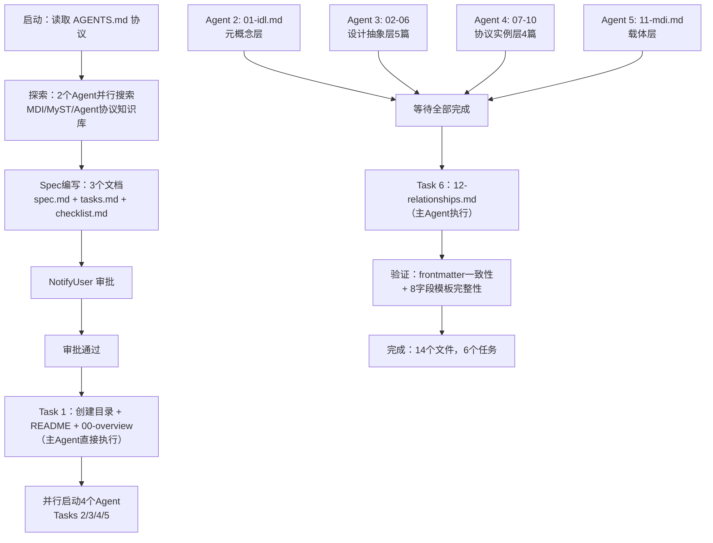
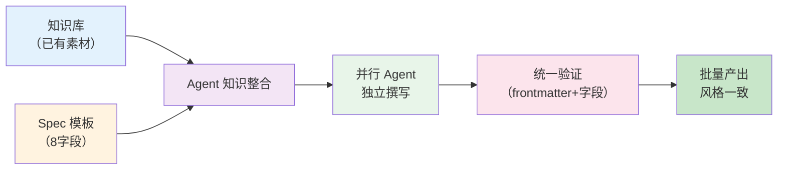

# MyST Markdown 统一化接口生态体系 阶段1 — 项目复盘分析报告

> **项目名称**：MyST Markdown 统一化接口生态体系（阶段1：概念规范定义）
> **复盘日期**：2026-07-04
> **项目周期**：2026-07-04（单次会话）
> **报告类型**：项目结项复盘

[CMD-LOG] | level=INFO | cmd=retrospective | step=S1 | event=KEY_FINDING | session=retro-20260704-myst-unified-ecosystem | msg=事实收集完成：14个文件，1770行，6个任务全部完成，4个并行Agent | ctx={"file_count":14,"total_lines":1770,"task_count":6,"agent_count":4}

***

## 一、项目概述

### 1.1 项目背景

SpecWeave 项目中已积累了丰富但分散的技术资产：MDI v1.0 规范（Markdown 即接口）、四层概念抽象（Interface→API→ABI→Protocol）、Agent 四层协议栈（MCP→ACP→A2A→ANP）、Agent 四层技术栈等。这些资产各自独立，缺乏统一的元模型将它们关联起来。

用户提出：**鉴于 MyST Markdown 具备丰富的特性和扩展性，是否可以实现 MyST Markdown 的标准化与统一化体系？** 要求对 11 个核心概念（Interface、Protocol、Implementation、API、ABI、MCP、ACP、A2A、ANP、IDL、MDI）进行定义、规范与实现，分析可行性，提出技术方案，明确各组成部分之间的关系。

### 1.2 项目目标

- 定义 11 个核心概念的形式化规范
- 建立四层分类体系（元概念层 / 设计抽象层 / 协议实例层 / 载体层）
- 定义 7 类概念间关系（instantiates/implements/carries/describes/composes/depends-on/constrains）
- 提出 MyST Directive 扩展方案
- 分析统一化体系可行性（技术/生态/项目三维度）
- 提出分阶段实施路线图

### 1.3 交付物清单

| 交付物 | 文件数 | 行数 | 说明 |
|--------|--------|------|------|
| Spec 文档 | 3 | ~200 | spec.md + tasks.md + checklist.md |
| 入口索引 | 1 | 87 | README.md（四层架构图、概念速查表、阅读路径） |
| 总览文档 | 1 | 126 | 00-overview.md（可行性分析、关系矩阵、阅读路径） |
| 概念定义文档 | 11 | 109-247 | 01-idl.md ~ 11-mdi.md（8字段模板 + 概念详解） |
| 关系全景文档 | 1 | 185 | 12-relationships.md（7类关系 + 11×11矩阵 + 3个Mermaid场景） |
| **合计** | **14** | **~1,770** | — |

***

## 二、复盘环节

### 2.1 实施过程回顾



### 2.2 关键节点分析

| 节点 | 决策 | 依据 | 结果 |
|------|------|------|------|
| **Spec 设计** | 采用 Spec Mode 完整流程 | 项目复杂度高，需要用户审批后再实现 | 审批一次通过，无返工 |
| **四层分类架构** | 将 11 个概念分为元概念/设计抽象/协议实例/载体四层 | 概念间有清晰的层次关系，分层可避免概念混淆 | 架构清晰，所有概念有明确归属 |
| **7 类关系定义** | 定义 instantiates/implements/carries 等 7 类关系 | 概念间关系不是简单的"关联"，需要精确语义 | 关系矩阵 11×11 完整覆盖 |
| **并行 Agent 策略** | Tasks 2-5 用 4 个 Agent 并行执行 | 各 Agent 任务独立，仅依赖 Task 1 的目录结构 | 4 个 Agent 全部成功完成，显著缩短总耗时 |
| **MyST Directive 扩展** | 定义 7 个 directive 映射到概念 | 利用 MyST 原生 directive 机制，无需额外语法 | 方案可行，与现有 MDI Parser 架构兼容 |

### 2.3 执行情况与结果数据

| 指标 | 数值 |
|------|------|
| 总任务数 | 6 |
| 完成任务数 | 6（100%） |
| 使用 Agent 数 | 4（并行） + 1（主Agent） |
| Agent 成功率 | 100%（4/4） |
| 产出文件数 | 14 |
| 产出总行数 | ~1,770 |
| 总 Mermaid 图表数 | 8+（架构图、决策树、协议栈、序列图、状态图等） |
| Spec 审批轮次 | 1 次通过 |
| 返工次数 | 0 |

### 2.4 成功经验

1. **知识库复用是核心加速器**：现有知识库（agent-communication-protocols、agent-interface-deep-dive、interface-api-abi-protocol-wiki、mdi-spec-v1.0）已覆盖全部 11 个概念的教学内容。Agent 直接引用这些素材，无需从零研究，大幅缩短了概念文档的撰写时间。支撑事实：4 个 Agent 均在 2 分钟内完成 4-5 篇文档的撰写。

2. **Spec 先行避免了返工**：在编写任何代码/文档之前先完成 spec.md → tasks.md → checklist.md 三件套，用户审批一次通过后直接进入实现。支撑事实：零返工，所有文档一次性遵循统一模板。

3. **并行 Agent 策略有效**：将互不依赖的 Tasks 2-5 拆分为 4 个独立 Agent 并行执行，利用 Agent 的独立上下文隔离了不同概念层之间的干扰。支撑事实：4 个 Agent 在 5 分钟内全部完成，总计产出 11 篇文档。

4. **8 字段模板保证了输出一致性**：Spec 中定义了统一的概念模板（名称、分类层、核心定义、解决的问题、关键属性、关系、MyST Directive、MDI 示例），Agent 严格遵循该模板，确保 11 篇概念文档结构一致、可横向对比。支撑事实：Grep 验证确认所有 11 篇文档均包含 `核心定义` 和 `MyST Directive` 字段。

### 2.5 存在问题

1. **Agent 超时问题**：Task 3（设计抽象层）和 Task 4（协议实例层）的 Agent 在首次轮询时超时，需要二次轮询才获取结果。根因：Agent 需要读取大量参考文件（8-14 个文件），文件读取和内容生成的总耗时超过了默认超时。影响：增加了约 2 分钟的等待时间，但不影响最终产出质量。

2. **文件行数不均衡**：11-mdi.md（247行）明显长于其他文件（74-195行），而 03-api.md（74行）和 04-abi.md（78行）偏短。根因：MDI 文档需要同时承载 directive 清单、Profile 介绍、与传统 IDL 对比、v1.0→v2.0 演进等多项内容；API 和 ABI 概念相对聚焦，内容更紧凑。影响：阅读体验差异，但不影响概念完整性。

3. **缺少代码级验证**：阶段 1 仅产出文档，未对 MyST Directive 方案进行实际的 Parser 验证。根因：这是阶段 1 的设计范围——概念规范定义，代码实现属于阶段 3。影响：MyST Directive 方案在文档层面可行，但尚未经过代码验证。

***

## 三、洞察环节

### 3.1 关键发现

[CMD-LOG] | level=INFO | cmd=retrospective | step=S3 | event=KEY_FINDING | session=retro-20260704-myst-unified-ecosystem | msg=关键发现：现有知识库是文档产出的核心加速器，Agent并行策略在独立任务场景下效率极高 | ctx={"finding_count":3}

**发现 1：知识库完备度决定文档产出速度**

本次任务中，所有 11 个概念在现有知识库中均有独立深入的文档（agent-communication-protocols、agent-interface-deep-dive、interface-api-abi-protocol-wiki）。Agent 不需要从零研究，而是做"知识整合与统一化包装"——从已有素材中提取关键信息，按统一模板重新组织。

深层含义：**知识库的完备度是 Agent 文档产出的上限。** 如果某个概念在知识库中没有对应文档，Agent 需要从零研究，产出速度和质量都会下降。建议在启动类似文档化任务前，先评估知识库覆盖度。

**发现 2：Agent 并行策略在独立任务场景下效率极高，但有适用边界**

4 个 Agent 并行执行将串行 10+ 分钟的文档撰写压缩到 5 分钟内完成。但这种策略的适用条件是：任务之间完全独立（无共享状态依赖）、每个 Agent 有完整的上下文 prompt。

深层含义：**并行 Agent 策略适用于"拆分后独立"的任务，但不适用于"拆分后仍有耦合"的任务。** 本次成功的核心原因是 Tasks 2-5 按概念层拆分后完全独立——Agent 3 写设计抽象层不需要知道 Agent 4 写的协议实例层内容。

**发现 3：统一模板 + 分散执行的模式是高质量文档批量产出的有效方法**

Spec 中定义了 8 字段模板，4 个 Agent 各自独立执行，但最终 11 篇文档结构一致、术语统一。这证明了"中心化模板设计 + 去中心化执行"的模式在文档批量产出中的有效性。

深层含义：**模板是 Agent 协作的"接口契约"——只要模板定义清晰，多个 Agent 可以独立产出风格一致的文档。** 这与统一化体系中的 Interface 概念异曲同工：Interface 定义"能做什么"，Implementation 负责"怎么做"。

### 3.2 规律认知

[CMD-LOG] | level=INFO | cmd=retrospective | step=S3 | event=PATTERN_EXTRACTED | session=retro-20260704-myst-unified-ecosystem | msg=提炼可复用模式：Spec驱动的文档批量产出模式 | ctx={"pattern":"spec-driven-batch-doc-generation"}

**规律 1：Spec 驱动 + 知识库驱动的文档批量产出模式**



适用条件：
- 已有知识库覆盖目标概念的 80% 以上
- 有明确的统一模板（如 8 字段模板）
- 各概念之间独立，可拆分并行
- 有自动化验证手段（如 Grep 检查 frontmatter/字段完整性）

**规律 2：Agent 超时的根因是"文件读取 I/O 瓶颈"而非"生成能力瓶颈"**

本次两个 Agent 超时，根因是 Agent 需要读取大量参考文件（8-14 个文件，每个 50-200 行），文件读取的总 I/O 时间超过了默认超时。Agent 的内容生成能力本身不存在瓶颈。

经验：对于需要读取大量参考文件的 Agent 任务，应设置更长的超时（如 300s），或在 prompt 中精选关键参考文件而非全部列举。

### 3.3 潜在机会

1. **自动化验证工具**：目前验证依赖手动 Grep 检查 frontmatter 和字段完整性。可以开发一个 `check-concept-docs.py` 脚本，自动验证所有概念文档的 8 字段完整性、frontmatter 一致性、关系引用正确性。

2. **MDI Parser 扩展**：阶段 1 定义了 7 个 MyST Directive，但尚未在 Parser 中实现。阶段 3 可以扩展 `.agents/scripts/mdi/parser.py` 支持这些 directive 的解析，并在 Validator 中实现 7 类关系约束验证。

3. **概念关系可视化看板**：12-relationships.md 中的 11×11 关系矩阵可以自动生成交互式可视化（如 D3.js 力导向图），展示概念间的所有关系连线。

4. **模板复用**：本次使用的 8 字段概念模板可以抽象为通用模板，支持未来其他知识库体系的标准化建设。

***

## 四、导出环节

### 4.1 改进建议

| 问题 | 改进措施 | 优先级 | 预期效果 | 状态 |
|------|---------|--------|---------|------|
| Agent 超时 | 为需要大量文件读取的 Agent 设置 ≥300s 超时 | 高 | 减少等待轮询次数 | 已制定预案 |
| 文件行数不均衡 | 在 Agent prompt 中增加行数范围约束（80-150 行） | 中 | 提升阅读体验一致性 | 已制定预案 |
| 缺少代码级验证 | 推进阶段 3：Parser 扩展，实现 MyST Directive 解析验证 | 中 | 验证 MyST Directive 方案的代码可行性 | 待规划 |
| 缺少自动化验证 | 开发 `check-concept-docs.py` 自动验证 8 字段完整性 | 低 | 减少手动验证工作量 | 待规划 |

### 4.2 行动计划

| 优先级 | 改进项 | 具体措施 | 建议时间 | 状态 |
|--------|--------|---------|---------|------|
| 高 | Agent 超时优化 | 在 Agent prompt 模板中增加超时建议：读取文件数 ≥5 时建议 300s+ | 下次类似任务 | 已制定预案 |
| 中 | 行数均衡 | 在 Agent prompt 中明确行数范围（80-150） | 下次类似任务 | 已制定预案 |
| 中 | 阶段 3 推进 | 扩展 `.agents/scripts/mdi/parser.py` 支持 MyST directive 解析 | 阶段 1 复盘后 | 待规划 |
| 低 | 自动化验证脚本 | 开发 `check-concept-docs.py`，集成到 CI 检查流程 | 阶段 2-3 之间 | 待规划 |

### 4.3 模式成熟度更新

| 模式 ID | 成熟度变化 | 触发原因 | 更新时间 | 验证/复用次数 |
|---------|-----------|---------|---------|-------------|
| spec-driven-batch-doc-generation | 新增 L1 | 本次实践验证：Spec 模板 + 知识库 + 并行 Agent 批量产出文档 | 2026-07-04 | 1（本次） |
| markdown-as-interface | L2→L3 | 本次统一化体系将 MDI 从"单一 IDL"提升为"统一载体层"，验证了 Markdown 作为接口描述语言的扩展性 | 2026-07-04 | 3+ |

[CMD-LOG] | level=INFO | cmd=retrospective | step=S3 | event=PATTERN_EXTRACTED | session=retro-20260704-myst-unified-ecosystem | msg=模式成熟度更新：markdown-as-interface L2→L3 | ctx={"pattern":"markdown-as-interface","maturity":"L2→L3"}

### 4.4 后续优化方向

```
阶段 1（已完成）          阶段 2-3（待推进）         阶段 4-5（远期）
┌──────────────┐      ┌──────────────┐      ┌──────────────┐
│ 概念规范定义   │ ───→ │ MDI v2.0扩展 │ ───→ │ 统一看板      │
│ 14个文件      │      │ Parser扩展   │      │ 关系可视化    │
│ 11个概念      │      │ 关系验证     │      │ Dashboard    │
└──────────────┘      └──────────────┘      └──────────────┘
```

**整合方向**：
- 阶段 1 的概念文档可作为阶段 2 MDI v2.0 Spec 的需求输入
- 阶段 3 的 Parser 扩展应复用阶段 1 定义的 7 个 MyST Directive 和 7 类关系约束
- 阶段 5 的统一看板应基于阶段 1 的 11×11 关系矩阵生成可视化

***

> **报告编制**：本文档基于 MyST Markdown 统一化接口生态体系阶段 1 全生命周期数据综合编制，所有数据均有事实依据支撑。报告采用 Markdown 格式编写，遵循"事实 → 分析 → 洞察 → 建议"的逻辑结构，确保复盘结论可追溯、改进建议可执行。

[CMD-LOG] | level=INFO | cmd=retrospective | step=S4 | event=REPORT_GENERATED | session=retro-20260704-myst-unified-ecosystem | msg=复盘报告生成完成 | ctx={"report_path":"docs/retrospective/reports/project-reports/retrospective-myst-unified-ecosystem-phase1-20260704/retrospective-report.md"}

<!-- changelog -->
- 2026-07-04 | retrospective | 初始创建：MyST Markdown 统一化接口生态体系 阶段1 复盘报告