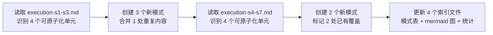
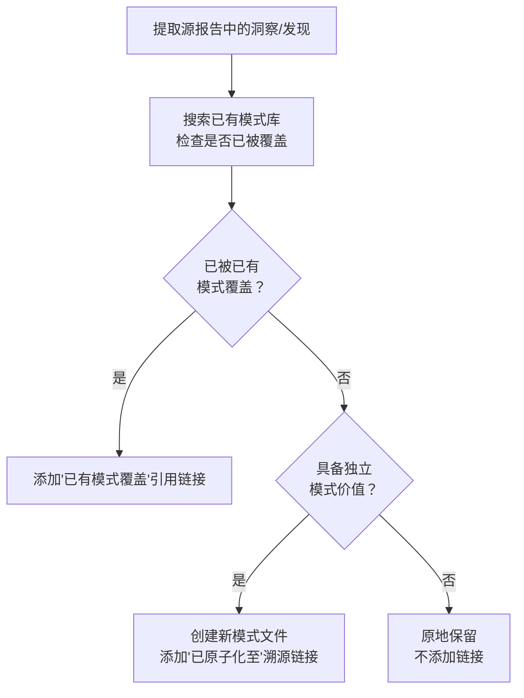
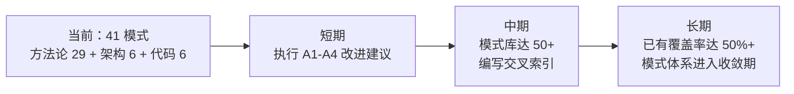

+++
id = "retrospective-atomization-execution-s1-7-20260624"
date = "2026-06-24"
type = "execution-retrospective"
source = "docs/retrospective/reports/retrospective-comprehensive-20260623/execution-s1-s3.md, docs/retrospective/reports/retrospective-comprehensive-20260623/execution-s4-s7.md"
tags = ["atomization", "pattern-extraction", "已有模式覆盖", "重复内容合并"]
+++

# AI 智能体开发规范体系 — 执行复盘原子化·洞察·萃取·导出

> **任务背景**：对 `retrospective-comprehensive-20260623` 系列的执行复盘模块（execution-s1-s3.md、execution-s4-s7.md）进行深度原子化，将其中未提取的洞察进一步拆分为独立方法论模式。
> **复盘日期**：2026-06-24
> **执行模式**：单智能体全程，同会话内连续执行
> **报告类型**：执行复盘 + 方法论萃取

---

## 一、项目概述

### 1.1 任务输入

| 维度 | 内容 |
|------|------|
| 目标文件 | `execution-s1-s3.md`（S1-S3 执行复盘，约 231 行） `execution-s4-s7.md`（S4-S7 执行复盘，约 248 行） |
| 已有原子化 | S1-S3：`structure-first-extension.md`；S4-S7：`diff-driven-refactoring.md`、`progressive-templating.md` |
| 待原子化 | 两个文件中 8 个洞察/发现，需逐个判断"新建模式"还是"已有模式覆盖" |
| 用户指令 | 依次对两个文件执行原子化，并在 S1-S3 中合并重复的深度解析内容 |

### 1.2 交付物清单

| 类别 | 数量 | 说明 |
|------|------|------|
| 新增方法论模式 | 5 个 | auto-generate-threshold、scripted-batch-correction、package-structure-leverage、refactoring-hidden-bug-discovery、i18n-anchor-page-strategy |
| 已有模式覆盖引用 | 2 处 | 发现二→retrospective-acceleration-effect、发现三→progressive-templating |
| 重复内容合并 | 1 处 | 发现三"包结构杠杆效应"深度解析（63 行 → 引用链接） |
| 溯源链接 | 8 处 | 两个源文件中各 4 处"已原子化至"/"已有模式覆盖"标注 |
| 索引更新 | 4 个 | methodology-patterns/README.md（2 次）、patterns/README.md（2 次） |

---

## 二、执行复盘

### 2.1 执行过程回顾

### 2.2 各阶段量化数据

#### 阶段一：execution-s1-s3.md 原子化

| 发现 | 原章节 | 处理策略 | 产出 |
|------|--------|---------|------|
| 发现一：auto-generate 张力 | 6.2 | **新建模式** | auto-generate-threshold.md（125 行） |
| 决策 S2-1 + 发现二：脚本化安全边际 | 6.1.2 + 6.2 | **新建模式** | scripted-batch-correction.md（187 行） |
| 发现三：包结构杠杆效应 | 6.2 | **新建模式 + 源文件合并** | package-structure-leverage.md（149 行）；源文件删除 63 行重复内容 |
| 结构阅读先行 | 6.3 | 已有（无需处理） | — |

#### 阶段二：execution-s4-s7.md 原子化

| 发现 | 原章节 | 处理策略 | 产出 |
|------|--------|---------|------|
| 发现一：重构中隐藏 bug | 7.2 | **新建模式** | refactoring-hidden-bug-discovery.md（101 行） |
| 发现二：跨任务隐性加速 | 7.2 | **已有模式覆盖** | → retrospective-acceleration-effect.md |
| 发现三：数据-代码分离抽象 | 7.2 | **已有模式覆盖** | → progressive-templating.md |
| 发现四：国际化锚定效应 | 7.2 | **新建模式** | i18n-anchor-page-strategy.md（113 行） |

### 2.3 执行量化小结

| 指标 | 数值 |
|------|------|
| 执行耗时 | ~30 分钟（阶段一 ~15 + 阶段二 ~15） |
| 新建模式文件 | 5 个（合计 675 行） |
| 已有模式覆盖引用 | 2 处 |
| 重复内容合并 | 1 处（删除 63 行，替换为 5 行引用） |
| 源文件溯源链接新增 | 8 处 |
| 索引文件更新 | 4 个 |
| 模式库总量变化 | 方法论 22→27，总计 34→39 |
| 遇到问题数 | 0（全程无 SearchReplace 失误、无导入验证失败） |

---

## 三、洞察

### 3.1 发现一："已有模式覆盖"是模式体系成熟的标志

**事实**：在 S4-S7 的 4 个发现中，发现二（跨任务隐性加速）和发现三（数据-代码分离抽象）被判定为"已有模式覆盖"——`retrospective-acceleration-effect.md` 已包含 sqrt(N) 学习曲线公式，`progressive-templating.md` 已在阶段三中系统化了数据-代码分离策略。

**规律**：原子化工作并非"每个发现都必须新建模式"。当模式库积累到一定规模（约 20+ 方法论模式）后，新洞察被已有模式覆盖的概率显著上升。这本身是模式体系成熟的积极信号——意味着项目的认知产出开始收敛，而非无限发散。

**量化**：本批次的"已有覆盖"率为 2/8 = 25%。若该比例在未来原子化任务中持续上升至 50%+，则表明模式体系已接近饱和。

### 3.2 发现二：原子化后的重复内容必须回源合并

**事实**：execution-s1-s3.md 发现三的"深度解析：包结构杠杆效应"子章节（含 mermaid 图、三层本质表格、反例对比、数学公式、lib/ 案例、一句话总结，共 63 行）与 `package-structure-leverage.md` 模式文件高度重复。

**处理**：将 63 行内容精简为 5 行——保留事实和规律陈述，用引用链接指向模式文件以获取完整分析，同时标明模式文件中包含的内容索引。

**规律**：原子化产生了一个"内容所有权"问题——完整的深度分析应该归属于模式文件（唯一权威来源），源报告应降级为概要 + 引用。不合并的代价是未来任何修正都需要在两个地方同步，违反 DRY 原则。

### 3.3 发现三：原子化边际成本递减

**事实**：阶段二（S4-S7）的执行速度明显快于阶段一（S1-S3），尽管两个文件体量相当：
- 阶段一：3 个新模式 + 1 处内容合并 ≈ 15 分钟
- 阶段二：2 个新模式 + 2 处已有覆盖 ≈ 15 分钟（但含 2 处"非创建"类操作）

**规律**：同一会话内连续执行同类原子化任务时，模式文件格式（TOML frontmatter + 标准章节）、索引更新方式（表格追加 + mermaid 节点）和溯源链接格式均已内化，后续文件的处理不再产生格式决策成本。

---

## 四、萃取

### 4.1 新发现模式：原子化三级分类策略

**定义**：对源报告中的洞察/发现进行原子化时，采用三级分类而非简单的"提取/不提取"二分法：
1. **新建模式**：洞察独立于已有模式，且具备跨任务复用价值
2. **已有覆盖**：洞察已被已有模式充分覆盖，添加引用链接即可
3. **原地保留**：洞察不具备独立模式价值（如一次性经验、过于具体的实施细节）

**本案例验证**：

| 分类 | 本批次数量 | 示例 |
|------|----------|------|
| 新建模式 | 5 | auto-generate-threshold、i18n-anchor-page-strategy 等 |
| 已有覆盖 | 2 | 发现二→retrospective-acceleration-effect、发现三→progressive-templating |
| 原地保留 | 0 | — |

**操作流程**：

**适用场景**：任何对复盘报告进行原子化的任务，尤其是模式库已有一定积累（20+ 模式）之后。

> **已原子化至**：[atomization-three-tier-classification.md](../patterns/methodology-patterns/atomization-three-tier-classification.md)

### 4.2 新发现模式：原子化后内容回源合并

**定义**：当源报告中的深度分析被提取为独立模式后，源报告中的对应内容应降级为概要 + 引用链接，而非保留全文。降级时需在引用中标注模式文件中包含的内容清单，方便读者按需跳转。

**原则**：
- 模式文件 = 完整分析的唯一权威来源
- 源报告 = 事实陈述 + 规律概要 + 跳转指引
- 引用链接需给出"内容索引"（如"含 mermaid 图解、维度对比表、数学公式推导"）

**反例警示**：不合并的后果是内容双写（源报告一份、模式文件一份），任何修正需双向同步。

> **已原子化至**：[post-atomization-content-merge-back.md](../patterns/methodology-patterns/post-atomization-content-merge-back.md)

### 4.3 可复用资产登记

| 资产 | 位置 | 复用等级 | 说明 |
|------|------|---------|------|
| auto-generate-threshold 模式 | patterns/methodology-patterns/ | 直接复用 | 30% 阈值判断法则 + 操作流程 |
| scripted-batch-correction 模式 | patterns/methodology-patterns/ | 直接复用 | 安全决策矩阵 + 脚本模板 |
| package-structure-leverage 模式 | patterns/methodology-patterns/ | 直接复用 | 三层结构杠杆效应量化分析 |
| refactoring-hidden-bug-discovery 模式 | patterns/methodology-patterns/ | 直接复用 | 重构 ROI 公式 + 20% 缓冲原则 |
| i18n-anchor-page-strategy 模式 | patterns/methodology-patterns/ | 按场景适配 | 锚定页内容结构 + 检查清单 |
| 原子化三级分类策略 | 本报告 4.1 | 直接复用 | 新建/已有覆盖/原地保留 三级判断 |

---

## 五、导出

### 5.1 改进建议

| # | 优先级 | 建议 | 依据 |
|---|--------|------|------|
| A1 | 🟡中 | 建立原子化前置检查脚本：在创建新模式前自动搜索已有模式库的关键词/概念映射 | ✅ 已完成：check-atomization-coverage.py |
| A2 | 🟡中 | 建立原子化后内容一致性检查：验证源文件中是否残留已提取的深度分析内容 | ✅ 已完成：check-atomization-duplication.py |
| A3 | 🟢低 | 模式库达到 50+ 后，编写"模式库快速检索指南"：按概念域/适用场景/成熟度的交叉索引 | 发现一：模式体系接近收敛时需要更好的可发现性 |
| A4 | 🟢低 | 将"原子化三级分类策略"和"原子化后内容回源合并"两个新模式原子化至 patterns/ | ✅ 已完成：atomization-three-tier-classification.md + post-atomization-content-merge-back.md |

### 5.2 模式体系当前状态

| 目录 | 模式数 | L1 | L2 | L3 | 本批次新增 |
|------|--------|----|----|----|----------|
| architecture-patterns/ | 6 | 1 | 5 | 0 | 0 |
| code-patterns/ | 6 | 1 | 5 | 0 | 0 |
| methodology-patterns/ | 29 | 12 | 16 | 1 | +7 |
| **合计** | **41** | **14** | **26** | **1** | **+7** |

### 5.3 后续方向

---

> **关联报告**：
> - [retrospective-comprehensive-20260623/README.md](retrospective-comprehensive-20260623/README.md)——本系列综合报告导航
> - [retrospective-comprehensive-20260623/execution-s1-s3.md](retrospective-comprehensive-20260623/execution-s1-s3.md)——S1-S3 执行复盘（已原子化）
> - [retrospective-comprehensive-20260623/execution-s4-s7.md](retrospective-comprehensive-20260623/execution-s4-s7.md)——S4-S7 执行复盘（已原子化）
> - [retrospective-atomization-modularization-comprehensive-report-20260623.md](retrospective-atomization-modularization-comprehensive-report-20260623.md)——上一轮原子化·模块化综合复盘
>
> **关联模式**：
> - [review-insight-export-loop.md](../patterns/methodology-patterns/review-insight-export-loop.md)——本报告遵循的复盘结构模板
> - 本次新建的 5 个模式（见 4.3 资产登记表）
